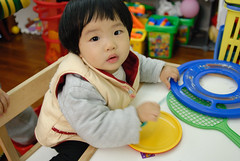

夾了好久的頭髮也綁了好一陣子的沖天炮  
  
  
  
在媽媽的反覆思索歸毛下 最後總算難逃被剪的命運  
除了因為擔心小愛的髮際會越綁越往上跑外(額頭已經有夠凸了)  
最主要的原因還是媽媽懶啦  
尤其是每當小愛早起嬉戲時 看著她一頭散髮覆蓋著眼睛的"ㄚˋ ㄗㄚˋ"樣  
媽媽內心總是難逃責任感與愧疚感的交迫相逼  
然後只得乖乖從溫暖的被窩裡起來好幫她夾好頭髮  
那種起床的心情真是無奈又痛苦ㄚ...  
所以媽媽我決定幫小愛剪去三千煩惱絲(其實是剪去媽媽的煩惱絲)  

趁著我+徹爸+阿徹剪髮之便  不小心+不好意思的又給設計師阿姨來了個買三送一  
其實上次設計師阿姨就很想幫小愛剪妹妹頭了  
基於專業的角度 阿姨是很不讚同小女生從小就一直綁著夾著頭髮的(髮際會越來越高)  
所以阿姨這次應該很開心可以動刀動到小愛的額前  
阿姨說 妹妹頭還可分斜邊/ 凹/ 凸 三種形狀  
但小愛額頭太凸不適合斜邊 (小愛這次應該是凹型吧)  
剪了妹妹頭  雖然呆了不少 但媽媽我覺得很有型很可愛哩  
  
  
  
可是徹爸說很像技安妹  我抗議道"哪有那麼醜 是很像日本小女生"   
徹爸又說"技安妹不就是日本小女生"  
ㄟ...我說的是一般那種瘦瘦小小的日本小女生啦  
(後來美賢說的好 像螢火蟲之墓裡面的那個妹妹啦)  
徹爸說他還是比較喜歡小愛披著頭髮的撫媚樣  
他還說只有我這媽在說這妹妹頭可愛  
ㄟ...真的還蠻可愛的ㄚ...可不是每個人都可以醜的這麼可愛的哩...  
  
   
  
  
  
這姿勢跟４５度角有像豬哥亮吧...  
  

