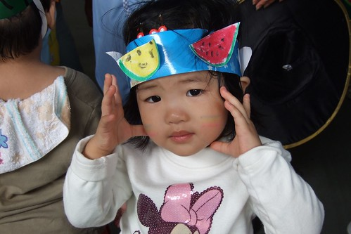
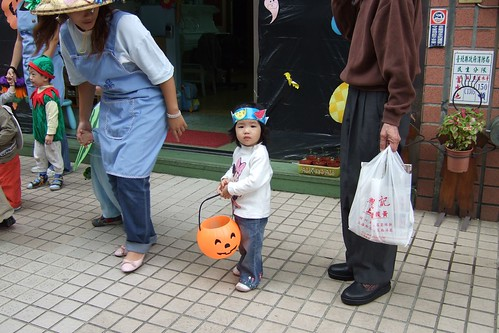
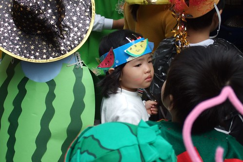
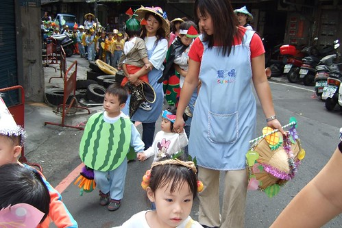
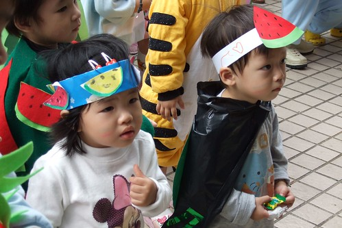
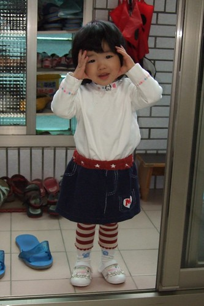
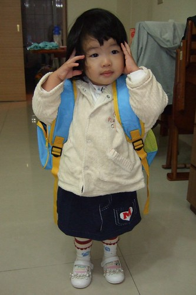

10/29 星期一小愛開始上學了  
前一天晚上我跟她說"明天沒有要去阿姨家了喔 要跟徹一起去上學了"  
小愛像是想了一下 三秒鐘後告訴我"好吧~"  
好吧?! 這詞用的時機未免也太好了...(新學的詞就這麼實用的被派上用場了)  
"好吧"也許真的貼切表達出小愛的不排斥與逆來順受吧  
  
星期一早上跟徹爸兩人懷著期待與坎坷不安的心拎著大包小包  牽著大的小的一起去上學  
進了校門後 我先拎出小愛的室內鞋讓她換上  
然後在我忙著跟老師交代小愛的一些生活習慣的同時 小愛換好了鞋站在一旁等著  
然後老師跟她說可以去遊戲區了喔  
然後她在老師的提醒下跟爸爸媽媽說了再見  
然後頭也不回的去找哥哥 一起要去遊戲區  
ㄟ....這跟阿徹第一天上學時我躲在校門外聽著阿徹在裡頭哭喊而自己暗自掉淚的情景差太多了吧...  
  
來到辦公室後跟徹爸兩人越想越不安 "事情應該不會這麼順吧"  
忍不住中午打了個電話到學校問老師  
先是園長接的 問她"有哭嗎"  
園長說"沒有哩 上午上去巡了2次看起來都可好的  午餐應該也OK吧  
           Happy老師中午遇到阿徹時跟阿徹說"徹我剛餵你妹妹吃飯 你妹妹跟你一樣很厲害吃飯很快哩"   
           阿徹聽了後就哈哈大笑的三聲..."  
然後電話轉給了小愛的導師  老師說"小愛很好阿 飯有吃 午覺也說睡就睡"  
聽到飯有吃 覺也睡 我跟徹爸心中的石頭總算放下去了   
就等著五點下班後 開開心心的去接小孩吧  
  
接放學等老師喚名字的時候 便快跑到遊戲區門口偷看想了一整天的小愛  
首先映入眼簾的是阿徹牽著一個頭髮綁的漂漂亮亮的小女生一起走出來  
我真的眨了一下眼(乾眼症容易眼花)再看一次 這真的是我家的女兒耶  
怎麼才上學一天 我家的黃毛丫頭就變成小公主啦  
(幼幼班陽了這麼久 總算出現一個小公主  老師總算一吐怨氣可以大展手藝了)  
小公主的臉上雖然明顯露出一絲倦容 但看起來真的就像老師說的很OK哩  
問她"好玩嗎"  小愛說"好玩"  "明天還要上學嗎"  小愛說"要" ...  
回家的路上 阿徹雀躍的跟我說"我下午上英文課的時候 妹來我們教室 我有搬椅子給她坐喔"  
阿徹的臉上盡是開心與驕傲   感覺的出他妹上學他非常之驕傲哩  
  

星期二早上小愛一樣開開心心的跟著哥哥去上學 跟媽媽說byebye  
今天去接小愛放學時 她已經知道要先去遊戲區前方讓老師穿外套 拿自己的包 然後去換鞋  
幫小愛穿衣服的Tina老師說"她人見人好 誰抱來玩都沒關係"  
阿徹的Freda老師說"小愛很適合上學喔"  
還說今天下午4點阿徹上英文課時 一直唸著"妹哩 妹怎麼還沒來" (以為他妹會像昨天那樣去他教室找他)  
Freda澆了這驕傲哥哥的冷水說"小愛早就去遊戲區玩了"    
  
星期三是萬聖節遊行 所以"交差"的幫小愛做了一個西瓜頭套 (小愛班上主題是西瓜)  
阿徹哥哥也熱情的幫妹妹畫了一個大西瓜 然後用繩子綁起來作一個大西瓜名牌項鍊  
可是小愛完全不領哥哥的情  
隔天早上發現包包裡有哥哥前一晚偷偷放入的西瓜項鍊時 毫不留情的拿出來丟在地上  
看的哥哥傷心的苦苦哀求"妹 這是哥哥幫你做的項鍊 很漂亮哩..."  
可是妹妹不要就是不要 很無情且殘酷的直嚷著"不要 不要~"  
  
  
  
當初有點遲疑要這時間送小愛上學嗎   會遇到阿徹怕了兩年的萬聖節遊行哩  
不過實在不想11/1上課兩天就又遇到週末 然後隔週一上學分離焦慮又得重頭來過  
只是我好像真是瞎操心了...  
因為擔心小愛會有啥狀況發生 所以媽媽報名了當義工 (維持秩序 因為園長說縣再車子都很冷眼旁觀然後車子一直ㄊㄨˋ)  
週三萬聖節那天的9點50分 我從摩斯漢堡享受難得愜意早餐後出現在即將遊行的隊伍前  
戒慎恐懼的喚了聲小愛  實在很怕她就賴著我討抱  
但小愛衝著我笑了笑 甜甜的叫了聲"媽咪"後  依舊讓老師牽著手順著隊伍走   
依舊證明媽媽又瞎操心了  所以媽媽放心的去幫忙照顧最缺人手又最難掌握的小班  
   
  
  
遊行隊伍中 我排在阿徹班級的後面 小愛班級的前面  
所以我可以隨時留意前面的兒子與後面的女兒  
看著人群中嬌小的小愛 真的覺得她很勇敢 很棒  也也許該說她真的很認命  
  
  
  
牽著老師的手 同班小哥哥的手 逛大街享受她的第一個萬聖節遊行(妳有機會在幼稚園過五次萬聖節的)  
ps. 小愛後方老師抱著小男生是她的同學 1歲5-6個月 14Kg   4個老師輪流抱著走3/4的遊行 真的很辛苦  
  
  
  
偶而我會到小愛前面叫叫她  她會開心的叫著"媽媽"  
然後一樣繼續跟著老師走...  
這點真的跟其他剛上學的小奶娃很不像  跟哥哥2歲半第一次遊行時全趴在老師身上很不像  
Freda老師笑說"我就說她很獨立 很適合出國留學的" (爸媽努力掙錢吧)  
  
  
  
回到學校最後的搗蛋歡呼 跳舞    
小愛跟同學小綠綠(園長的小兒子 小小愛2個月)兩人像是發呆二人組  
呆呆的直視著 站在他們正前方的趙老師(體能課老師 聲量很大 體型也很大)又喊又跳又唱的  
  
今天放學換好鞋子後  小愛知道把室內鞋放到自己的鞋格了 已經會認她的鞋格了  
問了老師 她在學校還好嗎  
老師說"她很獨立 都自己吃飯  睡覺也都睡"  
我又問"那上課是在發呆還是..."  
老師說"會靜靜坐著聽老師講  問她問題都會回答 有時候望著老師聽阿聽會衝著老師笑"   
老師們異口同聲的說"真的不像剛來上學的 很像上學很久了..."   
  
  
星期四經過三天試讀  學校發書包嚕  
放學時小愛揹著書包從遊戲區走出來時 那神情真的有臭屁  
而且還不願意讓媽媽幫她揹 堅毅的直說"自己揹..." 吼~  
其實書包裡真的沒裝啥東西 很輕  
可是書包很大阿...尤其小愛又特嬌小  揹在她身上真的就像是在召告"我很小 我有上學..."  
果然去診所 去便當店 回家的路上被不少人用異樣的眼光問"這麼小就唸書啦 她幾歲啦"  
媽媽除了得背負 把這麼小的小孩就送去上學的罪名 還多加一條"大書包壓搾這小身軀"   
所以每天上下學 我都得想盡辦法的要揹她的書包  
可是正值自我意識抬頭的姑娘總是固執的用"我~" 或"妹妹揹~" "自己~"來回應我  
  
  
  
週五早上起床喝完奶 換好衣服穿上小花襪後  
姑娘就下床往陽台衝 穿上她的小白皮鞋  
吼~愛漂亮了 小褲裙小花襪知道要再配上白皮鞋  可是鞋穿反啦  
  
  
  
穿好鞋後就又跑去拿她的書包  
  
  
  
還自己背了上去 可是媽媽還沒洗臉換衣服哩   
請她先放下休息一下也不要  就這麼背著書包進進出出走了10多分鐘  
然後又很堅持的自己背著書包從四樓走到一樓  
她爸爸說"跟她媽一個樣" 都是愛面子死ㄍㄧㄥ的個性  ^ ^|||  
  
  
  
回嘉義過了個開開心心的週末   
週一早上又一樣繼續開開心心的上學去  
這小女子真的有點出乎想像的習慣上學 (還不敢確定是不是愛上學)  
美賢阿姨說 因為週遭有這麼多愛她的人 給她滿滿的安全感 所以她這麼無懼  
也許吧~ 不過真的是很放心把小孩交給這樣的學校與老師...
