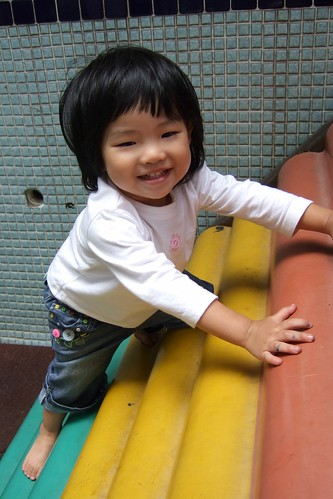

狠心的媽媽終究還是讓小愛以將屆滿二歲之稚齡開始了她這輩子漫長的上學生涯  
每個人聽聞小愛開始上學了 首先一定問小愛幾歲啦 接著問這麼早就上學啦....  
為了合理化 人性化我們這種殘忍的行為  所以我歸納出一套制式的回答:  
物價上漲所以幫爸媽節源一下  聽的人一定會問"差很多嗎?"  
平均一個月少付5-6張你說有沒有差  聽的人一定更會驚呼"差這麼多阿 那的確可以省很多"  
然後我打鐵趁熱緊接著說 其實主要是因為覺得保母帶的小孩有點多  
而且覺得兩歲了每天在那兜ㄚ兜  不如去上學了   
起碼每天可以在遊戲區跑一跑  可以玩滑梯 可以聽故事   
可以光明正大 名正言順的塗鴉 拿剪刀 撕紙  平常羨幕哥哥能做的事她也都能做啦  
聽到這裏 大部分的人一定會深表讚同的說 "上學好像還挺不錯的"  
嘿嘿 是阿~~不過我想大部分的人還是很難接受甚至很同情小愛這麼小就得去上學了  
套句阿徹舅公常說的"讀到老油條喔"     
呵呵 有阿徹哥哥在 我想小愛應該不會被炸的過老啦  
  
(以後每天就可以玩滑梯啦 不用巴巴的等著週末去公園或阿嬤家了)  
  
  

一個月前的中秋節補上班天  趁著送阿徹去上學的時候  
順便帶小愛去學校裡的遊戲區嚕一嚕  
半個小時裡阿徹哥哥細心溫柔的牽著小愛的手 跟她講這是什麼滑梯 可以怎麼上去  
小愛除了在哥哥去視線範圍外拿東西的時候被包圍她一圈的好奇哥哥姐姐嚇哭外  
其餘時間就信任的讓阿徹哥哥帶著她去探索遊戲區的每個角落  
有了這一趟經驗後 我開始三不五時給她洗腦  
"阿徹學校的溜滑梯好不好玩"   小愛當然開心的回答"好玩"  
"那去上學後每天就可以玩梯了好不好"  小愛當然又會說"好~"  
"乖 那過陣子後要跟哥哥一起去上學喔"  小愛又說"好~梯~"  
對! 上學有梯喔!  所以要去上學喔~  小愛逐步走進媽媽設好的圈套裡...  
  
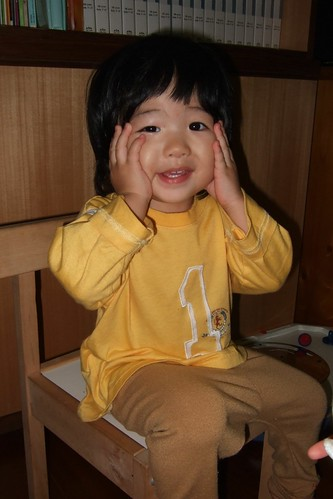  
  
(愛) 喂~ 嬤~ 梯~ 好玩~  
  
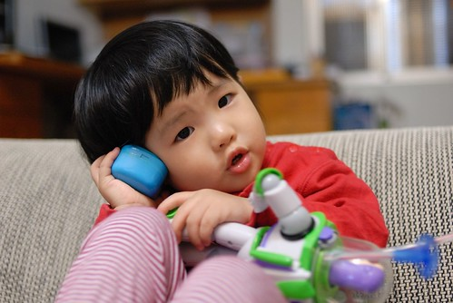  
  
週四的晚上哥哥得出門上音樂課去 (就是電視裡有很天真小孩唱歌的那家)  
小愛哭著也要跟出門 爸爸說"乖 等爸爸吃飽後帶你去散步"  
然後小愛自己就傳好這樣的全副武裝等著出門  
  
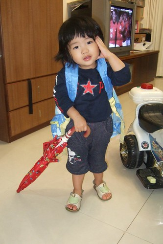  
  
(愛) 爸比~ 快一點啦~還要我等多久  
  
  
  
恬靜 可愛的女兒就即將邁入人生另一個重要的階段(寫的當下其實已經邁入了 媽媽的日記嚴重delay中)  
其實爸爸媽媽比她還期待 還好奇接下來會發生的事  
  
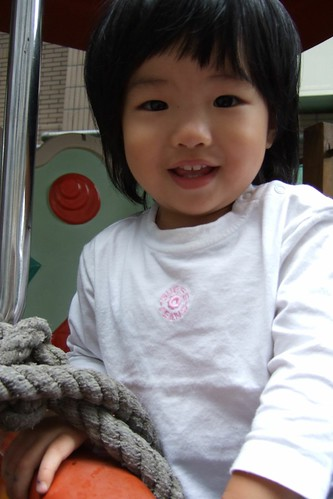  
  
不過爸爸媽媽不擔心  
因為知道小愛可以獨立 可以適應 而且還有阿徹哥哥會照顧她阿  
  
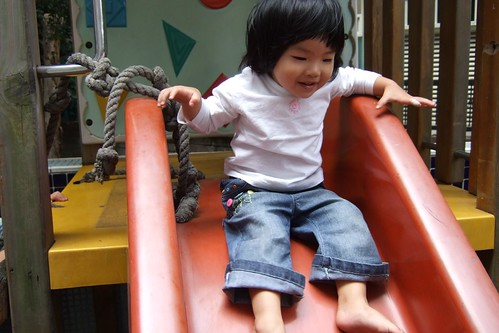  
  
阿徹哥哥會帶著妹妹去適應這新環境  這越來越寬廣新奇的世界的  
  
牽著妹妹的手帶動唱....  
  
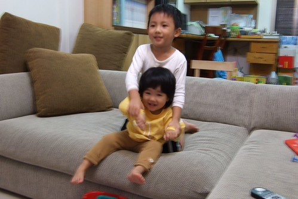  
  
引領妹妹接近大自然...  
  
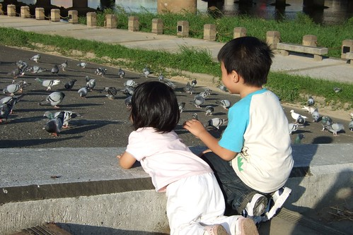  
  
探索新玩意以及一起異想天開....(阿徹哥哥賣力的要鑽木取火)  
  
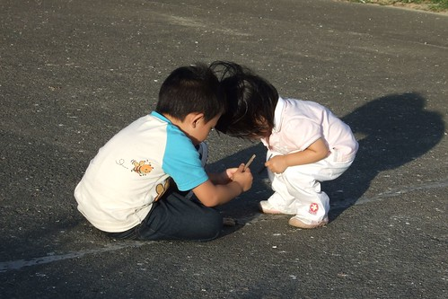  
  
準備好一雙舒適的室內鞋   
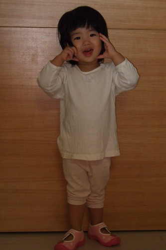  
  
一雙可以裝氣質的小白皮鞋  
  
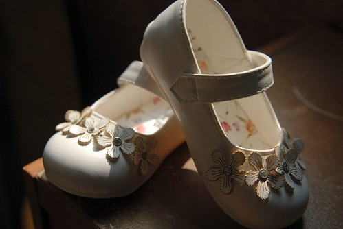  
  
我們家的小愛要揹起書包上學了 要開始乘著火箭般的學習成長了....  
  
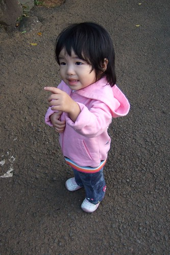
