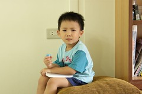

以前我是愛的教育奉行者  
現在則是大力跟其他媽媽呼籲"小孩真的還是需要嚴厲點"  
這其中轉變應該算大吧  
以前每當阿徹跟他爹協商破局轉向我求助時  
他爹總會"好心"的提醒我"他是在利用你啦" "人善被欺ㄚ"  
而當阿徹被他爹教訓的泣不成聲來找我討抱抱時  
他爹更是在我旁邊直呢喃著"慈母多敗兒阿"  
我總是一次又一次的給他機會  
卻也一次又一次的驗證"阿徹果然是知道事情的"  
所以真的不嚴厲不行了

其實也不知道是不是因為多了妹妹所以有了這樣的轉變  
但我承認兇小孩果然是習慣就好 哈哈...  
"訓練"自己嚴厲的過程中  
很奇怪竟也越加慶幸自己的"領悟"及肯定"鐵的教育"的必要性  
尤其看到像郭台銘 像某些企業家的夫人都是採嚴厲的方式教育小孩  
更是加深了我擺脫"軟腳蝦慈母"的決心  
這麼努力了幾個月 上周末發生的事總算讓我有種成功轉型的喜悅~

話說5/6星期六早晨  
我帶著阿徹去早餐店買三明治以及全家買飲料  
這小子在我等結帳時 直望著150公分遠的架子瞧  
"那是什麼東西ㄚ" "我們過去看看" "好可愛的玩具喔" "我想要買"  
娘我聽著她故意講給我聽的"自言自語"完全不為所動  
直到他語調轉變 似乎隨時會爆發性的哭喊著"我要買玩具"時  
我才冷冷的說著"不行 你再這樣以後再也不帶你買早餐"  
"要不然你留在這裡等看有沒有人要買給你好了"  
然後我自顧拿著早餐走回家而阿徹也還算控制住的只敢呢喃不斷的跟在我後頭  
回到家後爸爸看到我兇兇的臉知道阿徹討要買玩具時  
唸了一兩句 但也以為阿徹只是在撒嬌...  
(故事還沒開始喔 這只是前傳)

5/7星期日晚上  
依照習慣的回新莊的外婆家吃飯  
雖然我實在很不喜歡競選總部這樣的場合  
一來自己實在討厭跟那些阿伯阿嬸們交際  
二來是阿徹很容易在人多的地方out of control  
也許應該說人多的時候 我們對於阿徹又會特嚴厲吧  
但這就像是生活中無奈但還是得做的事吧  
吃完飯原本跟姐姐玩的很開心的阿徹  
看到爸爸要去百貨行買東西又要跟了  
承諾了不會吵要買東西 父子倆就也開心的一同前往  
20多分鐘後~  
我...首先看到鐵青著臉的爸爸  
然候緊接著看到眼眶泛紅的阿徹  
想也知道一定又吵要買東西了  
哇勒 前一天才這樣今天又這樣 我的火又給他"咻"的一聲給點燃了  
爸爸說其實他最生氣的是 阿徹明明知道他的承諾  
因為在看到東西時阿徹還會唸著"爸爸說我不可以買東西..."  
但是在最後看到筆(還是貼紙時)還是失控的吵要買  
氣呼呼的爸爸把阿徹交給我後 就去開車準備回家了  
小舅舅看到 好心的要帶姐姐還有阿徹去小7買多多  
我說"不行" 然後姐姐自己跟著爸爸去了  
然後我把推車上的妹妹晾在一旁 硬要阿徹站在牆邊罰站  
沒一會外婆拿了數個花花胸章給阿徹要他乖乖別哭了  
我ㄧ把拿起 因為我在教訓小孩  
外公又過來說"嬰子 賣靠兜後"(小孩別哭就好)  
可是看我臉色難看也不敢多說太多  
外婆又過來牽著阿徹的手要去外婆的三輪車上拿胸章  
阿徹跟著外婆走了好幾步  
聽到我在後面喊著"你敢拿"  
"哇"的邊哭邊跑回來  
(突然間覺得 我總算像個嚴母了)  
又教訓了一會 想哭但又想忍住的阿徹就這樣哭哭咽咽的來回好幾回  
然後小舅舅帶著姐姐買完多多回來了  
拿了一瓶放到阿徹手上要他別哭  
其實第一時間裡我想把阿徹手上的多多拿起來的  
但我又顧忌到外公外婆舅舅還有一堆外人的眼光  
好死不死就在我猶豫的那30秒裡  
爸爸的車到了 看到阿徹手上的多多  
先是惡狠狠的望了我ㄧ眼  
(徹爸說他不是惡狠狠 只是疑惑我幹麻一臉不知所措的臉 哈哈 竟然被他發現 不過那剎那 我第一念頭真的是"死了")  
然後拿起阿徹手上的多多 然後把小孩抱進車子裡  
這時我忍不住跟小舅媽說"大家對他好反而是害了他阿"  
於是我們夫妻倆就在眾人一片錯愕中告別離開了

剛到車上的阿徹當然是狂哭  
但是對於我們的指責"爸爸媽媽有罵錯嗎 你自己說你哪裡不乖"  
卻是完全不敢吭聲  
哭了幾分鐘沒效後 自己就爬到妹妹的汽座上望著窗外  
像是在想事情也像是在傷心難過(這兩件事好像可以併行)  
人果然是需要冷靜的  
因為靜下心後的阿徹忍不住就睡著了 且整件事似乎就這麼結束了  
只有在我幫他洗澡時熊熊(真的是熊熊)一臉哭臉的說"我要買筆筆"  
我又冷冷的回了句"你為什麼又突然在講這個"  
他就又像變臉般的馬上(真的是轉各臉過去就從哭臉變笑臉)開心的自言自語玩起他的玩具  
哇勒~  
不過聽到他這樣"試探"我而我又通過試探  
更加相信我往嚴母這條路的選擇是對的而且就快成功了

準備睡覺時阿徹聽了他爹的話一如平常的去拿了兩本故事書要我講  
正得意於當嚴母的我又冷冷的開口說話了  
"為什麼今天可以講兩本阿 你剛剛不乖哭哭怎麼可以講兩本阿"  
小子一聽又變半哭臉的說"兩本啦"  
我這嚴母又說啦(大家應該有感受到我的得意狀吧)"本來你哭哭鬧鬧一本都不行的 因為後來有乖乖所以可以講一本"  
這小子又鬧脾氣的跑到落地窗跟大沙發中間的小縫裡(就像自閉兒一般)  
我又說"你再這樣 就一本都沒有了"然後我就自個去泡奶了  
幸好 這小子就乖乖的拿一本書回架上  
然後開心的拿一本書到房間等我講故事  
好樣的!兒子你總算沒讓娘失望了  
不過說真的 幸好阿徹沒再番下去 要不然會搞到啥地步我都不敢想像哩

嚴母這條路果然是艱辛的  
但我益發相信這對阿徹是好的  
希望~
