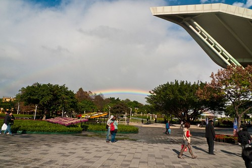
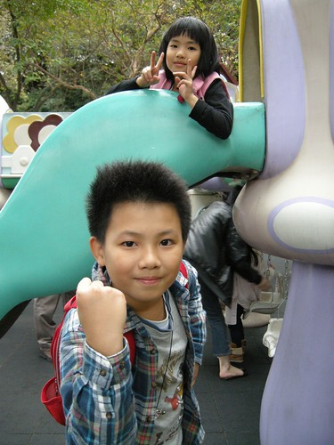

媽媽牌安親班開班的這半年多 家裡很常聽到我跟阿徹的驚呼"什麼! 又是週末了" 當中最主要的關鍵是母子三人那個很free的週三半天課/班 因為放完週末只要上兩天班就又是開心的週三  然後只要再上一天課就又到了期待週末的週五 所以我們不太有週一症候群也不會覺得日子怎麼過的這麼慢 甚至還快的讓我們覺得不可思議... 週三的下午除了會利用來上圖書館 去公園 逛書局 買東西 還有看牙這些本來壓縮在晚上做的事外 大半的時間其實我們都是在家 我忙我的 徹愛玩徹愛的 只是有一天徹愛突然說"既然是安親班 就應該跟以前幼稚園那樣每個月有一次戶外教學" 兩人還邊說邊笑 嘖嘖嘖~ 這分明是在ㄠ我這個廚娘兼後娘的安親班主任阿! 不過愛玩的媽媽還是爽快的答應了 於是母子三人間又多了一份甜蜜的期待  期待我們每個月的小郊遊 小散步 小樂趣 2013元旦連假前的周三下午 我們的戶外教學來到圓山花博公園看2012國際花藝展  

那天下午板橋的天氣很好 可是淡水捷運駛出地底後 看見的卻是下雨的台北市 但沒想到當我們在圓山站準備下月台時 卻發現遠方有道美麗的彩虹  襯著花博公園的彩虹看起來真的很夢幻 彷若通往美麗世界的橋樑  驚喜的我們真高興老天爺一開始就送了我們這麼一份美麗的紀念品  今天戶外教學的重點是正於花博爭豔館展出的2012國際花卉展 不同於徹家平常走的野外自然風 今天走的是雅緻氣質路線　如文人般的賞花作樂阿  看到愛心花　呼喊著"愛愛你的愛心耶"  我們嘖嘖稱奇於一個個栩栩如生 美麗的花藝作品  阿徹拿著他的相機照個不停 愛愛也在每一個作品前要我幫她照個不停  偶而還會跟我說"這裡好漂亮 咪咪我幫你也照一張"  愛愛模仿每一個作品的主題 擺出不同的照相POSE 攀爬的人  跳舞的小人  飛翔的鳥  伸長脖子的長頸鹿  大快朵頤著水果的樣子  這是愛愛最喜歡的花  美麗的美麗華摩天輪  一個多小時的看展下來 我們直呼著"真是太美了"  這是台灣傲視全球的另一種美麗 更難得的是展覽完全沒收任何門票費用 是不是很適合很棒的戶外教學地ㄋ~

看完花藝展 我們繼續到花博公園內走走看看  想不到兩年前的花博結束後 圓山這裡還是這樣花團錦簇 美麗萬分  而且搭配著不同主題 更是多元與好玩  想起當年花博的LOGO"美麗城市"  台北真的有變美麗說...  三人越走越開心 開心到阿母順口就說"我們走來去兒童樂園吧"  相當然爾兄妹倆開心的手舞足蹈 跳著往兒童樂園  放兄妹倆去玩前 請他們要先陪我坐一次摩天倫(上次花博沒坐到 一直記著)  大膽愛當然是樂意奉陪 只是苦了阿徹得硬著頭皮上  看到哥哥膽小的模樣 愛愛更是樂不可支 拍手叫好  當然沒那麼可怕 只是兄妹倆越演越像回事 真真假假讓人難以分辨  媽媽我看著這一系列照片 還是覺得好經典  星期三的下午 我們一派悠閒的坐在摩天輪上  看著地下正在拍婚紗照的新人 看著四周的台北風景... 我知道! 真的幸福的很過分... 我喜歡這樣一個月一次的母子三人小約會!  王子跟公主陪完阿娘 總算可以各自選一個遊戲玩 阿徹選了碰碰車  愛愛則是每次都坐的咖啡杯 一個人坐在大杯子裏轉阿轉  然後一起坐旋轉木馬  只是陪騎的王子有點無奈  但公主則開心 得意不已阿  兄妹倆接著繼續玩園內的遊樂設施  明明兩個人都已經這麼大隻 明顯的超齡了 連盪個鞦韆腳都沒法伸直  但兩人還是眷戀不捨兒童樂園  努力的爬  盡情的笑  這些都是來到兒童樂園最該做 也同時最大的收穫 離去前 兄妹倆來個成功紀念照! 下次再來兒童樂園不知何年何月了...  最後我們依然又跳著回圓山捷運站 準備搭車回家  看著夕陽西下 我們說"真棒的一個下午!" 
