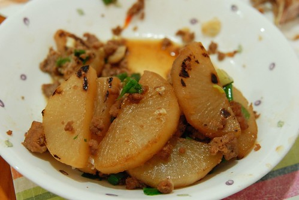
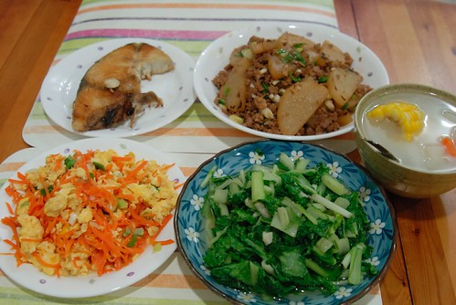
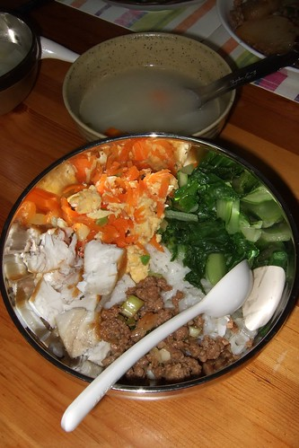

也不記得當初怎麼會在網路上找到這篇食譜的 當初第一個感想是材料跟做法都很簡單很符合徹媽不愛搞缸的懶性 重點是夠台啦  怎麼形容ㄋ? 就是我跟徹爸的媽媽其實廚藝都沒很高超 也不會煮像網路上很夯的美食blog那種色香味俱全的菜 好像也沒什麼代表菜 可是媽媽那1年365天每天開火 每天吃來吃去都差不多的菜卻養大我們這些小孩 而且讓我們最愛的還是吃家裏自己(媽媽)煮的菜 這道菜就是很像忙碌的媽媽會煮的"有鹹"又不搞缸 可以餵飽一家子的家常菜(很多食譜的家常菜其實一點都不家常 超搞缸)

材料： 白蘿蔔1/2根、豬絞肉150g、蔥片1根、香油1小匙

調味料： 醬油2大匙、味醂2大匙、米酒1大匙、糖1小匙

做法： 1. 白蘿蔔去皮，對半切，再切成1公分薄片 2. 少油熱鍋，蘿蔔平放 中大火煎至微焦後，下豬絞肉炒至焦黃熟透 3. 加調味料轉中小火加蓋收汁2分鐘後，開蓋將蘿蔔翻面， 續加蓋收汁至乾，撒上蔥片、香油即可。

(哈! 因為徹媽照相技術不佳 只能等徹爸回家後照這吃剩1/3的殘骸) 

雖然食譜這麼寫 可是我好像只有第一次做時有80%遵守(香油從沒記得過) 第二次做時 甚至還忘記調味料的比例是在下班回家的捷運上請徹爸幫我上網找的 而這一次後 我就此記得醬油兩匙+味霖兩匙 也就是這兩個要1:1的比例 不過這一次後 我的調味料好像也都只剩下醬油+味霖 而且1/2~2/3的蘿蔔 我用大約半斤的豬絞肉 是原本食譜一倍的量 就覺得帶有點蘿蔔甜 醬油香的肉末好好吃 忍不住就提高絞肉的比例 而為了讓絞肉軟一些 讓阿徹跟小愛容易嚼入肚 我最後悶的時間長達10~15分鐘 哈哈! 一整個"遵守性"很低的做法 不過真的很好吃啦! 徹爸甚至還說可以把這作為我們家的代表菜(總算有代表菜了 這算是徹爸難得對我廚藝的肯定)

其實一年前我沒這麼勤勞做晚餐的 大部分都是吃阿姨飯飯的 週間大約只會自己做個1~2天的晚餐 (週末就回嘉義或吃阿母啦) 徹爸笑說 以前工作輕鬆沒在煮 現在工作忙反而這麼勤勞煮 真奇怪 我想可能因為去年中在家當英英美黛子的那四個月養成的習慣吧(沒上班還不煮晚餐就太說不過去了) 後來再開始上班 雖然每天比以前更早出門上班更晚下班 還是希望自己週間可以盡量開伙個3~4天(偶而還會煮個水餃或粥麵湊5天 哈哈)

我週末早上都會去傳統市場買好一週的魚肉菜 尤其我喜歡冰箱冷凍庫裏永遠有魚有肉讓我隨時可以想煮晚餐 而青菜不夠用時就下班時去捷運口的全聯再添購一些即可 其實自己的手腳應該算快的 要在一個鐘頭內搞個4菜一湯不是問題 而且邊備料邊料理(就像煎魚煮肉時洗菜切菜)其實是比較有效率的 但我寧可每天早上比徹爸她們早40分鐘起床準備當日晚餐的材料 好好的把菜泡一泡洗一洗(如果煮戰鬥餐就沒法這樣泡菜了) 敖好高湯或燉好一鍋湯 或是魯好一鍋可以吃兩天的肉 最後把米洗好放下去預煮(現在不敢這樣用了 不過還是會洗好泡著) 再順便準備好我跟徹爸下午在公司的水果 其實這樣的準備時間都快夠可以煮好一餐了 但自己卻越來越喜歡這種情境與心情 當全家人還在安穩的睡覺時 自己一個人安靜地/斯理慢條地在廚房裏準備著 而同時也剛好讓腦袋整理一下昨天發生了什麼事 今天要做什麼事 這種緩慢的步調是當小愛阿徹醒著時很難有的…

因為早上的提前準備 所以當我接近六點半接阿徹小愛回到家後 可以如上緊發條般的打理阿徹小愛洗手換衣服 煮晚餐 倒垃圾(雖然幾天才倒一次) 而在廚房揮汗鏟鍋的同時 還會有小孩跑進來告狀要你調停或是要你看看他的作業作品及新玩意 最後七點多一些餐桌上擺好晚餐 吆喝小孩子吃飯 母子三人坐在餐桌旁 邊吃邊聊著今天好玩好笑的事(徹爸都是回家ㄑ一ㄥˊ菜尾的)

這是現在阿徹吃晚餐時的大碗公 每次看到這大大一碗 (比媽媽還多的飯量+舖面的菜 ) 阿徹都會誇張的大喊"看起來好好吃喔" 我想或許這就是阿徹的媽媽的味道吧~

補充: 寫完review時 才驚覺自己煮晚餐的另一大原因是因為我自己要帶隔天的便當啦 尤其現在上班午休只有一個小時 自己帶便當既省錢又省時方便 吃自己帶的便當才有時間睡午覺或是寫blog啦
