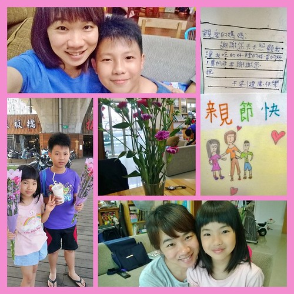
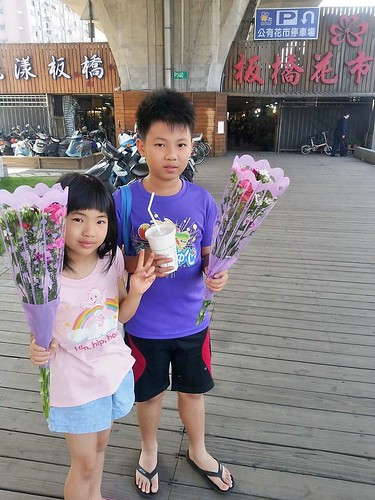
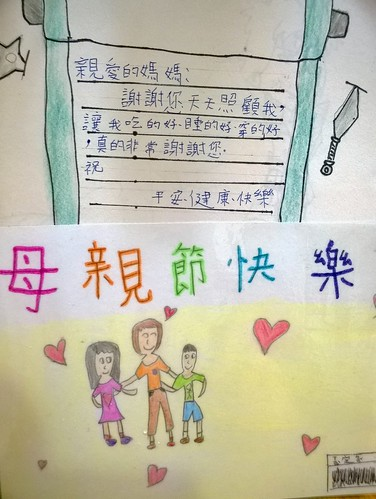
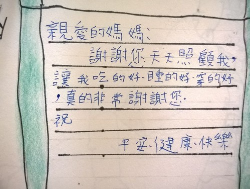
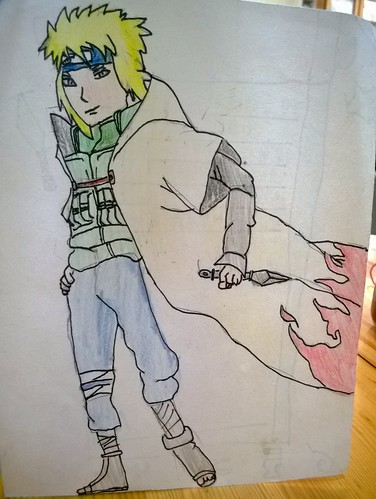
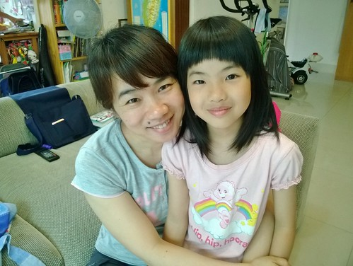
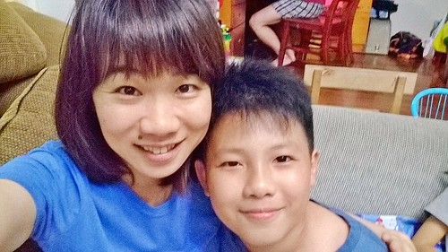

不過節日的我 今年的母親節卻有些不一樣 只因為與老爺交往第一天收到的三朵花後 相隔18年總算再收到花 人說女兒是老爸上輩子的情人 而媽媽我卻更幸福的擁有女兒與兒子這兩個小情人 謝謝我的小情人們~ 

母親節早上 我一如每個週日早晨 到菜市場進行一週食材的購買 而徹爸則陪著徹愛去進行他們的秘密任務  當我雙手提滿菜的甫進家門 沒想一束花迎面而來 外加徹爸照相機伺候的拍下這紀念性一刻 我說 好歹讓我先把菜放好(重點是把頭髮撥好) 再美麗優雅的來接受這份意外驚喜 (待照片) 其實我也真不是收到花就會被收買的女生 而是看到零用錢永遠不夠花的徹哥竟然願意拿他與愛妹一週零用錢去買花 吼~ 阿母心裡莫名的爽快!!! 而除了花之外 當然還有徹愛一人一張的卡片遞上  每次生日 母親節前 看到徹愛其實一點都不秘密的準備過程 我都覺得好笑 而且兄妹倆要給阿母的驚喜 也總是雷聲大雨點小的不出手繪卡片以及一些令我不知如何收拾的紀念品 (徹爸18年來可以很屌的不送花 其實也真是其來有自) 只是為娘由衷希望 每一天都把阿母的話放心上 捧在手上 奉為圭臬...才最最實在阿! 就如阿母每天努力認真的讓他們吃好 睡好 穿好... 話說已經五年級的徹哥寫的感謝詞多年來始終如一阿! 這點很令阿母哭笑不得  (明明已經是很久前畫的畫 被阿徹拿來當卡片 還說送了我最喜歡的帥哥(四代火影) 我ㄧ定很高興吧 Orz)   雖然我跟徹爸常自嘲 小孩被我們給教笨了 但我喜歡這樣有點蠢 有點純的徹&愛  幸福的我 有最可愛的小公主還有最帥氣的小王子 這就是每一天擁有的最棒禮物! 
