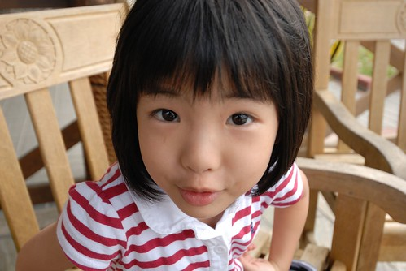

今天晚上跟兄妹倆邊做事邊聊天時 愛愛突然對我說"你的耳朵很好聽" 我聽不懂這話的邏輯 於是問她'你是要說我的耳朵長的很好 還是我的聲音很好聽?' 愛愛有點害羞的 笑著在我耳邊輕聲說'我是說 你說耳朵的聲音很好聽' 原來愛愛是覺得媽媽講'耳朵'這兩個字的聲音(語調)很好聽阿!  剎那 阿母我又醉暈在愛愛的裙擺下了! 我喜歡愛愛這樣不經意的小發現 小喜歡 小開心...   就像阿徹做的柚皮吊飾那樣.. 其實生活很簡單 快樂也很簡單!  後來洗澡時 愛愛笑著問'為什麼我這麼愛笑阿?'  我笑著回答'因為你常很開心阿' 常笑咪咪 開心的愛愛! 謝謝你讓爸爸媽媽也常跟著莫名的開心 笑咪咪!!
