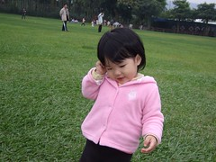

女生真的還是留點頭髮看起來會像小女生一些  
起碼可以做做門面裝裝氣質  
只是小女生要留頭髮真的還是得先墊墊媽媽的榜頭髮技術  
小時候一直都留長頭髮的我 因為陳嬤一早就都要忙做生意  
所以都是在前一天晚上就幫我紥好美美的頭髮  
而我也很厲害竟然可以一覺醒來髮型不變 也也許是陳嬤技術太好 紥的又牢又緊  
雖然小時候我沒有自己打理自己的髮型 但卻也常幫鄰居同伴紥麻花辮  
印象中 我的技術真的還不差  
只是 怎...經過二三十年 面對自己女兒的頭髮 卻顯得如此笨手笨腳...  
尤其相較於保母的"作品"也難怪徹爸常說"媽媽技術有待磨練"  
ㄟ...真是難為小愛週末沒去保母家的時候得忍受自己的披頭散髮   
  
(媽媽綁的)                                                                  (媬母綁的)  
  

放假在家 有時後還會忘了幫小愛梳頭髮 就這麼的披頭散髮  
要出門見人只好梳一梳 塞塞耳後 假裝故意飄逸樣  
  
    
  
真的看不太下去 就來跟髮夾吧  
只是小愛的髮量還真不少  玩到後來有夾跟沒夾的實在差不多  
  
  
  
媬母女兒都是從小留著及臀長髮加上手上已經帶過10多個小孩  
綁法技術想當然耳非泛泛之輩  
分線分的之又快又準 偶而還能有閃電分線或是紥小球球之變化  
媬母還安慰徹爸說"媽媽多練習就會綁很好了"  
  
    
  
晚上睡覺前 卸掉之後的頭髮像是燙了大波浪 帶點浪漫女人味...  
女生真的很多變...  
  
 
