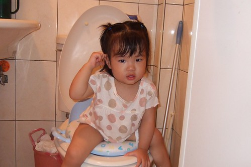
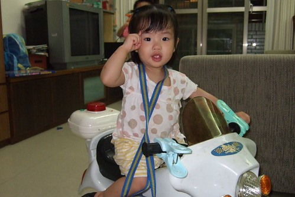
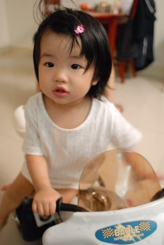
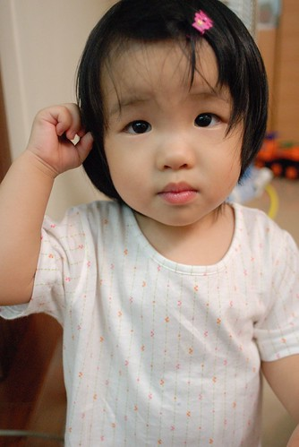

  
  
  
四月的時候保母說 這個夏天可以訓練尿尿了  
她可以一起訓練小愛以及另一個比小愛大6-7個月的小哥哥  
前陣子天氣熱了 我還在納悶怎麼保母都沒進一步消息時  
某天(應該是上週一)去接小愛時 無意間撇見小哥哥怎麼只穿著內褲四處溜蕩  
問了保母 保母用著我至今還是不太懂的靦腆語氣說"看要不要拿褲子來一起訓練"  
"好ㄚ~"   趁早學省點尿布錢  
回家後翻出阿徹學尿時買的一堆賤價薄小褲  
隔天就讓小愛揹了四五件去阿姨家  
就這麼小愛開始了她的學尿之路

第一天:    
噓歸噓 當然都是在離開馬桶後才給她尿下去啦    
問她要不要去尿尿都說好 但都是空包彈   
保母說小愛尿了後自己也不知道  
偏又很"秀裴"  教導她/問她"怎麼尿下了 要去馬桶尿尿..."之類的話  
保母起個頭而已 小愛就哭的像是被人毒打一般  
那晚回家後 喝多尿多的小愛果然短短三小時內換掉5件褲子  
不過後來尿濕後問她 哪裡尿尿 已經會摸著她那濕掉的褲檔給我看  
  
第二~四天:  
保母大約一小時噓一次  偶而可以坐在馬桶上尿出尿了  
但大部分還是空手而回  直接尿濕比較快  
媽媽常在小愛尿濕後 因為腳濕走路滑倒才知道小愛又尿尿了  
在家裡可能爸媽無聊就問"要不要去尿尿"  
小愛會搖頭說不要(不像在保母家都說好 )   
但偏爸爸又會一直問"去尿尿好不好"  把小愛都逼哭了   
可憐的小愛 應該漸漸感受到壓力吧  
當小愛第一次在家裡 坐在馬桶上尿出尿時  
我與徹爸還有阿徹哥哥開心的站著廁所門前對著還坐在馬桶上的小愛猛拍手 說"好棒"  
小愛笑的有點害羞有點開心  
  
第五~六天:  
週末出門在外 休息喔~  
  
第七~八天:  
白天在保母那都只有尿濕一次褲子  
而且都是因為傍晚保母兒子洗澡時 耽誤了小愛尿尿的時間才尿濕的  
其餘都是保母約一小時噓一次   
但....回家後的一小時內都會給我尿濕3-4次  好像把尿都留回家尿了   
本來以為是因為回家後喝多吃多尿也多 但保母說小愛白天也都喝掉3-4百的水  
所以也許小愛真是回家後顯得盡情奔放吧  
老媽子 老爸子 就甘願點跟在她後頭幫她洗腳 換褲子 擦地板吧  
我跟徹爸無聊每隔10幾分鐘就問"要尿尿嗎"  
小愛都搖頭不要 等到尿濕去洗腳時才又都比著馬桶示意要上去坐坐  
真的都只是坐乾癮的 Orz  
徹爸忍不住下了這樣的評語 "人家說女孩子比較聰明(學尿尿比較快) 我看也沒有阿"  
哈哈~   
雖然一樣猛尿濕褲子 但小愛已經會在尿下後一臉惶恐的急著找我 喊著"尿~ 尿~"  
似乎已漸漸意識到尿濕這事的嚴重性了  
也比較不會因為腳濕打滑跌倒了  
  
第九天: 就是昨天啦  
小愛竟然在回家後上床前的三小時內 完全沒有尿濕褲子  
雖然真的有點頻尿  尿了六次有吧(阿徹哥哥一次次的幫她數是第幾次成功)  
但...真是太令太令我們其他三個人振奮 感動與開心的  
尤其第二次時 已經間隔上一次半個多小時   
小愛跟著哥哥坐在沙發上看電視    
我擔心她尿濕沙發還故意要哥哥把節目暫停去廁所尿個尿給她看  
但小愛就是不要 我心裡只能想好吧 童子尿不臭沙發被尿濕也只能認了  
看了幾分鐘後 小愛竟然摸著她的褲檔跟我說"要~要~"  
我說"要尿尿嗎 那我們去馬桶尿"  
小妮子竟然就咚咚的從沙發上爬下來 跟著我去廁所坐在大馬桶上的小椅墊上  
等了數十秒後 我真的聽到水流聲  
這真的真的太不可思議了.... 不過我想這應該只是湊巧吧  
但接下來的晚上她真的都在馬桶尿  
雖然大部分都是我們主動問她要不要尿 然後才去馬桶尿的  
但這是個很大的進展  
不過也也許整個就是個湊巧(小孩行為向來沒個準字的)  
所以繼續觀察 繼續期待   
也許今天寫完日記回去  老媽子又得跟在尿後擦地板 換褲子了  
革命尚未成功 同志仍須努力阿~                  
  
衝衝衝 衝啦~  
  
  
沒有尿布的束縛 身手果然又敏捷許多  
  
  
  
(小愛)相信我 成功往往都是突然就發生的 是沒有道理的  
  

