愛愛最近也學會不用輔助輪騎腳踏車了!!! 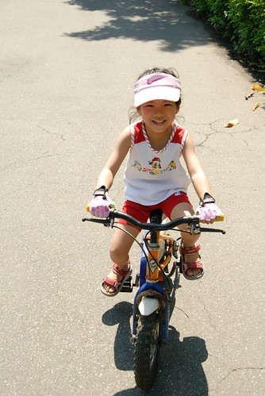

幾個月前我跟徹爸便慫恿愛愛開始練騎  愛愛也好不容易做好心理準備要拆掉輔助輪了 可惜她的身高還不夠  練划一次讓我們認清原來她的小短腿還沒準備好 直到前陣子有天媽媽突然想起 阿徹哥哥好像在愛愛這年紀(要算到月喔)學會了腳踏車 於是我們又重新啟動起愛愛的腳踏車計畫 而這次愛愛的腳總算可以穩當當的踩到地上了 愛愛也因此可以放心放膽的開始練划了

只是小女生真的力氣比較小也比較秀皮 不像阿徹當初練習時的"奮不顧身" 橫衝直撞 相對的愛愛的練習進度也緩慢許多 只是嘴巴很厲害的愛愛還是說得一口好車  每次練騎時小嘴巴永遠講個不停讓我們又好笑又好氣 甚至某個逛過百貨公司的隔天 她還跟我說 "等我會騎後 我可不可以去買昨天看到的那個包包 然後背著包包跟你們一起去騎車" (我們在戶外用品專櫃看到一個很漂亮又實用的小女生後揹包) 剛開始裝上踏板練騎時  小妮子甚至還要媽媽在她把腳就緒時喊著"1 2 3"然後才奮力踏下去 徹爸笑說 "看愛愛騎車他會破病" 不過徹爸最終還是看不下如此沒效率的進展緩慢   有天晚上刻意獨留他跟愛愛在頂樓練騎 果然經過那晚的指點加上徹爸對小車的持續上油  愛愛突然就這麼"順了"

真的會騎車了 愛愛當然是開心的不得了 而且每天晚上都很勤奮的上頂樓練車 爸爸跟她說"等你練習會騎另外一個方向了 還要帶你去公園騎  公園也ok了才真的代表你會騎了" 之後有天晚上愛愛問我"等我練習好另外一個方向 還有去公園騎過後 我可不可以跟哥哥她們騎車去動物園" 看來她是真的很期待可以自己騎車上路的日子ㄋ 而我們則是看她留著汗 臉紅咚咚 運動的樣子 感覺真好…

趁著上週回嘉義 徹爸幫她把她的愛駒載回去讓她可以去附近的幼稚園繞繞 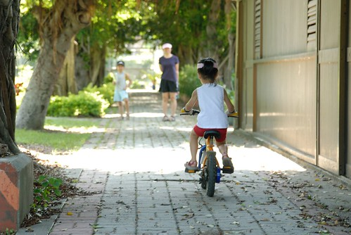

第一次在平地騎車 愛愛很開心 (哈 之前在頂樓不算平地ㄇㄟ) 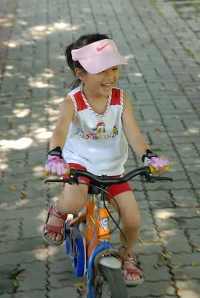

雖然烈陽高照 可是小短腿一圈一圈很努力 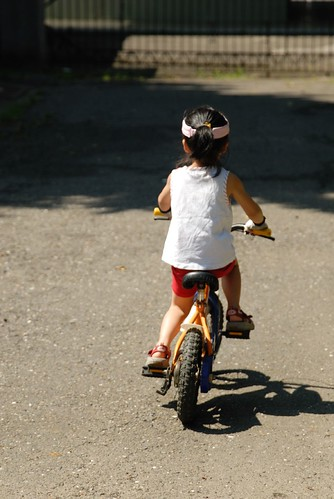

最後跟阿公合照時真是既開心又自信的模樣阿 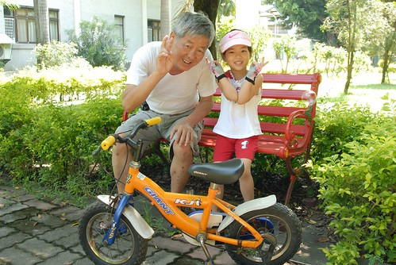

感覺不久前還才這模樣說 怎麼已經長大這麼多 這麼快啊 (三年前阿公還曾經扛了電動摩拓車去公園讓小嬰兒騎哩) 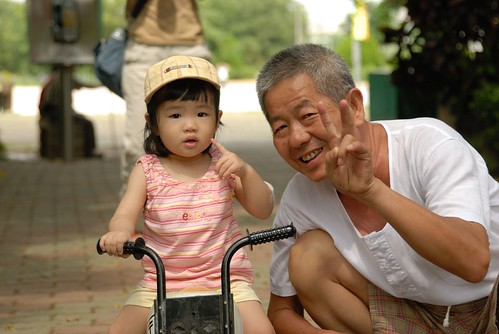

學會騎車在我們家是件大事 是很重要的人生里程碑 忍不住去翻看阿徹哥哥開始學騎車時的照片 [blog.yam.com/hmchen1975/article/12071429](http://blog.yam.com/hmchen1975/article/12071429) 一樣四歲半多一些的年紀  一樣的那台車 一樣的頂樓練騎... 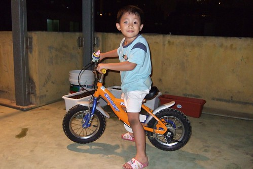

一開始哥哥練騎車時 愛愛還是在頂樓嚕魔拓車的小baby說 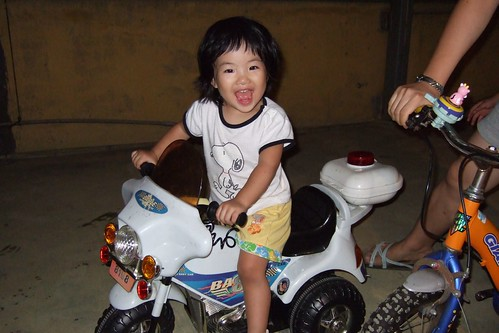

後來用奶粉點數幫愛愛換了台腳踏車  那時那算是他的第一台車 坐在用奶粉換的腳踏車上 她可驕傲的哩 (徹爸看到這張忍不住又念著 愛愛真是不上相阿) 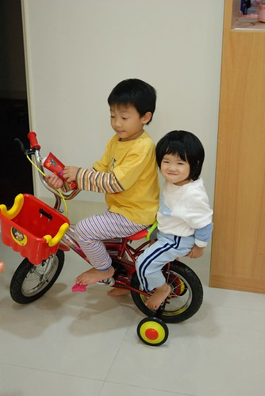

而現在愛愛竟然也已經會騎車啦~  傑克 這這這....時間真是過的太快 太神奇啦! 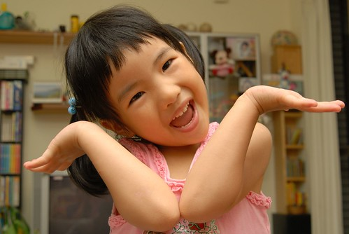

不過雖然愛愛會騎車了 我們還是跟她說 短時間內騎比較遠的地方還是得由爸爸載 愛愛也清楚的明白&認份 點頭同意 只是為了早點達成全家一起岀門騎車的願望  徹爸說"臭小ㄇㄟ  該好好訓練你了 " 我相信愛愛絕對不會像哥哥那樣在頂樓騎了1-2年後才開始上路 她一定會提早上路  提早換16吋車的...  大家拭目以待她的變化吧!!!

\======================================================================== 順道分享一下愛愛在月初花蓮瘋100K的照片

這是愛愛出門在外很常用的保力糖(保持體力的糖) Pinky    價格不貴又攜帶方便是我們哄小孩的好法寶 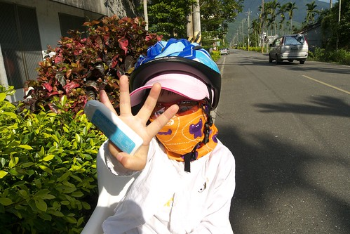

雖然愛愛沒有騎車 可是所有行頭幾乎都比照哥哥辦理 安全帽 遮陽帽 運動型墨鏡 領巾一樣也不少  或許因為這樣愛愛才會如此有參與感吧 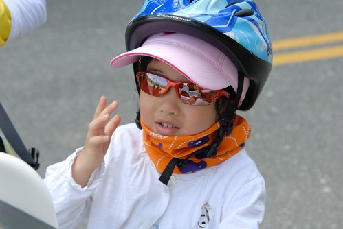

我們都說她是我們的最佳加油隊 而她也總是很盡責的幫我們加油打氣 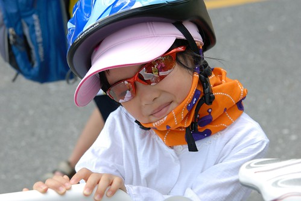

聽說她還會在徹爸賣力爬坡時唱歌給爸爸聽ㄋ 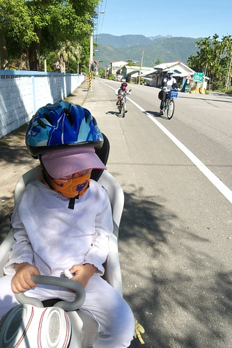

那幾天父女倆是時刻相依的生命共同體 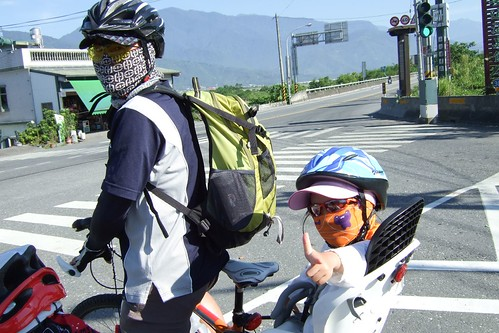

徹爸常笑愛愛說"你都不用騎車最輕鬆 最舒服了" 我說要在後面啥也不能做的曝曬一天可也是最累人的哩 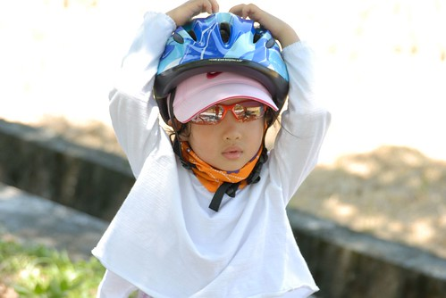

而且這樣的瘋狂之旅害的小姑娘也不能打扮的可愛美麗 每天卸下行頭後跟媽媽一樣的狼狽 羞於見人阿 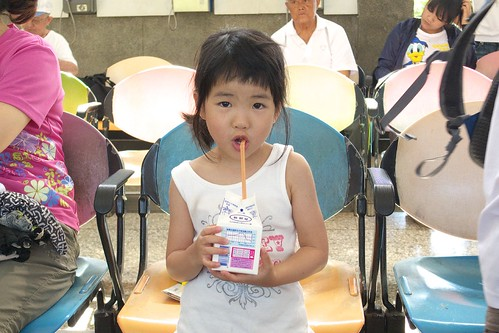

不過有玩的開心最重要啦~~ (姑娘現在總算破了100公分 期待早日破110就可以換車嚕) 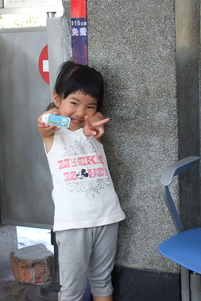

真的! 臭小妹真的玩的有開心 你要相信阿! 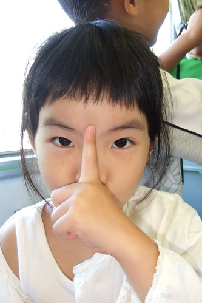

尤其吃著好吃的冰淇淋時  人生真是太美好啦~ 哇哈哈~~~ 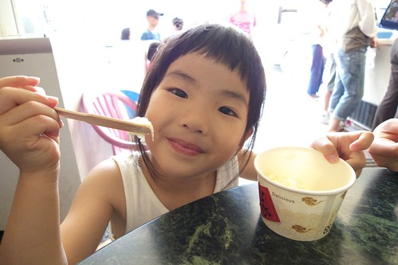
