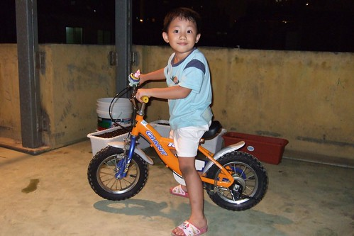

我們家的阿徹會騎車了...  
別問我三輪還是兩輪的 當然是兩輪的(三輪會騎是本能沒啥好現的)  
就是因為是兩輪的娘才敢驕傲ㄚ~~~  
  
學腳踏車總得做好心理準備去"跌跌撞撞"  
但日本台的"生活\*\*王" 專家傳授的腳踏車學習法似乎真的可以少跌一些 學的快一些  
阿徹要開始練習的第一天  堅持的不讓徹爸拆掉踏板 於是跌跌撞撞胡亂瞎搞一通   
除了換來滿腳摔過後的狼狽外 更深深打擊了學習腳踏車的信心  
最後阿徹總算卸下心防 願意讓徹爸拆掉踏板   
練習用雙腳去划車 然後把腳抬起讓車繼續滑下去  
第二次練習明顯的雙腳不協調  常划10步卻只換來滑1步 ( 很像小鴨子努力的踢動雙腳在游水一樣)  
然後不停的因為不平衡而跌倒  越跌越有經驗如何避免被車壓  
第三次練習 提醒他要用雙腳滑然後再把雙腳一起抬起  
阿徹聽進去了 try了幾次滑行的距離越來越長 跌倒的次數也明顯的減少 (但撞牆的次數增加了)  
第四次練習 可以滑行超過5公尺了   
阿徹雀雀欲試的直問爸爸"可以裝踏板了嗎"    
徹爸在評估阿徹已經算是滑的不錯 甚至可以轉圈了  於是幫阿徹裝上了踏板  
然後阿徹習慣性的用雙腳划了一下後 抬起腳踏下踏板....這車就這麼動了  
真的就像電視上說的那樣 裝上踏板自然而然就會騎車了  
真的怪神奇的...看的我跟徹爸大呼小叫  比阿徹還興奮  
"想不到我們的小孩竟然已經大到會騎腳踏車了"  
我跟徹爸對於自己學腳踏車的記憶還很深哩   想不到這樣的故事/回憶也已經發生在我們的小孩子身上  
真的不可思議~~~  
  

學會腳踏車後 每天都"新師好棒賽的"要上頂樓溜一溜  
連風大的颱風天也要上去溜溜車  

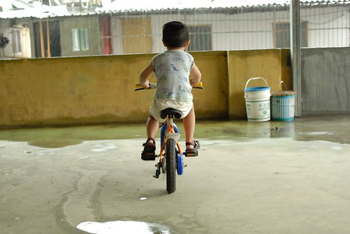  
  
越來越上手 越騎越快  
看的媽媽都有點擔心衝過頭撞上牆壁後會彈飛出去  
爸爸說要學會煞車後 才可以去公園騎車  
所以還是先繼續在頂樓這20多坪的小空地裡繼續轉圈圈吧  
而且順時鐘方向還很不熟練 多練習多練習 (逆時鐘方向可以飛車疾駛 順時鐘方向卻像新手上路)  
  
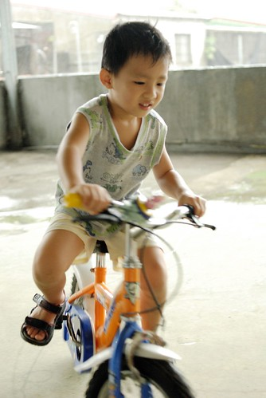  
  
其實會騎腳踏車也沒啥好得意的啦  
只是很替阿徹開心學會了一件對小男生來說是件大事的事  
小孩子的童年就該有個腳踏車伴著的  
  
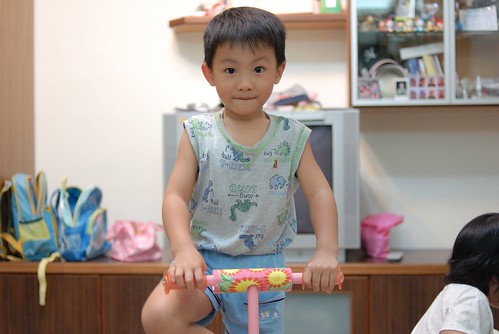  
  
況且5歲這年紀就學會腳踏車應該值得拍拍手吧  
我跟徹爸好像都是7-8歲 上小學後才學的  
不過好像更該替我跟徹爸拍拍手 忍心讓小孩這樣子去摔  
  
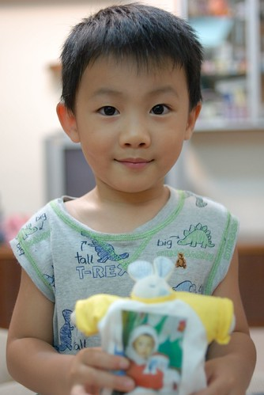  
  
生活中總有玩不完的新意與耗不盡的體力  
  
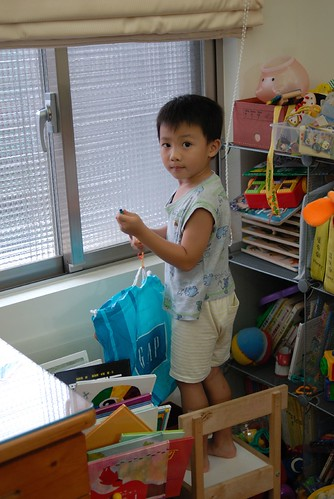  
  
頂樓澆水灌溉一家子最近細心灑下的種子  
期待自家青菜上桌的那一天...(完全之沒信心 )  
  
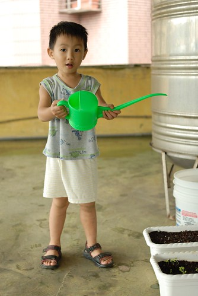  
  
徹品牌之木琴 敲敲打打不亦樂呼  
  
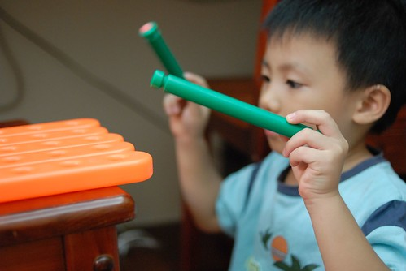  
  
樂高是永遠也玩不膩的玩具  
  
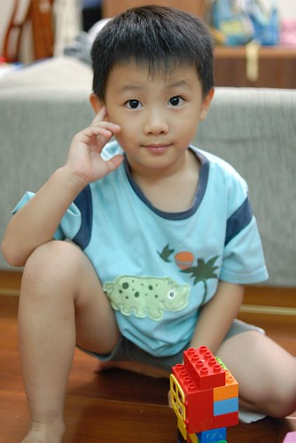  
  
徹牌裁縫機 據說轉一轉後衣服可以變大  
  
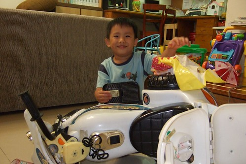  
  
徹爸協助設計的公主裝  
  
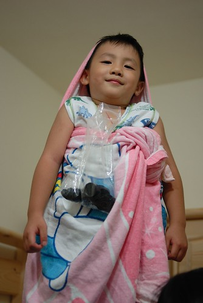  
  
呵呵~日子怎麼會無聊ㄋ  
日子悶的慌的人  養個小孩就不會慌啦  
  
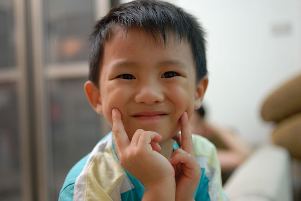
