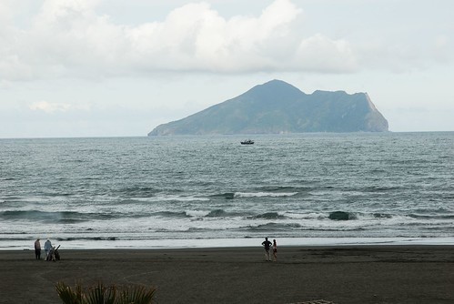
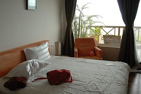
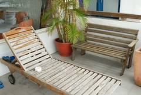

話說....愛徹家距離上次出去走走已經4個月了...

實在是因為太熱了, 所以暫時休兵4個月...

這有點不像愛徹家的風格... 

不過, 因為9月開始我們家的作息會有些許改變...

媽媽於是決定在改變前來個小旅行...

這次選定距離較近的宜蘭....

而且, 這次以玩沙為主題...

於是...媽媽找了一下, 選定了這次的地點...."宜蘭 外澳"...

(相信看到這裡, 大家一定看的感覺有點奇怪,

知道怪在哪嗎﹖﹖哈哈..這篇是徹爸寫的..) 

宜蘭外澳距離雪山隧道出口並不遠...

途中會經過頭城,

剛好就在我們經過的路上有一間有名的冰城...阿宗芋冰城

天氣太熱了, 去消個暑吧!!!

(雖然妹妹有點咳嗽, 但是來了不吃, 還是有點可惜...)  一到門口, 好多人停車壓...

今天還好, 第二天回家時順路買回家時...

車子多到並排停車, 還出動警察來站崗...

  店內陳設還蠻簡單....

  點冰跟給冰都很快...我才幫徹媽照張照片, 冰就裝好了...

  鐺..鐺...鐺鐺..這是這杯拉...

我是覺得芋頭很好吃, 軟硬適中..(不過太香了, 還是覺得有香料的感覺)

 阿徹也覺得很好吃...

  妹妹也吃了不少...不過還是不敢給他吃太多...

在此提一下, 這次徹爸的文章...多了一個PK項目

以下這2張, 是用不同相機拍的...

大家可以先猜猜...文章最後面會有答案...  照片A-1

  照片A-2

   吃完摟...門口有擺著一台很舊的腳踏車,

以前我阿公也是騎這種的...坐墊超難坐的...

小時候, 我都會跟我阿公去老人會...要坐半個鐘頭...

屁股每次都一痕一痕的...

  相信大家都有吃冰吃的黏黏的經驗,

所以門口還有貼心的洗手台, 

吃完冰, 要去玩沙摟....

PK題again...  圖B-1

  圖B-2 這是從民宿陽台看出去的景色...

說實在的, 跟我想像中差很多...

我一直覺得宜蘭的沙灘是很粗的石頭沙灘...

原來我錯了....

 房間還算不錯...

   雖然不大, 也別有一些悠閒的感覺...

 往外海望去...這就是傳說中的龜山島...景色還不錯...

  休息一下, 要去玩沙摟...阿徹提著整袋的玩沙道具...

可開心的很了....

  ㄟ...這是誰拍的壓﹖﹖這是阿徹拍的歐...

以後爸爸跟媽媽的合照會越來越多摟...

 那你們3人當然也要拍摟...

  妹妹一直在看大海...不知道他呆會兒會不會怕大海

(阿徹第一次去海邊可是害怕極了)....

 這是我們住的民宿的後面...

  這是另一家較大的民宿...每家民宿後面有一個步道連接, 感覺不錯...

  這是新落成的外澳旅客中心(後來忘了進去逛逛, 有點小遺憾)...

 還沒到海邊2個人就玩起來了...

 看來妹妹比哥哥大膽多了...沒有害怕的感覺, 大步向前走....

  阿徹突然發現一個小植物...

好厲害, 獨自在這邊生存...我想拔起來, 還蠻深的拔不起來...厲害...

 我們在比較邊邊玩. 這邊人比較沒那麼多...

 海灘還蠻乾淨的...沙灘部分延伸的蠻出去的...

 比較靠近漁港那邊人就蠻多的..

  哎呀...這是什麼﹖﹖死河豚﹖﹖

蠻恐怖的...萬一採到, 應該會掛彩加噁心!!!

 妹妹很快就上手摟...

  媽媽...你在做什麼形狀壓﹖﹖

還一手無法掌握 !!!我會害羞耶...

 妹妹超開心的...笑容伴著美麗的海景...

  至於哥哥...他一直去海邊舀水....

但是一回來倒在洞裡, 馬上就又都不見了...

我跟媽媽一直叫他不要再裝了...

他還是一股腦兒一直跑來跑去...

聰明度有待加強...

  妹妹果然是新手, 常常用手摸臉...

不一會兒, 臉就沾上沙子了...弄了好久才弄乾淨...

這種沙子...會黏黏的...不太好清理...

不過, 好像海邊的沙子都是這樣...

 阿徹連家裡的奶瓶都拿來了...

  我們去的第二天剛好是頭城搶孤...

港邊已經架起高台準備明天的搶孤了...

聽民宿老闆娘說...搶孤那天港口會交通管制...

要開車進去就要前一天去...

 哥哥...好玩嗎﹖﹖﹖

 這是海灘邊的一排民宿...

 後來教阿徹要做個水庫, 水沖上來時就會跑進去了...

 阿徹跟媽媽努力建構中...

 沒錯吧...沒什麼人, 可以玩到爽...

 有了小DC自拍的機會增加摟...

 水沖上來. 又流回去後...海岸變的超級光滑...

 妹妹已經習慣玩沙摟...臉不會常常沾到沙子了...

 不跟海景照張相太可惜了...後面就是龜山島歐...

 妹妹應該在看倒影中的自己吧...

 把湯匙洗一洗...

  走到海裡也不怕摟...

這時候, 妹妹的外褲都濕了...索性就把外褲脫下來了...

這時, 突然妹妹朝海裡衝去..好個小妮子, 這麼大膽... (嘉義家有小泳池. 如果脫的剩小內褲就是要衝進去玩水了...)

但是, 說時遲那時快...妹妹還是太小了, 一不小心就被浪沖倒了...還泡在水裡喝了幾口水...

  就變成這樣了...

後來妹妹就說他要回去了...媽媽只好先帶他回去了...

(當時因為我手上拿小兩, 所以救援動作慢了點...

不然應該不會吃到水的...我要懺悔...嗚嗚嗚...)

  哥哥就跟我繼續待在海邊...繼續蓋著大水庫...

這個水庫夠大吧...

 這小男生真的長大了, 越來越勇敢了...還敢作這種高難度動作...

 玩好久了...該回去找媽媽跟妹妹了...

  回去民宿就要先洗澡摟...

晚餐就聽民宿老闆娘跟書上的建議...

要去這附近的海產店- _更新海產店_...

一開始我還聽錯了, 以為走路10分鐘...

後來媽媽說...應該是開車10分鐘!!!

幸好有聽媽媽的...不然怎麼走的到??

  點了一些菜...在等的時候, 發現筷子上的店名怎麼不是更新海產店﹖﹖﹖

挖勒...不會走錯了巴﹖﹖

  果然..................................

要在前面那家才是....真的是挖勒xxx...太烏龍了...

不過幸好菜還不錯,

但是飯真的太差了...太油了..

怎麼有這麼油的白飯﹖﹖

幸好明天還有一天...明天有機會再來吃....
