好個舒服的清晨...

連阿徹都感受到了...  

要開始第二天的行程摟...

一大早, 外面是晴天的好天氣....

  我的鏡頭跟太陽對照也還是有星芒的拉..

只是醜了一點...

 阿徹在床上滾來滾去...

 你看吧...心情好也不要太得意忘形了...掉下去了吧...

  門上的倒影...看起來, 我還不是挺胖的...

阿徹大概覺得...這有什麼好拍的... 

整理一下, 下去吃早餐摟...

  妹妹昨天睡的不好, 一直咳...以後, 真的要記得帶止咳塞劑...

幸好都是媽媽起來照顧妹妹的...

讓徹爸可以睡個好覺.. (大家都知道...徹爸是不太耐超的..很容易沒電...)  餐廳有可愛的擺飾...

  這是今天的早餐...

突然感覺到...宜蘭的空心菜, 梗都好大(昨天晚上吃的也是很大)...

  外面的景色還不錯...

從網站的照片上看...後面本來應該是庭院...

後來大家連接起來變成一條路...庭院也縮水了...

但是我覺得這樣也不錯...昨天走到沙灘時, 蠻愜意的...  妹妹雖然沒睡好, 但是狀況看來OK...

  餐廳旁邊有一些介紹宜蘭的書籍...

我拿了一本有關於搶孤的書給阿徹...

他好像蠻有興趣的...

  吃完早餐摟...要準備check out摟...

最後再到陽台休息一下...

  我, 媽媽跟阿徹一起在外面看風景...

突然妹妹把門給關上了, 嚇了一跳...

幸好現在妹妹力氣夠大了...試了幾次就開了...

實在很害怕, 她會突然哭出來...就慘了..

 不過媽媽好像沒睡好, 臉有點...

  這張照片怎麼照的呀﹖﹖

莫非是我爬到欄杆外﹖﹖﹖ ----------------------------------------------------------------------------

好摟, 正式出發摟...

今天第一站, 北關農場-螃蟹博物館...

  這是主要建築物, 依簡介來看...事實上北關農場很廣...

但是太陽有點大, 實在無心力去逛整個農場...

 門口有隻大螃蟹...蠻壯觀的...

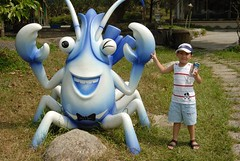       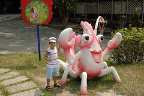 遊樂場還有2隻小螃蟹...這就可愛多摟...

 這是博物館大門...

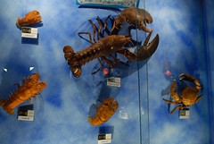    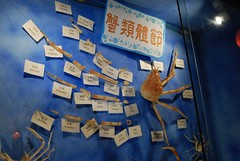 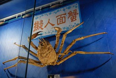    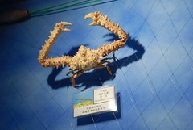 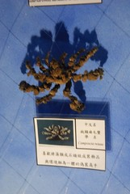              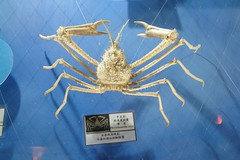 螃蟹蠻多種的...從超正常到超奇怪...都有...

 這應該是館徽吧...設計的蠻不錯的...簡單的方形線條... (奇怪, 這到底是怎麼想出來的呀﹖﹖怎麼幾個方形就變成螃蟹了﹖﹖ 設計真的是要靠天賦的... 媽媽有跳舞, 彈鋼琴的夢...我也有做設計師的夢...)

  這好像是跟日本有合作出的紀念品 (這圖案我好像看過, 該不會我小時候來過吧)...

                    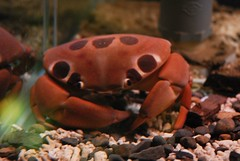              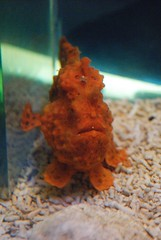 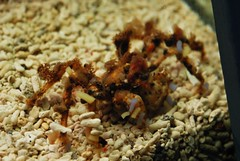    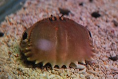 剛剛看到的是標本, 現在的是活生生的螃蟹了...

真的是從超正常到超奇怪都有呀!!!

  整個場館, 是有點濕...有點冷...不過是還可以接受...

在有限的經費下, 可以維持這樣算是蠻不容易的了..

當然...農場要賺錢不能只靠螃蟹...

這裡也有其他農場都有的彩繪...

  這是徹爸第一次陪阿徹畫...以前都讓他亂畫...他開心就好...

這次我不知道那根筋不對...居然陪他畫起來了... (說個小秘密, 我小學學過2年畫圖毆...)

 妹妹也來插花...畫個幾筆...

  如果要我陪他畫, 當然就不能再像以前那樣大紅大紫亂畫..

幸好他沒有太反抗...

 為了不讓妹妹搗蛋...隨便拿了張紙打發她...

  妹妹應該有發現到我們打發她的意圖...

鐺...鐺...鐺鐺...畫好摟...

不過PK題又出現摟...

 圖C-1

  圖C-2

螃蟹臉上 的點點是阿徹的創意...我覺得效果不錯...

 農場都處都有畫好的螃蟹...都畫的超好的...

 農場還有準備一些吃的...油麵, 仙草冰...等等

  吃了一些東西, 乘個涼吧...

哥哥突然要去遊戲區玩...挖勒..中午耶..

好吧..你要去就去吧...

  你看吧...汗是用滴的...

玩夠了吧...該下一站摟... --------------------------------------------------------------------------

中午本來想吃吃小7就好...

但是, 想到昨天的烏龍事件...有點不甘心...

所以...一定要吃到昨天那一間-更生海產店....  他們的座位有圍起來, 風就比較小了...但是情趣少了一點...

 這是他們出名的吻仔魚羹...媽媽說..魚怎麼都小小的...

 照例還是有一盤蝦子...吃起來跟昨天那家差不多...

  青菜就不吃空心菜了..改吃別的菜...

整個吃下來...覺得也不是很便宜...

覺得跟昨天那家差不多(好像還比較貴)...

但是...飯好吃多了(海產店...好像不能以白飯論好壞...)... --------------------------------------------------------------------------

我們的下一站, ---礁溪川湯溫泉飯店---

  一上了車....妹妹終於不支, 睡著了...

我們為了讓妹妹睡久一點...還在小7休息了30分鐘...

川湯的湯區還不錯...

不過, 更衣區...冷氣還是不夠強...

每次泡完, 就又流了一身汗... (可能是太胖吧...我還是對日本的泡湯環境比較讚賞...)  哥哥的泳帽夠炫吧...

台灣的泡湯都好像是遊戲區...

大家是來玩水的...

 妹妹也換上可愛的泳衣摟...

 果然夠胖...妹妹好小隻...

 這個溜滑梯...哥哥應該有玩了30次以上...

  沒錯吧...泡湯區跟玩水區沒2樣吧...

還有水槍勒(耳且是電動的)...

呆了3個鐘頭, 要回家摟...

  這張照片是妹妹跟媽媽在外面等爸爸哥哥時, 妹妹幫媽媽照的...

看來也可以慢慢訓練妹妹照相摟...

 

ps.本來要在礁溪吃刷刷鍋的...

最後覺得開車回板橋也才一個鐘頭...

在外面吃東西, 不僅貴, 還要賭是不是好吃...

還是撐回家吃熟悉的東西好了...
