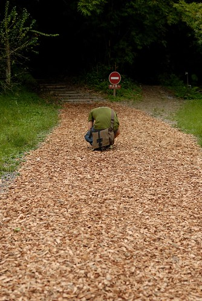
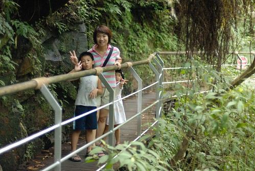
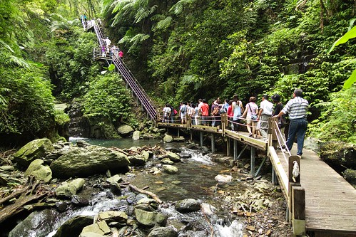

九月底去外澳玩沙前我們順道繞進礁溪探訪同事介紹的林美石磐步道 穿過礁溪溫泉街往佛光大學及淡大分校的山上去 下交流道後約莫30分鐘的車程即可到達 "林美石磐步道位於礁溪高爾夫球場旁，是林務局於2005年規劃完成開放的一處森林步道。 此步道以呈現低海拔森林生態系及「四稜砂岩」石磐景觀為主，步道平緩，路線不長， 蕨類整類豐富多樣，沿途還有溪流瀑布等景緻，吸引不少遊客前來踏青。" 我們用了一小時多一些些的時間走完1.7公里(一圈) 也呼吸了很多的芬多精 看著沿途的大小瀑布及溪流 我跟徹爸說"還真有點日本奧入瀨溪"的味道 徹爸淡淡的回我"差多了" 哈! 不過感覺真的還不錯啦!!  有小橋 有流水 有豐富的森林生態 而且整理得乾淨宜人 只是阿 遊客還真是不少(上山時看到數輛遊覽車還以為是上佛光大學的 結果都是來這的)  這就不好了... 

要抵達林美步道得先走一小段沿著礁溪高爾夫球場旁的產業道路  

道路沿途都有鐵網以防天外飛來一球 

第一次離高球場這麼近的我們 對於那樣美麗的草坪跟氛圍看的嘖嘖稱奇 阿徹問"我們也可以去打看看嗎" 孩子 我們家連球具都買不起了 更別說入會了...期望你長大後嚕 

穿過與高球場緊鄰的道路後(約5-10分鐘路程) 似乎換個景來到了另一個地方  一個飄渺茂盛的林間 

其實走到這裡看到收費亭後我才明瞭原來步道還沒開始ㄋ 所以我稱之前走的叫"產業道路" 步道的入口處有個收費管理亭  我們進去時已經3點多管理員揮了揮手說"不用票了" 雖然有點竊喜省下那幾十元的票 可是出來時看著那些憑票領冰棒的游客 阿徹應該很是羨慕 

收費亭到步道真正的入口前 沿路地面上鋪有帶點香味 踩起來軟軟的小木片 這樣的木頭色搭配後方的一片綠景別有一番的味道 

只是走在上面 有那麼一點奢侈的感覺 

美麗的景緻來個一張吧~  只是小妮子又kimo不好的躲到我身後去了 

整條步道大部分為小碎石或枕木鋪設且期間林木茂盛  還頗原始自然味 

而一些較狹窄且緊臨涯邊的步道旁設有護欄 

而沿途中常可聽到或遠或近流水 瀑布聲  清涼的感覺讓人很想下溪玩水 

愛愛今天的吸盤腳沒帶出門 所以走的有點唉唉叫 

倒是阿徹哥哥被上了"海邊"的金箍咒後 完全不敢喊苦 

甚至懂得調整自己 好好觀察享受沿途的一草一木 

這裡的遊客多到某些路段會塞車 

尤其在這塞的嚴重等了好幾分鐘 

走近後才發現原來這梯子有人數限制 一次只能5-8人通過 

這梯子真的挺窄挺抖而且不算短  體力不好點的走到後頭得雙腳雙手併用狼狽而上 

等著前面人慢慢而上 後頭的我們多些雅致欣賞下頭風景 

溪流是很好展現攝影技術的主題  越來越不單為攝影而攝影的徹爸也忍不住多拍了幾張 

不過還是最樂於拍有感情的清麗老婆 可愛兒女啦 

趕著天黑前去玩沙的我們  一路計算著剩下的路程快馬加鞭的趕路著 走了一圈回到收費亭後  我們趕緊往我們今日最主要目的地 外澳沙灘前進去嚕.... 
