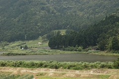
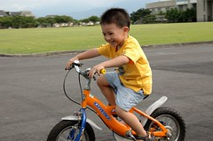
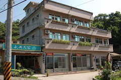
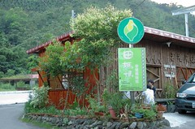

期待了好久  
總算在小愛滿7個月的前夕  
進行一家四口的第一次旅行  
我得先澄清一下  我們真的不是因為要去湊雪山隧道的熱鬧  
純粹因為想找一個近一點的地方玩  
而且想去造訪去年因颱風封山而取消的太平山  
旅館訂好一週後 看到新聞才知道雪山隧道通了  
雖然慶幸著以後可以免去北宜公路九彎十八拐的暈車之苦了  
但卻也擔心著雪燧剛開通的人潮  
道是徹爸從進北宜高就很興奮  
除了進入雪燧後滿懷開心的聽著雪燧的廣播  
更冒著變成烏龜車的風險拿出他的D70猛拍  

說真的雪燧好長喔  
除了廣播人員低沉緩慢的聲音也的確如新聞所說"會嚇著小孩"外  
隧道兩旁灰白的牆壁實在需要好好"美化"一下  
要不然望著這同樣的風景20分鐘 實在很難不讓人想睡覺  
出了雪燧後 首先映入眼簾的便是這些五彩繽紛慶"豐收"的汽球  
哈~感覺像是出了機場大廳後接受人家迎接的花圈

進入宜蘭的第一站便是尋找電影"魯冰花"中的世外桃源"雙連埤"  
(魯冰花是我每看必哭的唯一一部電影)  
雖然因為正中午的艷陽高照而讓這裡少了份"詩情畫意"的朦朧美感  
但其"靜懿"(這好像又是我自己亂說的詞)的感覺卻讓人"舒服的沒有負擔"  
我想若是晚風徐徐的傍晚望著這幅美景一定會讓人更感動莫名的  
(沒想到因為阿徹的帽子忘在這 讓我們很快的又在兩小時之內造訪此處  
 ㄣㄟㄚ...要我把你記到心坎裡 也別用這方法嘛)

  
 行前剛好買了本詳盡介紹宜蘭的旅遊書  
 所以這次玩的吃的幾乎都是書上介紹的點  
 第一個中餐 "林香游家肉粽"  
 置身死巷&小巷中的肉粽店(其實比較像住家)差點讓我們找不著  
 而不知是否因主為外送客 我們彷若意外的人客  
 吃的真是給他有點小尷尬~

 第二站 員山公園&自行車道  
 太陽夭壽的大加上兩個小的都在睡覺  
 因此只有徹爸下車去尿尿&照相  
 徹爸的心得是設施不少但看的出閒置無人用  
 因此作罷臨時轉往宜蘭運動公園  
 一到公園阿徹便迫不及待的要騎他的腳踏車  
 辛辛苦苦從台北載下來的車子當然要給他騎一騎嚕

   
 公園裡看樹 玩石子 看小鳥 騎車車  
 很像就在台北住家公園裡做的事  
 但望著一片大草地跟沒有高樓阻擋的天空就是讓人沒作啥也舒服  
 (這好像就是台北人的悲哀 大老遠跑去看山 看天 看海)

第三站 今晚的住宿地大同鄉松羅村(玉蘭茶園)

  
房間如網路照片&預期般的簡單 清爽  
預定晚餐是"田媽媽泰雅風味館"  
由於通常需預訂加上聽聞老闆晚點要去表演  
我跟徹爸只好在六點鐘帶著因中餐肉粽而仍飽氣的肚子去餐廳  
后~生意果然好  
一人200元的套餐 老闆配菜不接受點餐  
待第一匹菜上來 哇 我跟徹爸的胃口頓時都開了  
陸續上了5菜一湯(其實是六菜 只是第六道炒高麗菜要送來時 我們已經飽到不行)

我跟徹爸為了大快朵頤一番  
把小愛放在他的推車上陸續給了他 盤子 湯匙 飯匙 餅干...  
待嗑完五菜一湯帶著愧疚的心打算買單離去  
才發現 哇還有水果 茶凍以及冰涼的玉蘭茶可以喝(我跟徹爸就站在茶筒旁連灌了好幾杯)  
只好再回座位吃水果 也才被隔壁桌告知剛有第六道菜要送來  
哇~真的是讓人吃的很爽的一餐  
以後有機會一定要再來吃吃

吃飽飯後開著車又去尋找書裡介紹的景點"長埤湖"  
ㄣㄟㄚ...繞了半個多小時 換得的是"本湖已於86年封閉"  
哇勒 才剛發行的旅行書未免太不及時了

晚上洗完澡後其實很想好好休息了  
但是實在好奇民宿老闆在玉蘭茶園至高點開設的景觀別墅  
於是摸黑開了車上茶園景觀亭  
一下車便被滿天星斗給驚艷  
好像打從大學後就再也沒看過這麼滿天星了  
很高興自己現在能帶著阿徹讓他看到這樣的滿天星  
看著天上好多顏色的星星(阿徹說有好多顏色的星星)  
不禁覺得今晚的住宿真是值回票價~  

附註: 陸續會有此次宜蘭行的相關日記報導 敬請大家拭目以待喔~

         照片搶先看

        [http://www.flickr.com/photos/hmchen0328/sets/72157594180982297/](http://www.flickr.com/photos/hmchen0328/sets/72157594180982297/)
