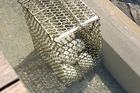

這次旅行的重頭戲是去年與我們無緣的太平山  
(去年7月都已訂好太平山莊房間卻因颱風道路中斷而被迫取消  
 此次封山封了近10個月 直到今年4-5月才重新對外開放)  
往太平山的路上 徹爸開玩笑說'會不會又封山了阿'  
我說'不會吧 沒聽說宜蘭下啥大雨阿'  
結果 嗚嗚嗚...到山下的管制哨購票時才發現'又封山了'  
天阿~你是要我明年繼續來叩關阿  
我們會的  明年您再等著吧  
不過下次我們會考慮春天去的 在梅雨颱風季節前去

雖然太平山去不成  
還是購票進去'鳩之澤' 也就是以前的仁澤  
鳩之澤目前已無住宿 只有溫泉SPA以及煮蛋區  
花了50元買了8顆蛋  還需跟別人借個捕鼠器煮我們的溫泉蛋

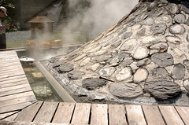  
等待的時間裡只有一個感覺'熱 真熱'  
雖然小愛早已在我揹巾裏睡著  
為娘的我也盡量躲在陰涼處  
但看著滿頭大汗的小愛 還真擔心他會中署  
而一旁的歐巴桑媽媽團可能因為心疼小孩在這大熱天被愛玩的爸媽帶出門  
除了一直叮嚀我別讓小愛熱著了  
也拼命拿她們的煮熟的溫泉蛋溫泉玉米以及蓮霧給阿徹吃  
真是謝謝這些旅行中的有緣人

待溫泉蛋煮熟帶到車上享用時  
看到晶盈剔透的蛋黃  
后~興奮莫名 原來這就是傳說中的溫泉蛋阿  
讚~若不是擔心膽固醇過高 還真想一口氣嗑他個4顆蛋

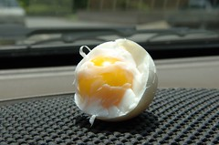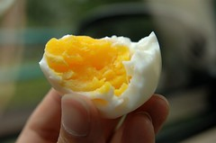

第二站 棲蘭森林遊樂區  
原以為躲在'森林'裏可以避避暑氣  
但消暑的效率卻遠不如躲在咖啡吧的大洋傘下點杯冰涼的飲料

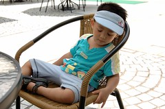

涼爽過後 該走的路還是得走  
徹爸突然對於區內的蔣公行館很有興趣  
小小的陰暗的行館竟也讓他待了數十分鐘  
'相見恨晚'的樣子讓徹爸忍不住說'說不定我是蔣公投胎轉世的喔'  
哇勒~見鬼~

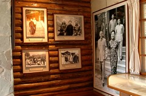

在徹爸跟蔣公幽會的同時  
我們母子三人卻在森林步道中尋找猴子的蹤跡  
只因阿徹看到警告台灣獼猴出現的招牌  
加上路人甲乙敘述著'有人看到猴子'的故事(我深深懷疑是一跟鵝毛變成一隻鵝的故事)  
於是只好跟著阿徹一步一台階的尋找猴子芳蹤達20分鐘之久  
直到他問了20遍以上的"猴子在哪裡ㄚ 怎麼都沒看到"後  
才願意跟隨前面亦無功而返的小哥哥往回走  
要不然揹著小愛的我還真擔心他就這麼一路給我堅持的走下去哩

離開棲蘭 熱爆  
開著車尋找小7買御飯糰解決三口人的午餐  
又餓又累的大熱天裡  
坐在有冷氣的小紅裡大口大口的嗑著御飯糰跟飲料  
只有四個字形容"爽!滿足阿"

太陽實在大到可以殺人  
也讓人除了旅館之外實在想不出哪裡可以不需被曝曬  
只好2點多就在今晚住宿的"若輕新人文會館"大廳裡苦苦等候check in  
會館有點出乎意外的偏僻  
但離傳統藝術中心以及冬山河自行車道卻不是很遠  
會館的建築物,接待人員以及氣氛果如其名很"人文"  
只是對於帶著兩各小傢伙的我們來說  
空間/床墊的窄小以及不是太好的建材卻讓我們對於這裏有些失落

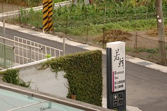

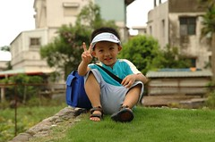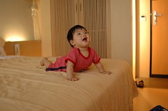

休息了1個多小時暑氣消了點 太陽也小了點  
讓阿徹選擇"玩沙"亦或"騎腳踏車"  
他選擇了騎腳踏車而且還堅持的要騎他的小腳踏車  
ㄟ~這小車要騎到冬山河畔的紅色大橋要2個小時吧  
重點是這對阿徹來說根本是"mission impossible"  
不管我們怎麼警告告知 阿徹就是堅持要自己騎  
好吧~騎多少算多少了  
揹著小愛的徹爸在前頭開路  
而我騎著車慢慢慢的跟著阿徹  
還不時的問他"你確定要自己騎 現在回去換還來得及"  
騎了10多分 歷經了一些上坡段但連自行車道入口都還沒到達  
這小子總算說"不要騎 要媽媽載"了  
於是再折返回會館 放了阿徹的小車而我換了台可以載他的車  
然後一家四口總算開開心心 輕輕鬆鬆的踏著腳踏車  
在微風輕拂下享受冬山河畔美景

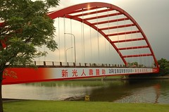

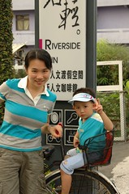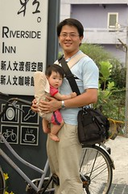

今晚的晚餐一樣是旅遊書上介紹的餐館 羅東"菜根香麵粥舖"  
(雖然宜蘭夜市小吃很有名 但帶著兩個小孩實在很不適合 )  
外觀略顯老舊 但進去後卻別有一番古色古香  
且生意超好 候了10多分才等到位子  
又餓又累的我跟徹爸點了  
芋香排骨麵/海鮮燴飯/筍湯/滷豬腳/魯米血/青花涼拌菜/一碗阿徹白飯/3瓶飲料  
真是給他不問價錢的點 (結帳才350元時 更是滿意到不行)  
不過厚~不知道是否因為太餓 真的是好吃到撐飽肚子也爽  
為了不留下絲毫食物 我們三人的飲料竟然都沒喝完  
大家就可以感受到我們寧可讓肚子裝滿其他食物的心意了  
一陣杯盤狼急後才想起忘了照張相留念一下  
ㄟ~只好離去時照張店舖外觀以滋紀念  
真的喔~超級好吃 去宜蘭玩的人有機會可以去試試~

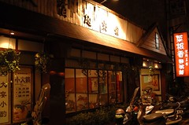

酒足飯飽之餘卻錯過了傳藝中心的星光票機會  
只好回到會館繼續"續攤" 會館提供的星光咖啡吧  
有蛋糕有水果有現打的鳳梨汁/金桔汁還有熱茶咖啡小點心  
每次出去玩都會為了水果攝取不足而傷神  
甚至都會帶著水果刀跟幾顆蘋果出門  
覺得會館這樣星光咖啡吧的安排還不錯啦  
所以如果是沒帶小孩的幸福男女要去宜蘭玩  
我還是會給他小小推薦這個住宿地的

雖然吃水果時阿徹便喊著累了 想睡了  
回到房間後卻又脫胎換骨般的生龍活虎  
大戰1小時候才願意睡去  
10點鐘一家四口便已都疲累的沉沉睡去  
養足精神繼續明天的行程  
雖然大家都已經開始想我們的家了  

