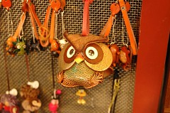
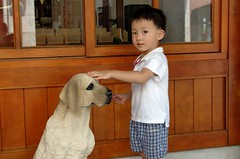
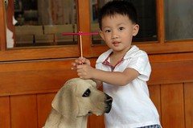
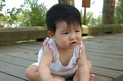
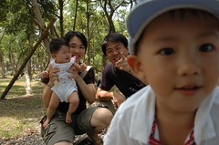

OH YA!再半天就可以回家了  
哈~很奇怪的心態  
真的是給他熱到有點發昏發傻了

吃完早餐後再次進入傳統藝術中心  
因為昨晚答應了阿徹要讓他在此買兩樣禮物  
幸好這除了停車場需直接曝曬於大太陽下外  
有不少的室內展館跟騎樓可以讓人棲身

傳藝中心裏販售不少的傳統手工藝品  
也可看到不少的國劇臉譜或是布袋戲偶  
對於'井底蛙'阿徹 他都稱之為'鹹蛋超人'  
阿徹稱那些國劇臉譜為鹹蛋超人 稍微可理解一點  
因為他似乎覺得只要是戴面具的超人就稱為鹹蛋超人  
但也叫霹靂布袋戲的戲偶為鹹蛋超人就有點'那個'了  
糾正他'那不是鹹蛋超人'時  
小子還會堅持的有點生氣說'是啦 那是鹹蛋超人'  
而且還是有點大聲的說'那是鹹蛋超人啦'  
惹的路過的30多歲不懂童心的男人用著嗤之以鼻的語氣笑著'哼 鹹蛋超人~'  
哇勒~老兄礙著你啦

離開傳藝中心接著就是去看Punkin嚕  
原以為瓜棚底下應該是躲避暑氣的好地方  
(連會館人員都說那很適合帶小孩去避避太陽)  
但又錯啦~  
覆蓋著塑膠棚的南瓜園就像烤箱一般  
照了幾張相後便又急忙的躲回車子裏了

行程的最後一站'羅東林業所'  
小小的地方但感覺涼爽舒服

  
請徹爸拿出腳架為一家四口的第一次旅行留下全家福紀念  
哈~又是狀況百出  
尤其是阿徹 耍寶的讓人好笑又好氣

結束拍照後 到林場外頭的"林家肉羹"吃中餐  
生意果然超級好 很多外地遊客慕名而來  
但我跟徹爸對他的評價卻是'還是陳嬤的肉羹好吃'  
滿頭大汗的回到車上後  
一家三口大喊'喲后~回家嚕'  
總算結束這次三天的宜蘭行~

繼去年7月底在花蓮熱到  
今年6月底一樣在宜蘭熱昏  
我跟徹爸已經決定 幾年內再也不會在夏天出遊了  
秋天真的還是比較適合出遊~
