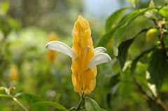
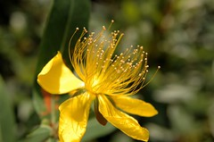

這趟旅行中最常看到的兩樣東西是"蜘蛛"與一片平坦的"稻田"

 (很像從他處飛撲而來的蜘蛛人  覺得爸爸把蜘蛛照的很有力道 很人化)

(三天中體會了蘭陽"平原"的美感 舒服感 )

很多人用很'懷疑'的口氣問我們'宜蘭這麼好玩可以玩三天阿'  
哈哈~ 看完三天的遊記 你覺得ㄋ?  
其實旅遊對我們來說  
就只是去外頭看看藍色的天空 白色的雲 綠色的稻田森林以及各式各樣的花草 昆蟲  
滿足媽媽愛玩的心  
啟發阿徹好奇好玩的心  
誘發爸爸按下相機快門的衝動與感動

得承認帶著小孩旅行是累的  
尤其還帶著兩個  
一個是尚未有自主力 全需仰賴爸媽揹抱的小愛  
而另一個是更難掌握預期的 好奇/精力旺盛/調皮搗蛋的阿徹  
雖說阿徹們現在是被動的被爸媽帶去旅行置身大自然中  
但期望阿徹跟小愛有天也能跟爸媽一樣會盼望期待家庭旅遊日的到來  
我想信旅行可以讓小孩自然而然地愛上大自然 甚至貪心的期望阿徹日後可以是個自然生態工作者 保護者  
且旅行是一家子累積共同回憶最好的方式~

上面兩張照片看的出攝影者的功力相差很多  呵呵~  
講究功法的徹爸於左圖完美呈現背景與人物  
而把單眼當傻瓜使用的媽媽就這麼的把背景橋座切半~嘿嘿
