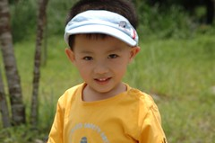

阿徹篇~  
旅行對於阿徹來說應該已經很習慣了  
從7個多月大開始他的第一趟環台花東旅開始  
每年總會有2趟以上的過夜旅行  
從第一次旅行時的傻不嚕東(就像妹妹這樣)  
到現在的獨立自主 甚至意見超多  
雖說有點懷念以前那個不會頂嘴的傻阿徹  
卻也喜愛現在這個嘰嘰喳喳 滿腦子鬼主意的大小孩

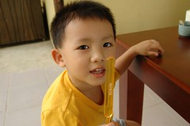

阿徹的眼睛算是很銳利  
蝴蝶 螞蟻 蜘蛛常常逃不過他的眼睛  
常常會就這麼認真的望著這些昆蟲

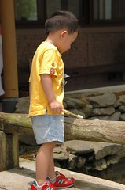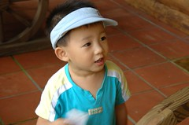

也常常會太認真的玩過頭  
起床後就像上了發條式的停不下來的玩  
直到12小時後力氣耗盡 瞬間沒電睡著  
也許應該說他很有玩的本事吧~  
只是阿徹ㄚ阿徹~  
當爸爸媽媽都已累趴時 請不要再喊著'再玩一下下'了  
你的一下下都好久喔~

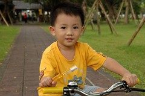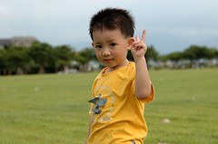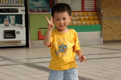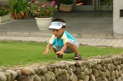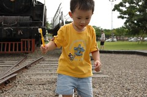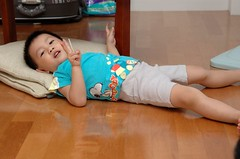  
小愛篇~  
覺得小愛是這趟旅行最大的受害者  
大太陽加上小愛濃密的秀髮  
小妮子常不小心就呈現這般彌留狀態

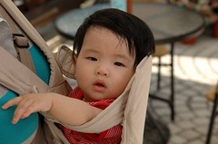

偶而卻也發現小愛異常專注的注視著某物  
(可見旅行還是對他有所收穫的啦)

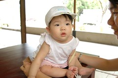

第一次讓小愛的雙腳踏上草地  
小妮子的反應是'這啥東西阿 刺刺的哩'然後縮起他的小腳指  
模樣真是可愛到讓人更想捉弄他

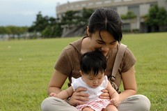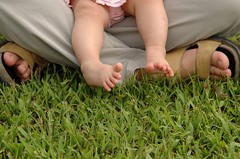

第二次要再讓她踏上草皮 小妮子就抵死不從 唉唉叫了

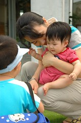

也許小愛的小小腦袋裏想著'怎麼大熱天的帶著我四處跑阿?好熱好熱~'

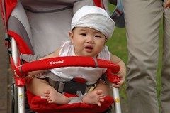  
真的得跟小愛說聲'謝謝' 謝謝你陪著爸爸媽媽還有阿徹哥哥 這樣瞎玩  
真是難為你了~  
但是媽媽相信 很快的你也會跟哥哥一樣喜歡這樣的瞎玩的~

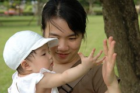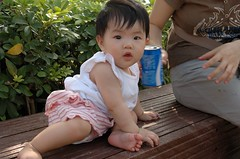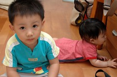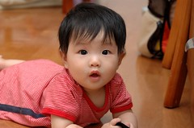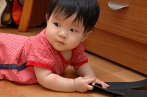
