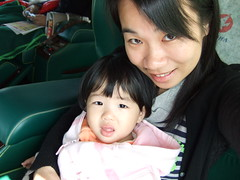

開心的放完9天年假後 跟徹爸才赫然發現3/3徹爸跟阿徹都要補上班上課  
因為過年前早跟媬姆說我這天不用上班   
所以也不好意思再把小愛送去然後自己一人去放風  
原本還在猶豫掙扎要不要讓阿徹翹課 母子三人一起在家混  
但週五同事臨時邀約去她新竹家中作客  
由於已經推拖太多次不好意思再拒絕  
於是決定瞞著阿徹 自己一人帶著小愛搭火車去新竹  
原訂10點5分的自強號火車 9點30出門 9點50分到板橋站  
一點都不意外的買不到座位票    
打了通電話給同事告知"沒有位置所以不去了"後   
看著窗外藍天白雲 決定推著推車跟小愛散步回家去  
出了板橋站看到客運站 突然發了神經走進客運站"心想如果不用等太久 有車坐就來去吧"  
結果購票 上車 開車 不到5分鐘 我跟小愛就這麼在開往新竹的阿羅哈上  
單程120元 客機座椅 個人數位電視 還有茶水餅乾服務 很物超所值的感覺  
突然很慶幸自己沒買到火車票 其實自己超怕火車上的吵雜與不隱蔽性的)  
  

1小時20分鐘的車程裡 小愛安靜的玩玩電視按鈕 吃吃餅乾 喝喝水   
然後在溫暖陽光的斜射下 躺在我懷中睡著  
看來~小愛真的很有帶出去玩的命  
  
到了阿姨家  怕生的小愛熊熊被嚇的流了一些眼淚  
也只敢賴在媽媽身上玩阿姨從德國帶回的小鴨(一開始不知道德國帶回的隨便小愛扭捏)  
等待阿姨做飯的一個半小時裡 總算放鬆的自個四處走走看看  
只是新婚的阿姨家 有太多精巧又低矮的裝潢與擺設  
媽媽緊張的一直跟在一旁 身怕一個不小心就毀了桌上的小花 地上的白地毯  
阿姨很貼心的幫小愛煮了一"鍋"粥   
看到那鍋粥 忍不住慶幸自己還是有來新竹 要不然可就太對不起阿姨了  
(雖然小愛最後只吃了小小一碗 不到1/10的量)  
大夥圍桌吃飯時 小愛也席桌湊了一腳  吃義大利麵 喝香菇雞湯  
繼吃粥時不小心打翻些許於白地毯上  
媽媽又不小心被小愛ㄎㄟˇ到而打翻半碗湯於地上  
嗚嗚~真是超..超..超級不好意思的  
雖然大家都說小愛的表現很優了  
但媽媽還是覺得帶小孩到沒有小孩的人家中真是一大考驗~  
  
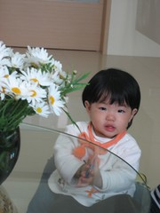 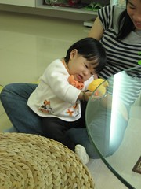 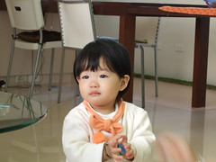  
  
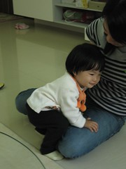 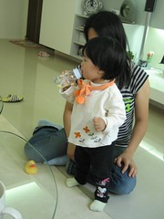 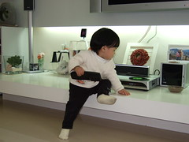  
  
吃完中餐 就匆匆離開趕搭3點發車的阿羅哈(完全不考慮搭火車了)  
小愛累的在往車站的途中就在叔叔車上睡著了  
因為媽媽要忙手忙腳的揹著一個大包 抱著小愛 掛著推車  
小愛在下車的時候還是被驚醒了  
不過小愛並沒有哭鬧 還是靜靜的讓媽媽抱著牽著 買票 泡奶喝奶 等車上車  
上車玩了幾分鐘的電視按鈕後 就又坐躺在媽媽身上沉沉睡去  
(小累卻睡不著的媽媽還無聊的搞自拍)  
4點10分抵達板橋站  小愛又在下車時被驚醒  
然後又靜靜的被媽媽放在推車上 慢慢散步回去接阿徹哥哥下課嚕~  
(途中經過百事特 媽媽又忍不住進去逛逛冬出清 小愛又坐在推車上等了半小時 )  
  
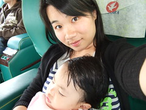  
  
以往都是把妹妹放在保姆家 然後帶著哥哥去喝喜酒 吃好料啥的  
今天是第一次沒有帶哥哥只有帶妹妹出門  
雖然很期待 過程也很令媽媽開心滿意 但心裡還是對阿徹哥哥有小小愧疚  
比平常早了40多分鐘去接阿徹 然後帶著兄妹倆到公園裡玩玩  
小愛真的長大了 可以自己走樓梯上滑梯 穿過管子 溜著小滑梯下來  
也可以自個坐在搖馬上了(不過體重太輕 搖不太動哩)  
阿徹應該很開心 妹妹已經大到可以跟他玩一樣的玩具了~  
  
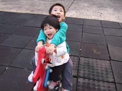 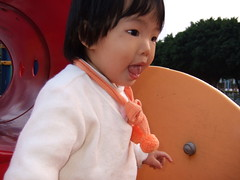  
  
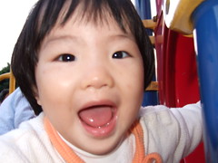 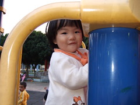  
  
今天媽媽真是對這對兄妹太好了  
離開公園後還去50元批薩買了披薩 薯條套餐犒賞兄妹倆 (彌補阿徹 獎勵小愛)  
哥哥津津有味的吃了半個小披薩 沾著番茄醬的吃薯條  
小愛也煞有其事的沾著番茄醬 薯條一根接一根  
對小愛來說 真是充實又愉快的一天ㄚ~  
  
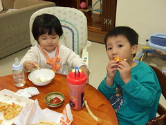  
  
隔天週日 徹爸去打球  
媽媽第一次帶著兄妹倆坐公車回陳嬤家  
雖然只有短短30分鐘的車程 但要帶著兄妹倆還有推車還有奶粉 換洗衣物啥的  
也算是個令人期待又難以預期的挑戰  
阿徹遵守承諾的自己一個人坐(以往坐公車 坐捷運都會怕死的一定要人抱著坐)  
小愛也乖乖的卡在我跟哥哥中間  
原先最擔心的下車 果然在亂中有序中三人平安落地  
(真的忘了沒牽著的阿徹是怎麼自個跟在我後頭下車的)    
到達陳嬤家時 陳大哥不可置信的問我們三人是怎麼回來的  
哇哈哈~像陳嬤說的"生了兩個 自然有辦法帶"  
有了這第一次經驗  以後徹爸可以放心去打球啦(記得打完球來接人就好)  
真高興離正常日子越來越近了~  
  
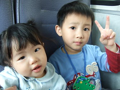   
  
週日這天天氣依舊晴朗舒服  
幫小愛穿了藍色小洋裝 綁上兩根頭髮 總算比較像清秀的小女生了~  
(最近徹爸常跟我說 真的不用帶妹妹去把頭髮修一修嗎 很醜很像豬哥亮哩  
 為了證明這醜的過程是值得的 媽媽第一次這麼幫小愛紮頭髮 效果不錯 清爽許多)  
  
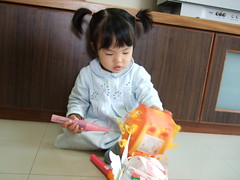 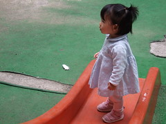
