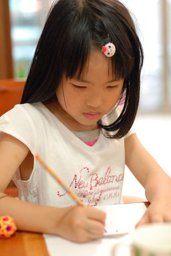

最近愛愛發生了幾次 躺在床上等入睡時跑出來找我們說"我會怕" 紅著眼的模樣煞是惹人愛憐 昨天晚上當我們跟阿徹各自忙著時 愛愛又突然一個人落寞了起來然後又喊著怕 我跟愛愛說"有什麼事要跟爸爸媽媽說 如果只是放在心上 大人不會知道也沒法幫你" 然後我請愛愛收拾好哭哭臉或是願意告訴我時再來找我 洗澡緩衝情緒時 愛愛一臉準備好似的開口說 "我常常會想起去防災教育館看的影片 最近練習畢業典禮 每次聽到消防局那首歌裡的消防車聲音我就會怕..我想要你們也要看那個防災影片" 我問"你是怕如果發生火災時 爸爸媽媽不知道怎麼處理嗎?" 愛愛說"我希望你們知道可以怎樣避免火災" 我說"好!那我跟老師借影片看 不過你可以說你在影片裡看到什麼嗎" 愛愛說了好幾項注意事項 例如電線不可以纏綑 不可以一個插座同時用很多電... 我很訝異她記得且能說出這麼多我覺得似乎超乎她這年紀能認知的事 況且教育影片的用語難免正經又拗口 那當下我慶幸我沒有一開始就用一堆"好"或是"別想太多"這類的話 說是轉移其實是敷衍來回應她 最後愛愛突破心房說出她這陣子一直藏在她心頭的恐懼 "我怕如果發生火災 爸爸媽媽受傷了 我不知道要去哪裡找爸爸媽媽..." 我總算明白愛愛擔心的不是沒有人照顧她 而是她害怕不知道爸爸媽媽在哪裡 害怕看不見爸爸媽媽 我試圖跟她解釋有關意外 有關死亡... 但我發現愛愛很難理解/接受如果這些發生在爸爸媽媽身上 的確! 連我自己都覺得好難講 好難懂 好難作好準備 好難... 愛愛說最近每當她沒事做 無聊 或是覺得孤單的時後(我又很訝異愛愛說出孤單這詞)就會想起 然後開始害怕 我對愛愛說"那你以後覺得好像要開始害怕的時候就大聲告訴我們"我開始害怕了" 我們就給你個大擁抱 然後一起說故事 做事情..." 我想這是媽媽目前能給愛愛的幫助~  

後來我跟徹爸才分別想起 其實這樣的愛愛很像我 小時候的我 爸爸媽媽生意很忙 哥哥又都住校  常獨自在家的我就像這樣會想起所有可能發生的意外 我們跟愛愛說 每個人都會有害怕的事情 就像哥哥睡覺會想起恐怖的事不敢自己睡覺 愛愛似乎比較能理解自己會害怕 也應該有比較同情哥哥的處境(起碼昨天晚上二話不說就跟哥哥一起睡覺了) 不過我心裡也真是很訝異原來每個人心裡真的都住了個小鬼 即使是再堅強的人...  但對付心裡小鬼最好的方法就是把心灌上滿滿的愛 尤其是家人的愛  曾經徹爸跟我說"不要把自己小時後的期望轉移到小孩子上" 其實我小時後最大的期望就是每天回到家有個可以開開心心說東說西的對象 讓我感覺不孤單而已 所以我現在每天跟孩子說好多話 也喜歡他們喜歡跟我說好多話 我堅信一個能明白且感受到自己在愛裡長大的孩子 未來一定不管怎樣都能堅強過下去  不過話說真的覺得快要念小學的愛愛最近又長大了好多 前幾天一家子在遊戲區玩數字遊戲時 看到愛愛坐在那張從小嬰兒就開始坐的小椅子上  才發現椅子已經變的這麼小了  這張小藍椅的小主人不知不覺間已經長大嚕  長大到不只椅子快坐不下  連找數字的速度也快許多  只是阿~ 怎麼長大後反而禁不起輸ㄋ 連兩次第四名 竟然就哭了起來...這樣不行喔...數到10 如果還哭就要打屁股了... 幸好愛愛的情緒止住了  而長大的另一件事 愛愛真的會寫自己的名字嚕~ 會寫名字了 算是取得念小學的資格了吧!!! 呵呵~ 
