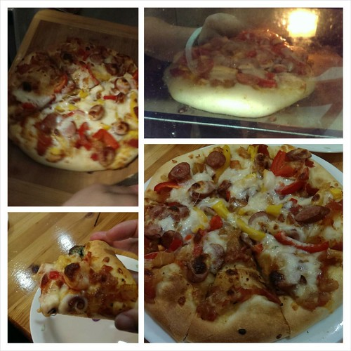
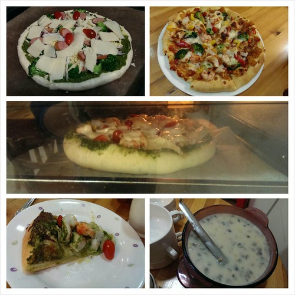
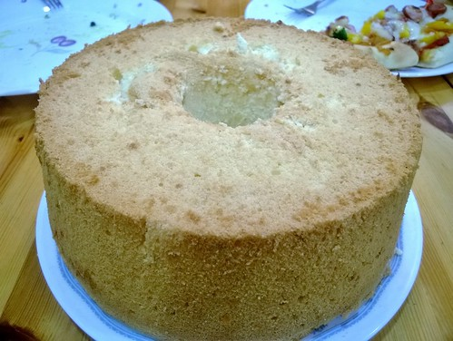
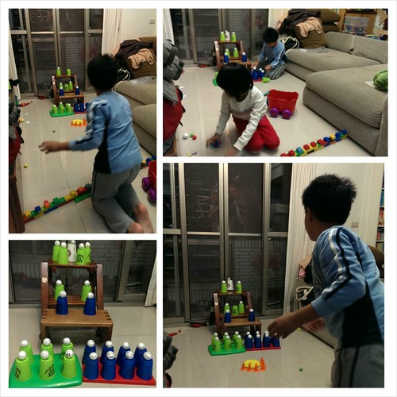
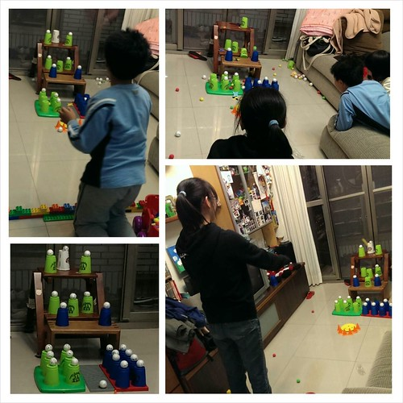

徹爸曾經笑過我 光一招pizza就可以打發所有來家裡的客人 哈哈哈~ 還真的是這樣... 因為女主人只會家常菜 既不特別 還怎樣都比不過客人的媽媽們 所以倒不如讓大家嚐嚐這外頭絕對吃不到的充滿徹家風格的手工pizza 況且 家裡也難得有客人 久久吃一次pizza也是挺不錯的 尤其剛出爐的pizza 起司還會牽絲的 熱呼呼急下肚 真的so good~自從六年前開始玩麵粉後 家裡買外面pizza的次數好像三根指頭數的出 偶而好奇去吃外頭窯烤pizza  雖然好吃但一頓吃下來貴三三還吃不飽 每每這時後 真的所謂 世上只有媽媽好阿~

每次做pizza好像都是忙匆匆的備料 入爐 然後等pizza一出爐 更是趕緊緊的分切以讓客人享受最熱呼呼 會牽絲的pizza 那天我團團轉著 同事竟也拿著相機跟進跟出 我說 "廚房好亂 不好拍啦" 同事笑說"這才是家的樣子" 看到同事處理後的照片 哇賽~ 女主人我的屁股真的忍不住翹起來 pizza看起來好有一回事阿!!!  那天備了青與紅二種醬  而材料除了彩椒 青花菜外 還有海鮮跟火腿二種 2\*2 四種組合剛好配和四個pizza麵團  自己玩的很開心  那天還烤了一個蜂蜜檸檬戚風蛋糕 直被我念不上相的脫模動作  一樣的被同事拍的超有FU (老闆娘的FU 哈哈)  好久沒烤戚風了  還是好喜歡這樣家庭版戚風的清爽口感 雖然酸溜溜  簡單的pizza 濃湯與蛋糕 再配上暢飲的可樂 以及徹爸回家時順道帶回的好幾袋鹽酥雞 這晚的聚餐很棒阿! 而徹家更special 的待客之道是飯後還有小人版的夜市遊戲可以玩喔  雖然徹家很孤僻　沒啥朋友　但有朋自各方來不亦樂乎阿～ 
