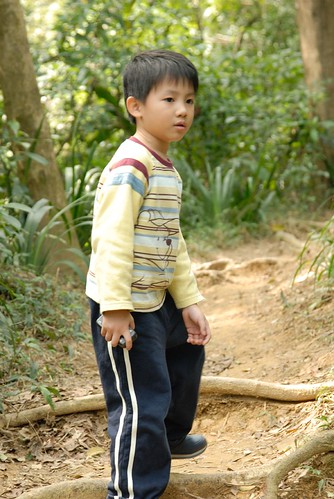
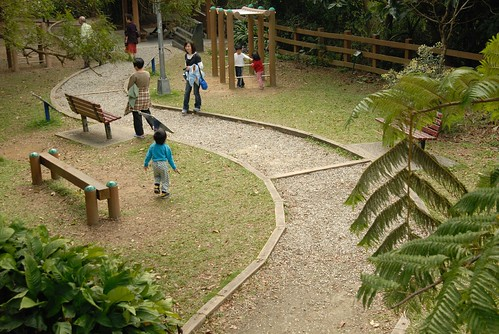
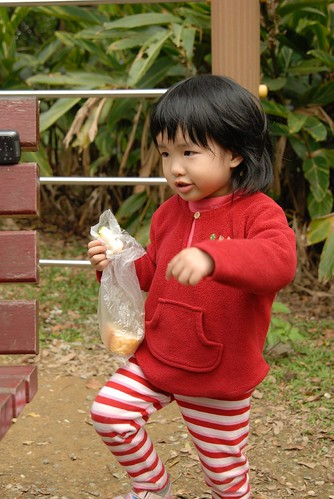

今年我跟徹爸是打定主意要多帶阿徹小愛去"健行走路"的 尤其阿徹的"不要"嚷的越兇 我們就越偏要帶他去 很變態的一對父母 哈哈! 宜芬曾經問過我"為什麼這麼要求小孩爬山/走路" 呵呵! 也許是因為媽媽一直很愛山吧! 也許是我跟徹爸喜歡在山上健行的那種感覺吧! 朝著目標 走就對了!   過程是種折磨也是種享受 而站在山頭登高望遠時 身子是熱的 汗在流著 但心頭鬆了/笑了 另方面我們應該還是有貪心的希望透過走路的過程磨練阿徹的心志吧 一個可以享受走路甚至堅持走完的人以後應該比較可以吃苦吧! 我這麼想...

過完農曆年沒多久的二月中 今年開春的第一砲: 富陽自然生態公園~

很難想像在台北  在出了捷運站只要5分鐘路程的那裏能有著這麼一個像是森林的生態公園 走在裏頭偶而還可以聽到捷運轟巄巄的聲音  似乎提醒著自己還身在台北中 而站在福州山遠眺101更讓人深信自己是在台北沒錯 呵呵~ 就是很衝突的感覺啦 繁華的台北 vs 原始的生態公園 也許這也是一個城市的多元發展吧~

走過大街穿過小巷  富陽生態公園就這麼藏身在路的盡頭

一步踏進公園裏很難不被這片原始林態給嚇到了 哇勒~未免太別有洞天了!!!

連入口處旁的廁所也很有感覺說 (公園裏唯一的廁所)

(阿徹那陣子照相非常愛這樣子搞怪 有夠不可愛的) 

穿過入口處的小廣場後 緊接著就是石子小路 

才要開始走而已 怎麼小愛的氣色就看起來不太好哩?!

園區沒有太大但也不太小 尤其"生態"公園該有的 賞蝶區 蛙鳴區 生態區啥的都俱備了

路兩旁的植物也可都春意盎然ㄋ

因為我跟徹爸一心想挑困難度高一點的路走 於是一個不小心我們就走往了福州山的步道上 原本要走的"生態園區"也就大半略過了

石子路  木樁路 然後石階 再來還有這種黃土小徑 就路況來講就已經夠豐富了

小愛很棒的自己認真努力的走著

阿徹今日也很認份 不敢亂哇哇叫

慢慢走 慢慢看 真的不會很累啦~

兄妹倆競技似的互有領先

累了 就停下來喝口茶休息一下

YA! 補充體力後又活跳跳啦

很棒的小愛  完全靠自己的小短腿走完

累的時候也只是牽著媽媽的手 靜靜的走著

快到休息的涼亭了! 提起勁一口衝上去

不知不覺就到達頂點福州山公園啦

看到平衡木還有力氣躍躍欲試

學校體能課有上過 走的很好嚕

這個皮小子當然就更不用說了

下面照片中的另一對祖孫倆 原本阿嬤祇是帶著孫子到生態公園散散步而已 可是平常沒玩伴的孫子看到阿徹小愛很開心 硬是拉著阿嬤跟我們一起走步道 雖然阿嬤得一手牽著孫子一手掛著滑板車 很辛苦 但阿嬤說這是孫子第一次爬山  想不到他竟然可以走完 應該也很欣慰吧 小男孩在下山時 一直問著我問著阿嬤  我們可不可以去他家 甚至不小心讓他聽到我們等會要去M時 也吵說要一起去 我最後只好很認真的請他乖乖跟阿嬤回家休息 而他竟然就生我的氣不跟我說再見了 呵呵! 很直接的小孩反應  但我想或許這就是獨生子女的孤單處吧

福州山公園有一瞭望平台 可以清清楚楚的看見101那根柱子 看到101 我跟徹爸兩人第一個反應是 哇! 跨年還這看煙火應該覺對很清楚吧

上下兩週分別是單眼小兩跟DC小P拍的 我也搞不清楚哪張是哪台了

9點半多出門到現在也中午12點多  愛愛的小肚子早已餓了 先吃早餐剩下的麵包撐著 等會爸爸媽媽要犒賞去吃M叔叔哩

沿路花花蟲蟲不少  春天果然是個美麗的季節 百花齊放 萬物復甦阿!!!

如果我沒說錯的話這是野薑花 以前在台中唸書時常去夜市買

今天的好天氣加上近中午時刻    看到不少小蝴蝶出沒

透明小蜘蛛

好毛的毛毛蟲   從沒見過這麼怒髮衝冠的毛毛蟲

生態公園內常可聽見蛙鳴聲 可是卻找不著看不到任何青蛙 倒是一漥漥的水池裏蝌蚪不少 有的甚至已經漸漸長出雙腳了ㄋ

石階尚不知名的紫色小花   葉瓣大小就跟幸運草一般大

春天當然少不了杜鵑花嚕

很有趣的枯葉 一片片漂漂亮亮的捲起來 徹爸說裡頭應該有蛹吧  可是裡頭又是空的應該真的是葉子自己捲起來的吧

期間也看到不少人來這騎車 莫非這就是傳說中的越野?! 只能說現代人真是@#@  這樣挑戰極限...

雖然來回也只走2個鐘頭左右 (徹家都是邊走邊看 速度很不快的 => 路程不多) 但這樣的路況阿徹跟小愛都能不唉唉叫的走完 很棒了喲!

哈哈~ 免不了的我跟徹爸的自拍 (背景很像在哪個深山野外中吧)

全家福也來自拍 (有了小P的廣角功能 全家福自拍越來越容易了...呵呵 我好像有廣告嫌疑喔)

離開公園先去M叔叔填飽肚子  還有一項今日大任務等著我們ㄋ (台北市的街道真的比較乾淨 衝著台北的街道真的還蠻羨慕台北市的)

在M叔叔塡肚休息半小時後 我們又出發行軍

要去哪? 要去公館買拼圖! 用走的? 是的 用走的! 走多遠? 徹爸查了google Map 從捷運麟光站到台科大距離兩公里 嗯~ 不是太遠 所以我跟徹爸一開始就打定主意要用走的  因此今天才搭捷運出門的 只是再加上台科大到公館台大校門口這段路  竟然走了1個半小時多...

反正就又是順著路一直走阿走  只是走到路程中段的辛亥路時遇到了撞牆期 進退兩難  回頭不是 前進又路迢遙

辛亥路這個好長的十字路口 剛好讓阿徹小愛可以坐下來喘一下

很多時候一家子就這樣默默的各自走著

偶而看到好玩美麗的風景事務 再吆喝其他人一起觀看

從早上9點半從家裏出發到這時候已經下午3點多 除了中午在M叔叔坐了半個小時外 其餘的時候我們都是在站的/走的狀態 走了一個多小時快到基隆路的時候  小愛的眼皮已經沉重的像是馬上可以倒地睡覺 而當徹爸抱起 讓她可以靠著休息時 果然咻的就睡著了 而且沉到當我們到達公館的拼圖店努力要叫醒她起來選拼圖時 怎麼樣都喚不醒

而阿徹哥哥走到後來則是連話都不想說了 雖然偶而他報怨著"他的腳在痛" (可能走太多路小腿在痛了) 但他還是低著頭猛走 連休息都不要 因為他有聽進去媽媽說的"再撐一點 很快就到了" 所以他不想休息 只想趕快走到目的地 而到達公館謎屋後 徹爸讓他挑了一個喜歡的皮卡丘拼圖當作給禮物 阿徹的辛苦應該就都拋到九霄雲外了吧

(一家子走到台大校園裡時才總算有目標離我們不遠已的真實感...  )

買完拼圖後轉搭三線的捷運 總算在4點半回到我們板橋的家 今日的行軍之行圓滿落幕~~

ps. 遊記如果跳著寫 跳過去的那個就會越難問世了 鑒於我的網誌編輯夾裏已經躺著去年的燈會 小人國 朱銘美術館... 今年的不管怎麼樣還是一個一個依序寫下來的好 免得自己對愛徹家旅遊紀錄的愧疚感逐年攀升
