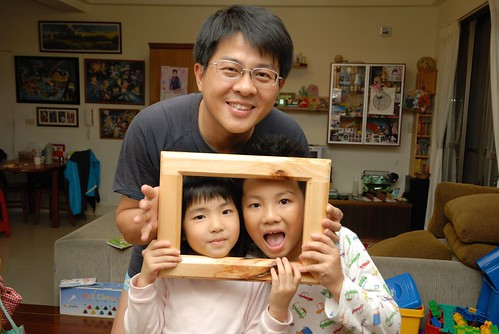

猶記得我們才熱血地參加100年的元旦升旗與健走 轉眼間又是新的一年的開始 101年的第一天跟家人一同吃飯時 經媽媽提示赫然發現自己已經要38歲了 天阿?! 真的嗎!? 我不敢相信這事實 認真的算了算... 果然自己真的快有這樣的年紀了! 也難怪徹爸會被人家說是中年男子了! 不過我比較在意且甚至感覺有點屌的是 今年我就要全面升級為小學生的媽嚕~ 這一年裡 大班的愛愛變的更活潑 更有主見 還超級地期待變小學生 小三的阿徹經歷了更多現實的學習考驗 雖然有苦有淚 但越來越是我們家的阿徹 中年男人的徹爸 邁入公司第十年 有無奈有妥協 但依然是我們家那個聰明的 自信的大柱子 而已經不知道志向兩字被放在哪的我 依然每天轉阿轉 但越來越愛這樣的轉阿轉... 前陣子我跟徹爸兩人討論著"為什麼很多人覺得我們家很常出去玩 很愛玩" 我真的覺得不會阿.. 直到有一天我從1月數到12月 數我們家過夜旅行的次數 7次! 嗯~ 頻率好像是有那麼高一點.. 不過我想去的口袋名單還很多說 所以新的一年還得繼續加油! 但除了玩 我們一家子也會努力過好我們的每一天! 繼續累積徹家的每一份回憶! 祝所有人的2012年也都充滿 滿滿的自信與想望!!! 
