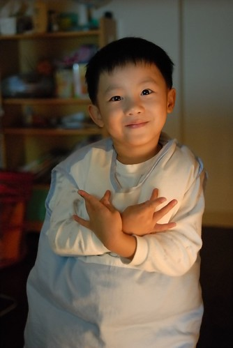

  
  
為了合理化 規矩化買玩具的頻率  
約定阿徹每年只有聖誕節跟生日可以買(大)玩具  
年中前阿徹都還會很開心 很期待的等他生日的到來 聖誕節的到來  
常問我"聖誕節要到了嗎"  
我說"現在是夏天 要等夏天結束後天氣變的很冷的時候才會到"  
熱了好久阿徹似乎也明白聖誕節不會那麼快到的  
又改問我"我的生日到了嗎"  
我說"你生日是2月還有好幾個月" 阿徹一臉疑狐的問"下一個月就是2月了嗎"  
我只好又得無情的告訴他"不是 現在才9月接下來還有10月 11月… "  
阿徹聽了我數那麼多月後還是繼續問"是下一個月嗎"   
三條線的我只好更冷酷的告訴他"要等聖誕節過後的下個下個月才是2月"  
聽到生日還比聖誕節晚到 阿徹總算苦著臉生氣的大叫"?什麼我生日是2月 我不要…."  
哈哈~~誰叫你要那天蹦出來  娘也沒辦法

不過盼了好久總算慢慢聞到聖誕節的味道了  
阿徹老早就想好了他的聖誕禮物  
可是爸爸說 要乖乖的 有在爸爸的好人名單裏才有禮物喔~  
OH~天阿~怎麼要買個自己肖想的玩具也這麼難等待 獲得阿~
