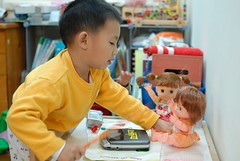
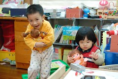
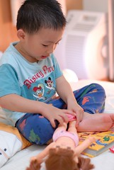
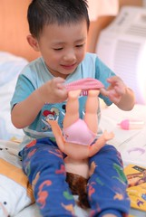
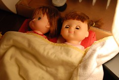
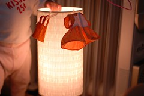

雖然阿公阿嬤 阿姨 舅公等一堆人都笑說 "男孩子怎麼在玩洋娃娃"  
但...阿徹真的喜愛洋娃娃 對她們也挺好的哩...  
有時邊打理著洋娃娃 嘴上還會念念有詞  
大概把爸媽對他說的那套都搬來教導他的娃娃吧  
娃娃很乖 起碼不會讓阿徹氣的破口大罵  
阿徹傷心難過時 娃娃也會靜靜的聽著阿徹訴苦 而非落井下石  
難怪阿徹對娃娃這麼好  
幫她們換美美的衣服 給她們秀秀 看電視  
還給她們安排佈置了一個溫暖舒適的床  
  
    
  
睡覺前 娃娃也要換上睡衣 只是會不會太粗魯了點 倒頭栽小心娃娃腦充血哩  
  

安置好的娃娃就這麼靜靜躺在我們的床尾睡覺  
睡在枕頭上還蓋上暖暖的肚圍   
連換下的衣服也用衣架整齊掛好(新毛巾的掛鉤不知不覺被小子從垃圾桶撿回當衣架)  
好好照顧你的小寶貝阿~徹  
  
  
