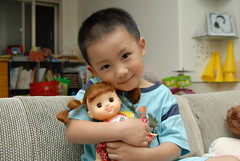
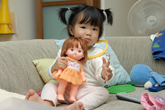
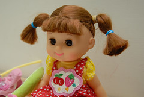
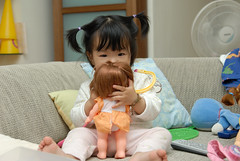

就這樣洋娃娃入侵了我們家...  
好久好久前　阿徹就常吵著要洋娃娃  
在學校會跟女同學一起玩洋娃娃　甚至拔光洋娃娃所有衣服幫她換裝  
去別人家也會肖想著別人妹妹的洋娃娃  
害羞渴望的樣子逼的媽媽只好開口跟小主人說＂可不可以借我們家哥哥玩一下你的娃娃＂　  
真的買個洋娃娃給阿徹哥哥玩　有點怪　媽媽我實在做不出來  
好不容易小愛大了＂兄妹倆一起玩洋娃娃＂這理由我比較能接受點  
但底線是＂不准買芭比＂　  
那種看起來就像還在喝奶的娃娃　媽媽還可以接受...  
  
（眼神散發出父愛光輝的阿徹）　　　　　　　（相較之下更顯小愛的粗魯生澀　就像個新手媽媽）  
　

前幾週帶著阿徹到SOGO尋找他的夢中娃娃　（還熊熊真不知道要去哪買洋娃娃）  
我跟徹爸一眼看上pilot的娃娃（妹妹手上那隻）妹妹頭很清純很可愛的乖乖樣  
但阿徹比較喜歡留著長髮來自韓國的開心妹妹  
雖然當下妹妹沒有表現出想要娃娃的樣子　　  
問她甚至還搖頭拒絕  
但為了避免日後兩人搶娃娃的情景　還是兩人各帶了一隻回家  
買回家後阿徹勤勞的餵娃娃喝奶　梳頭髮　佈置娃娃睡覺的地方  
睡覺前幫娃娃換睡衣　起床後幫娃娃換裙子  
儼然一附好媽媽的樣子  
起先不太理睬娃娃的妹妹也漸漸的有摩學樣  
抱著娃娃拍拍秀秀　拿著梳子幫娃娃梳頭髮（粗魯的讓我都很擔心洋娃娃遲早有一天會禿頭了）  
  
原先阿徹的睡覺儀式就會搞的有點久　  
現在更多了一道幫娃娃換衣服的儀式  
雖然爸媽被搞的都快神經耗弱想罵人　  
但還是得耐著性子等小子慢慢的幫娃娃換衣服（不能否定阿徹認真照顧娃娃的心意）  
這幾天徹爸索性自告奮勇的說要幫娃娃換睡衣　好讓阿徹趕緊去刷牙  
於是乎常在跟阿徹刷好牙進房時  
就看到一個中年男子用著大手拿著小衣褲套到裸體的娃娃上  
那畫面真的真的好好笑~  
真的是為難徹爸了...（不過說不定徹爸很高興他可以回溫兒時回憶）  
  
　  
  
對了　阿徹買的這開心娃娃還附送了一片１０來分鐘的卡通  
就是以這洋娃娃為主角的卡通  
阿徹很愛　早上起床上學前看　晚上回到家也看  
真的是....中毒很深
