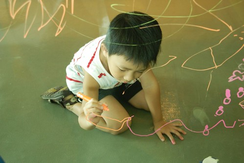

學校的聯絡簿裡有一欄是有關當日學習狀況的勾選 學習狀況分為三種"認真" "進步" "不專心" 在阿徹小班及中班時大部分都是被勾選"進步" 偶而出現一次"認真"時 我都會超振奮很驚喜的跟阿徹說"哇 你今天很認真阿" 雖然已經很滿足阿徹沒有被勾不專心很好 但還是會偷偷期待我們家的阿徹是個上課認真的好學生的

我甚至認真的用我的統計思維去想"認真"與"進步"的差別到底在哪 就我認知 所謂的"進步"就是與前一次的測量值(前一天的表現)相比 這一次(今日)的表現"更好" (是"更好"而不是"變好" 代表著我嚴重的先入為主  bias不低阿... ) 因此有沒有可能我們家的阿徹其實都是很認真的 只是認真的程度一天又比一天更進步阿 所以我懷疑"進步"有可能...應該是"認真"的一個比較級吧 我甚至有衝動想要跟老師問明白她們判別的邏輯 幸好理智還是有控制住當媽媽的大頭病 明明就是自己小孩不夠認真還在那胡亂掰....ㄘㄟˊ

阿徹上大班後 覺得他最顯著的改變就是上課及寫功課專心度的進步 連Freda都分別慎重的告訴我與徹爸(徹爸送上學時講一次 我接放學時又講了幾次) 害我跟徹爸都忍不住開始懷疑/期待 我們家的阿虎是不是要開始開竅啦...

聽說尤其是上午的英文課 阿徹已經不若往年(錢還真的炸兩年了)般漫不經心 可以認真的面對拼字 對話練習了(莫非就像是野田妹醒悟一般) 一開始我跟徹爸兩人還會一如往常的互相調侃說 "唉 剛開始而已啦 很快的阿徹就會鬆懈下來 故態復萌的啦..." 開學至今快兩個月了 很欣慰還能在外籍老師的聯絡簿上看見這樣的好事

這幾週外籍老師在英文學習週記上寫了如下這些評語

第一週： Henry has a good knowledge of the lesson. He is a good student and is good at communications with me. He seems to enjoy the lessons. 第二週： Henry needs to focus on phonics when we do the lesson. This is very important for his reading skills. 第三週： Henry is making good process and is always very polite to me. He will be a good and quick learner in the future. 第四週： Henry knows the lesson well. He was great this week. 第五週： Henry is making great progress. 第六週： Henry was great again this week and he knew the lesson well.

希望我們家的阿虎真的可以這麼持續下去 誠如我們常告誡阿徹的"沒有要你什麼都要會 但一定要認真" 認真是我們對他唯一的要求 唯有認真 做的/學的才會都是他的 也唯有認真才可以讓爸媽在他上小學後還能翹著二郎腿爽....
