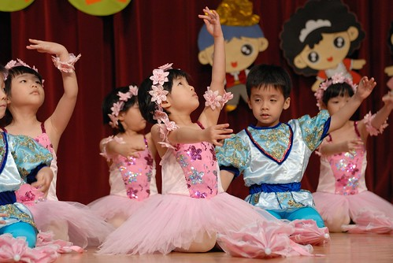

開了一早上研究討論會議 腦細胞全死光的週五下午 除了適合聽著張雨生的歌 在FB跟玟姿阿姨破紀錄的留言聊天外 也很適合看小女孩的照片 說說她的事......

四月底的音樂發表會 很喜歡愛愛舞蹈班的表演"機器娃娃" 前半段的機器娃娃模式中 愛愛那仿若機器人般的無表情 專注的讓人著迷... 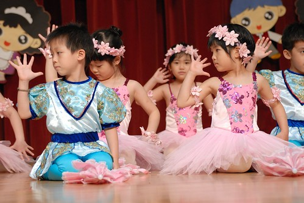 專注的讓在台下的我看的也好專注 臉上也跟著超認真的起來 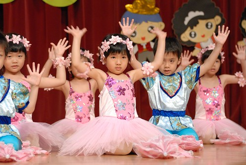 沒有笑容 沒有偷喵 真的就像是個機器娃娃 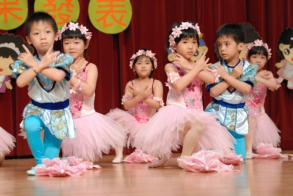 後半段 機器娃娃被注入生命了  小女孩活潑了也笑了.. 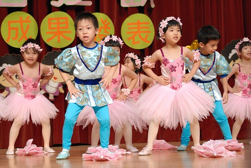 三年每週一小時的律動/舞蹈練習成果在短短的幾分鐘表演中顯現無遺 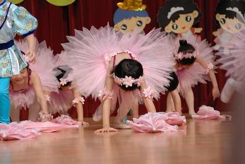 小女孩因為舞蹈也更加自信成熟 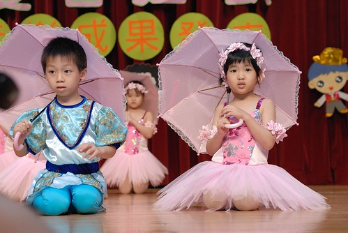 這樣的小女孩讓身為爸媽的我們深深迷戀 戀的不可自拔阿.... 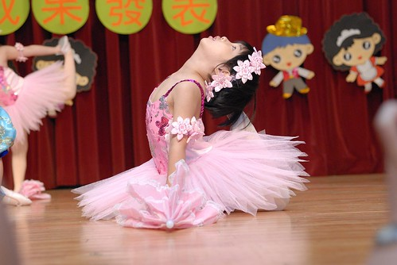 嘿! 小女孩 表演的這麼棒怎麼還皺眉ㄋ?  是因為曲目結束但情緒還沒回復嗎?! 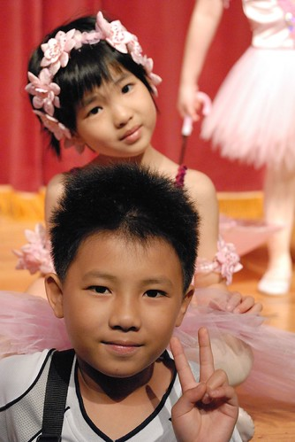 

那天的表演總共有四首 老實講除了舞蹈課的機器娃娃讓我印象深刻 想要拍手叫好外 其餘的只讓我感覺 小孩好忙 忙著換衣服 忙著上台 忙著下台... 愛愛回家後問了我幾次 我第一首上台表演的是什麼阿? 呵呵 (舞蹈班是第三首) 除了機器娃娃外 愛愛班上表演的曲目 他自己與我最喜歡/印像深刻的是下面的涼阿涼 到現在還常會在家裡唱著涼阿涼.... 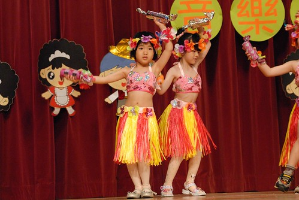 這樣性感的女孩 給人感覺又截然不同 圓臉的有點喜感... 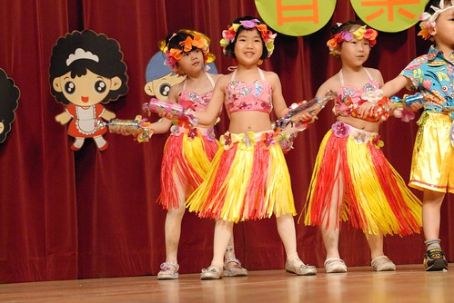 最後的大紅禮服的小公主打扮  台風穩健但兩眼已漸漸無神去 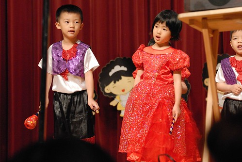 幸好最後加碼的戲劇客串演出茄子 總算又回神了 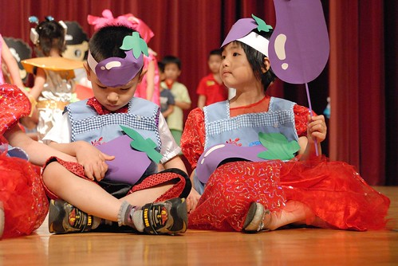 我常想 孩子需要到底的是什麼 我們大人想給 要給小孩的又是什麼... 每當這樣庸人自擾時 幸好都有徹爸丟來的拖鞋敲醒我" 想那麼多..." 是的! 想那麼多幹嘛 就照著自己的想法 自己的能力 想怎麼做 能怎麼做 就這麼做就好嚕.... (怎麼不小心又寫成叨念+感嘆文了)

持續這兩個月都有在家包過一次水餃 突然愛上在家現包現煮 還吃的到脆脆又鮮甜高麗菜的水餃 第一次包餃子 愛愛認真的要我教他每個步驟 不熟練的練習著包餃子... 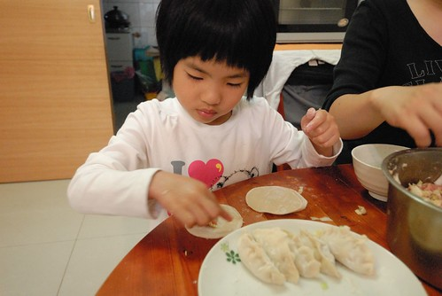 隔一個月再包水餃 除了對於肉餡的份量沒把握需要跟我確認外 愛愛已經不用我提醒/示範 自己一顆接一顆的包著 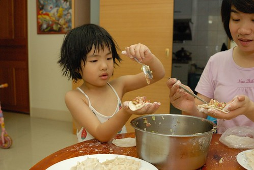 而且愛愛包的餃子除了比較瘦一點外 外觀上來看幾乎跟我包的一樣了... 我說 再過個幾年 家裡的包餃子工作就可以都交給他嚕 就像媽媽小時候一樣 愛愛聽了好高興 好期待.... 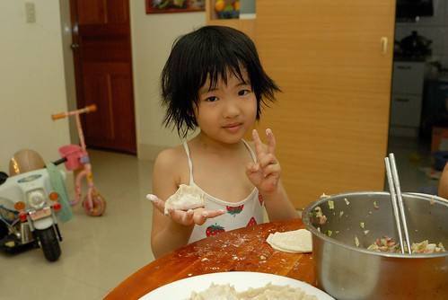 我跟徹爸很喜歡聽愛愛講話 敘述一件事情 除了很有邏輯性 很表情豐富外  我們甚至覺得每當她在敘述事情時認真的眼睛好像會發亮 那眼神好像會勾人家的魂.... 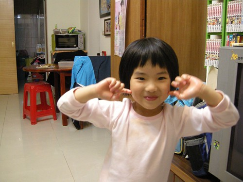 從家裡到幼稚園的上學 回家路上  愛愛固定的會停留幾個點跟一些人道早餐 說再見 經過的兩個社區警衛伯伯 飯飯阿姨阿伯 甚至檳榔攤的阿伯 一開始因為他們的主動問候 到現在變成每天阿伯們很開心 愛愛也很開心的問候 我不得不懷疑 是否愛愛的笑容真的有魔法 真的如他們所說 聽到愛愛充滿精神的聲音 看到每天笑盈盈的臉龐 就讓人好開心... 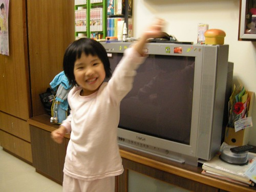 姑娘! 要繼續保持你的開心 你的笑容下去喔... 傳染給在你身旁的每一個人.... 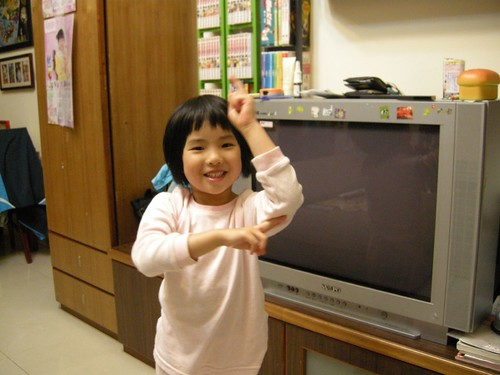
