低級小學生阿徹的第一年總算順利, 健康, 平安也應該還算快樂的結束了... 成績單上的各學習領域: 語文 (國語以及鄉土語言) 7+1, 健康與體育 2, 數學 3, 生活課程 6, 綜合活動 3, 英文 1 阿徹 除了鄉土語言為甲外 其餘的學習等第都是優   哈哈~ 果然不出我跟徹爸的意外.... 如果讓阿公阿嬤們知道了 我跟徹爸一定又會被唸'誰叫你們都不跟他說台語ooxx之類的' 而小菁老師的文字描述: "準時上學, 打掃認真, 積極主動閱讀課外讀物, 認真填寫'閱讀星光'認證單, 閱讀態度值得嘉許 對繪畫很有興趣, 觀察力敏銳, 作品十分出色   溫和良善, 常常陶醉在繪畫和閱讀的世界中" 看到老師寫的這些 很欣慰阿徹在學校應該是個乖學生吧! 但我更是欣慰 阿徹是個喜歡閱讀, 繪畫, 溫和良善的大小孩了... (不只是媽媽自己老王賣瓜自誇的喔) 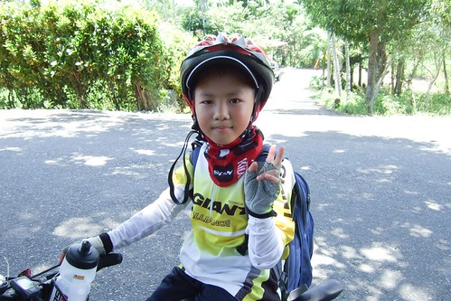

阿徹一年級至今的全勤紀錄 因為這回的花蓮行而請了最後兩天的事假 (因為考量了天氣以及媽媽想要看金澄澄的稻穗 ) 我們跟阿徹說"這是我們家給你的這個暑假夏令營喔" 講夏令營是有一點騙小孩啦  因為明明就是爸媽愛玩 爸媽的天外飛來一筆... 但是就因為我跟徹爸 那越來越想飛的心才促使我們下定決心帶阿徹去做做看 如果成功了那我們家以後的旅遊方式就又多了一種選擇 而如果失敗 那爸爸媽媽就也安份點再多等待些... 很高興此行阿徹雖然有苦 有累 但他很認真 很堅持 也有開心....

一開始規劃行程前我們即先問了阿徹 願不願意去花蓮騎車 我們也沒隨便硬是要騙他去  開始即充分告知他 會有點辛苦 會有累喔.. 只是傻愣子阿徹想也不想的直說 '好'  順道開了幾個條件 如要泡溫泉 要摸蛤 直到要出發前兩天 阿徹似乎有感受到爸媽最後緊鑼密鼓準備的小緊張壓力 在放學回家的路上問我'' 如果我騎不到怎麼辦?'' 阿母我冷冷的告訴他 '' 那你就睡路邊吧!!  因為騎不到也沒有地方可以睡覺 '' 聽到這阿徹的臉似乎抽續了一下  可是他沒有多說什麼 其實我跟徹爸也會緊張 阿徹的能耐到底有多少 雖然我們對他深具信心 相信這樣的路程安排他絕得可以負荷 但我們還是做了最壞打算 就是頂多掛在路邊後 由徹爸回頭去開車來載  所以...別想太多啦...

看著阿徹的照片 每張照片的背後都有著當下的小故事 小心情 或是小成長 就像徹爸說的 ''經過這回 覺得阿徹又長大了'' 所以說這是我們家給阿徹的夏令營可真一點都不為過也不誇張地...

蓄勢待發的兄妹倆  愛妹可是阿徹的最佳學伴 遊伴阿! 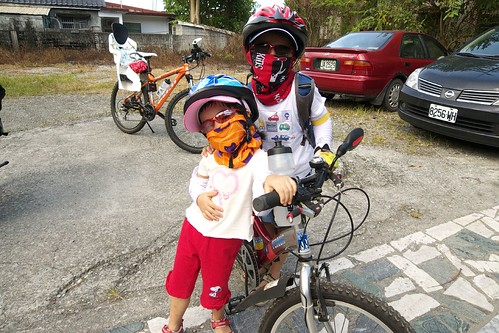

第一次的全程戴安全帽騎乘 本來很擔心怕熱的阿徹會戴不住的說 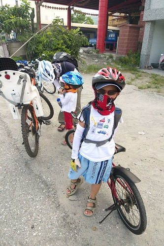

第一次的seven用餐經驗  人生第一個國民便當 阿徹一直說好好吃喔~ 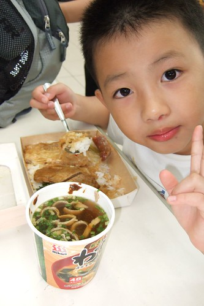

阿徹剛上中班就已經會騎腳踏車 但實際開始上路騎車也不過是這一年來的事 徹爸說 一年前才剛開始騎河濱車道而已 想不到才一年阿徹就進步很多 雖然第二日的50km跟阿徹至今保持的單日最遠騎程距離相當 但以前都是騎河濱又直又平 這回的50KM很不單純很不簡單 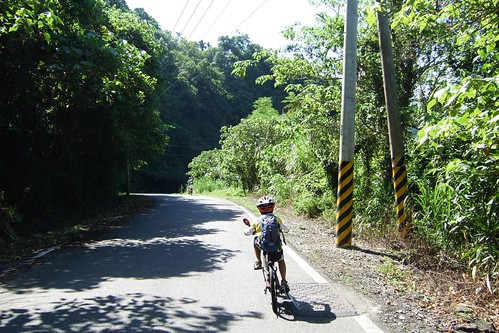

其實這樣的山路 阿徹如果累到發脾氣摔車(把車摔到一旁)不想再騎 我跟徹爸是絕對可以理解的  但很高興阿徹沒有這樣的反應/情緒出現 雖然有嘟嚷著幾次'好累 不行了' 甚至還紅了眼 偷偷流一些淚 讓他搞不清到底領巾裡的是感冒的鼻涕還是哭的鼻涕 但他還是努力的踏著 牽著....  (是的! 那幾天阿徹是小感冒 早晚吃藥狀態的  ) 媽媽看的忍不心問他''包包我幫你載 好不好?"  想要减輕點阿徹的負擔 阿徹卻總是回答我"我可以的!"　而拒絕了我的提議 雖然徹爸也都跟我說"他(阿徹)可以的"　但看在阿母心裡真是小心疼阿...(就說媽媽寵小孩吧) 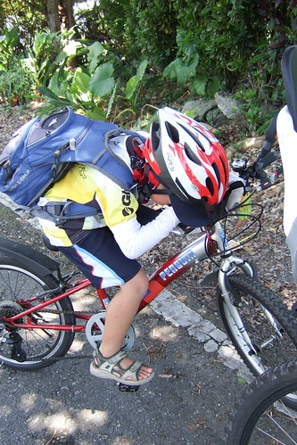

累的當下問他以後還敢跟爸爸媽媽來騎車嗎  阿徹扁了扁嘴巴 搖搖頭說不要了 可是過了最苦的之後 涼快了 輕鬆了 再問他要再來騎嗎  阿徹又開心的點點頭說好 甚至得意的說 這次四天騎一百 下次三天騎一百 再來兩天騎一百... 嗯~很好! 沒有怕到就好 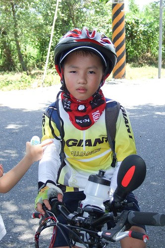

有的時候我或徹爸跟著阿徹並排騎車 聊聊學校的事 家裡的事以及沿途所見  這是愜意的... 而經過鄉間小道時  阿徹常會幸福模樣的大喊'我聞到好香的味道喔' 是阿! 那是樹的味道  稻田的味道 花的味道... 經過這麼多年大大小小的旅行 跑花東  阿徹越來越聞的到大自然的味道 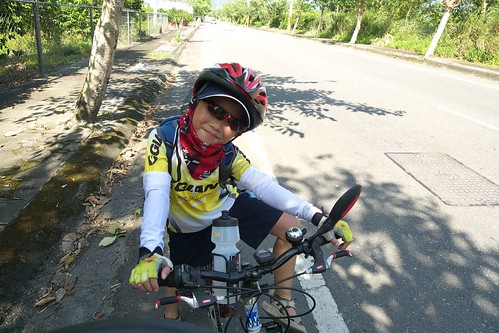

第二天阿徹最累快撐不下的時候 我拼命用溫泉鼓勵誘惑他 '再撐著點 就可以到民宿去泡喜歡的溫泉了' 阿徹搖搖頭說 "'不要! 到民宿後 我想要先睡個大覺" 可見他真的很累了 連溫泉也難以讓他生出力量 結果到了民宿後 小子卻又生龍活虎的直說自己不累 不要睡覺 我問他 剛是誰一直說到了民宿後要睡大覺的  他害羞的笑了笑... 不過阿徹真的是有累到 就在徹爸硬規定得睡覺後不到幾分鐘時間內他便沉沉入睡了 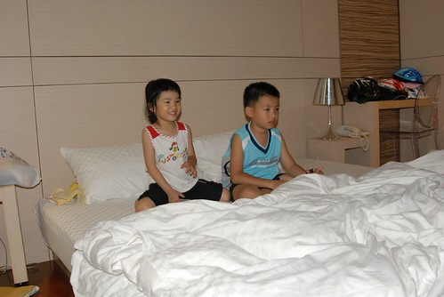

阿徹的體力真的還不錯  每天的溫泉過後隔日便又是一尾活龍 不像媽媽或爸爸每日抵達後或清晨睡起的疲憊酸痛 徹爸說 阿徹的疲憊來的快也去的快 果然是小孩子阿... 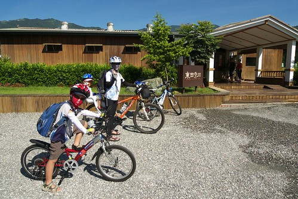

第二日的苦絕對給阿徹帶來很難忘的回憶 但因為已經最苦 小子更能堅持且enjoy接下來的一切 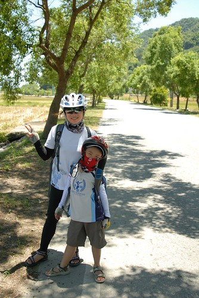

衝阿~ 幹勁十足的連媽媽都自嘆不如  徹爸說很快的 阿徹就會超越我了....嗚嗚嗚 

矮個子阿徹經過這一年變的越來越強壯 有muscle了喔 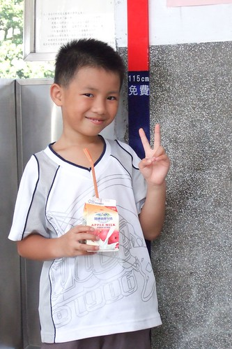

不過真的還是傻愣子 耍寶一個...(學著鬥雞眼的兄妹) 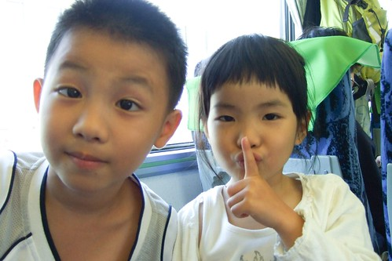

媽媽以前常想著阿徹上小學後可以去哪上享受樂趣或是不同體驗等的夏令營 經過這回 我想一家人都能參加的夏令營更是寶貴跟值得珍藏阿! 珮君阿姨笑我說"當你們家小孩好辛苦喔　要爬山還要騎車..."　我聽了忍不住大笑 徹爸說　我應該回答"當別人家小孩考試前要加強也很辛苦的" 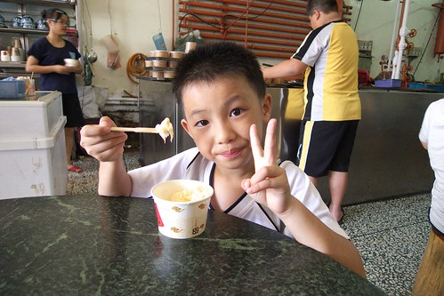

不知道阿徹到哪一天開始會不再喜歡跟著爸媽岀門  但我們期待著每次結束後的下一次... 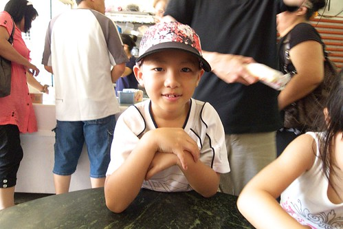

下一次的挑戰去哪裡ㄋ?   噓~這是我們還不能公開的秘密............
