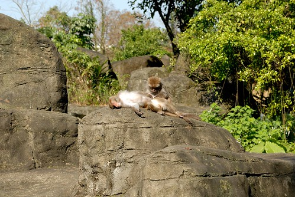
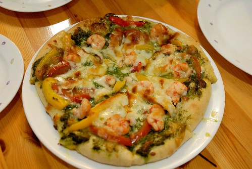

趁著過年前的空檔 這幾天讓徹愛回嘉義阿公家開心過寒假 昨第一天 愛愛三不五時打電話找咪咪 東聊西扯很是開心 只是咪咪我過了好久的晚上才總算到11點的睡覺時間 今第二天 耳根子清靜一整天 心想咱家小孩真是乖巧 知道不能打電話打擾上班的爸媽 但沒想到晚上當我跟徹爸正寧靜享受著晚餐時 電話來了 電話接起 擴音器傳來兩個小孩不同音頻的哭聲 哥哥說著"媽咪 你們可以早點回嘉義嗎" 而妹妹更是哭到完全不能或是不想講電話 電話這頭的我與徹爸則是既好笑又好氣... 所幸徹爸最後烙下狠話"妳們自己要堅強 這正是考驗你們的時候" 結束一切(其實是爸媽就不想理了) 飯後收拾好 我與徹爸各自坐在餐桌看書 看著滿屋的寧靜與自己的一派清閒 心想原來這就是一般所謂的兩人世界阿 真的很是愜意 尤其是多了好多隨心所欲的時間 但老實講真的不習慣 (這樣的幸福太不切實際 哈) 我突然想起前陣子去動物園看到的猴子 那天是連日濕冷後的大晴天  動物園裡的每隻猴子與猩猩都大剌剌的曬著太陽 "偽頂客"的我們 就好像這對舒服曬著太陽但又無聊到抓蝨子的猴子阿!  

今天要下班前 徹爸恍然大悟般的MSN敲我說"哇~ 我下班前你有好多時間阿" 很擔心我會無聊的樣子 我說"放心! 我有很多事情可以做" 首先就是不用猛盯著手錶 趕著時間準時離開辦公室 然後回家燉鍋茄汁牛腩 好讓這幾日可以簡單炒個青菜就有好吃的燴飯吃還有便當帶 這是兩人世界最方便的一鍋底數餐 空檔再烤個香蕉戚風蛋糕 作為接下來兩日的輕早餐 (以上就解決了接下來兩天的三餐) 最後徹爸進門時 滿屋子香 外加現炒的青翠熱青菜 真的是很有小夫妻生活的感覺阿~~~ 原以為兩個人的生活 大概會趁機偷懶 靠外食解決 自己卻還是比照往常生活 準備一切 今天又更是深刻體悟 規律生活習慣所帶來的穩定與踏實~

前陣子第一次嘗試做青醬口味的pizza 雖然青醬顏色最後焦焦醜醜的但香氣與味道卻令人意想不到的amazing 立馬登上我與徹愛pizza排行榜的No.1 我們無視乳酪絲的燙 呼嚕呼嚕的一口接一口 一片接一片 這樣的一餐好滿足阿 ~~~ 
