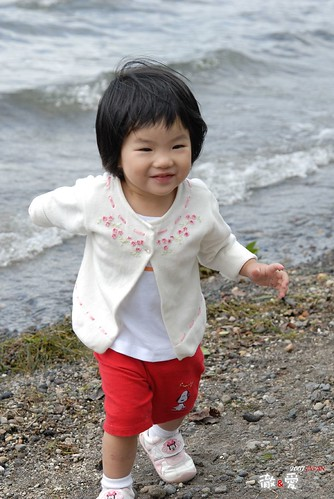

七天的旅行跑了很多地方  很累很趕...  
但看到阿徹跟小愛的隨遇而安  享受遊玩  乖巧貼心...  
即使再累作夢也會笑...  
很充實 很安慰 很感動 很暢懷 甚至很驕傲的一趟旅行....  
  
七天的遊記實在不知如何下手  
加上最近工作開始進入旺季   
還是先來個review文 好好回味阿徹跟小愛這幾天的可愛模樣吧   
其餘的 就慢慢來吧~  
  
PS. 大家可以多上flicker看徹爸寫的註解 給他動力完成這艱鉅的任務  
       (大人也跟小孩一樣很愛人"波"的)  
  
小愛在整個旅行中的表現只有二句話形容"真是有夠愛玩 有夠適合玩 "  
晚晚睡覺不會嚕  早早起床沒有下床氣  
上車咻的123睡覺  下車咚的123精神百倍  
能夠走的自己走  能夠吃的盡量吃  
認真的享受這趟旅行...  
甜美恬靜的形象擄獲每位同團阿嬤 阿姨 哥哥姐姐的心  
  
有這兩個寶貝的旅行真的很棒  讓爸媽才剛回來又想帶著下一次的旅行了...  
  

出發的那天小愛似乎就感受到出遊的興奮 很High  
標準為了玩 衝衝衝的小女生~  
  
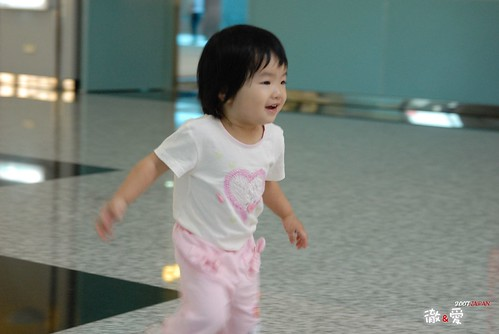  
  
膽子也不小(起碼比哥哥大很多)  讓爸媽反倒常腳軟 "挫勒蕩"  
  
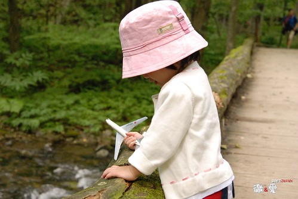  
  
遇到喜歡玩的溜滑梯或事物 靈活俏皮的讓人想捏她小臉一把  
  
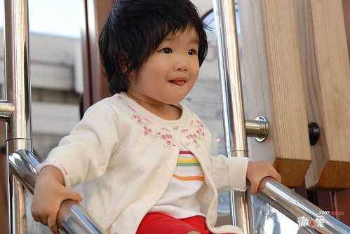  
  
端裝成熟的模樣 又讓爸媽很難相信不久前她還只是個剛出生的小猴子而已  
  
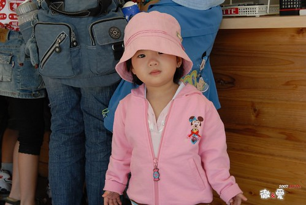  
  
兄妹倆打出生到現在從來沒有過可以這樣大口嗑冰  
而且還3天內來了5隻這麼的密集  
哈冰淇淋的模樣便又顯得稚氣十足 (學會了說"冰起領"..很可愛的語調)  
  
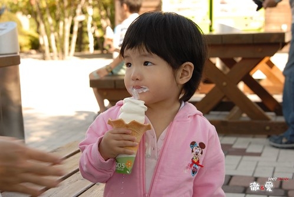  
  
紅嫩富有彈性的臉頰就像手上的水蜜桃一樣  
  
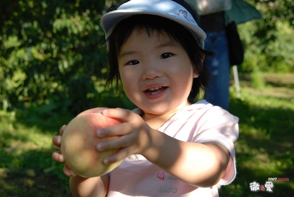  
  
戴上漁夫帽 真的挺有大明星避人耳目上街的架勢  
  
"米您"是小愛最近的新歡&最愛  
看到電視上或是Disney land的"米您" 總是手足舞蹈開心的大喊"米您"   
其實她喊"米您" 時的可愛甜蜜模樣&聲音 更甚於"米您" 阿  
  
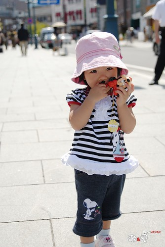  
  
大膽愛又不怕死的伸手一摸海膽(應該是海膽吧)  
  
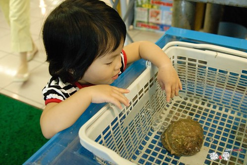  
  
第四天越來越疲憊了  
一大早上車後認份且把握時間的趕緊補眠  
這一瞇就可以存儲夠"凍"到晚上的精力與體力  
  
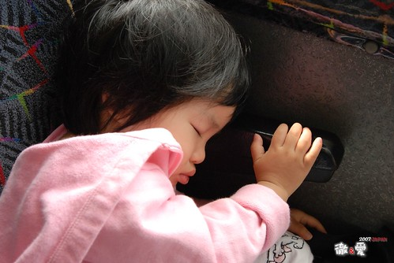  
  
哥哥愛玩角色扮演 娃娃類的"粉味"遊戲  
小愛卻是愛玩原本期望哥哥玩的車車類"陽剛"遊戲  
倒底是星座上的差異(雙魚 vs. 射手)  
還是個性上的天生不同亦或是老大與老二的差別ㄋ  
真的很難理解....  
  
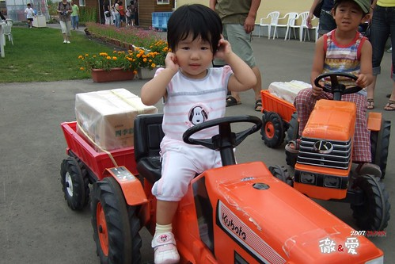  
  
吃到第五隻冰淇淋 哥哥吃了幾口便興致缺缺  
只有小愛依舊高度亢奮的大口嗑著冰淇淋(沒有哥哥搶食 真難得真好)  
  
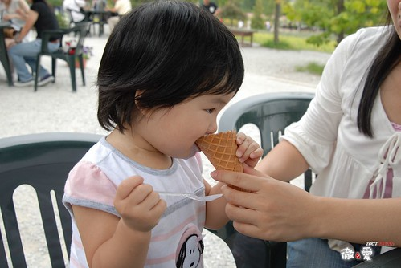  
  
白飯吃膩了就換喝牛奶嚕  
一開始一天只有睡前一餐奶其餘跟著吃飯吃麵瞎吃  
後來再好吃的日本白飯也吃膩了  牛奶終究成了整日營養的來源  
不過還是得乖乖的陪吃飯...  
  
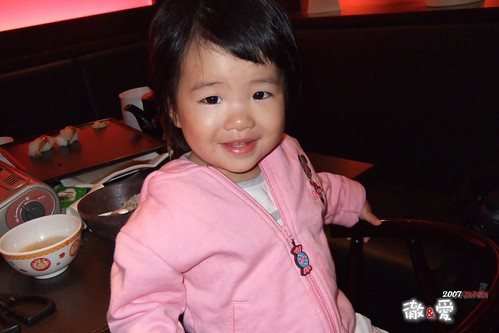  
  
到第六天其實一家四口都累斃了  
但看到"米您" 看到城堡 遊行 表演... 心情還是興奮  
  
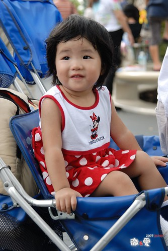  
  
今天的下午茶與晚餐就是爆米花吃到飽  
  
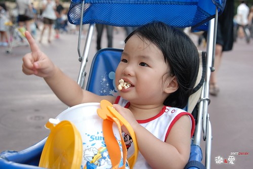  
  
小愛不客氣的獨自嗑掉半桶 (因為哥哥堅持的要找他的公主爆米花桶 )  
餵飽肚子後卻也累的睡著了(小手還放在爆米花桶裡  真的是吃到睡著的)  
  
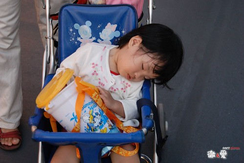  
  
最後一天還是鼓足力氣的前進上野動物園  
雙下巴好像少了些 不過多了睡眠不足的水腫樣  
  
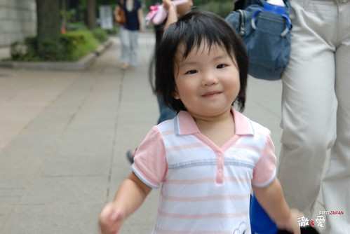  
  
提著小包包跟好媽媽阿...  
  
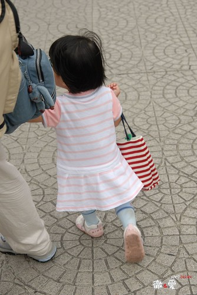  
  
旅行再好玩 還是想念自己的小床 家裡的味道   
快了...就快回家了....帶著滿滿的回憶回家  
  
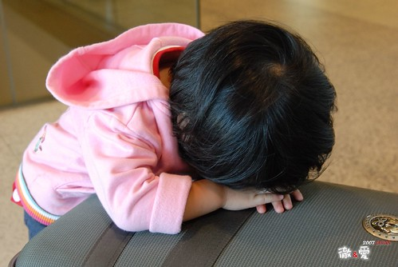
