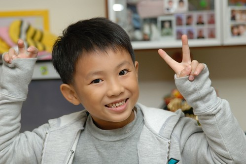
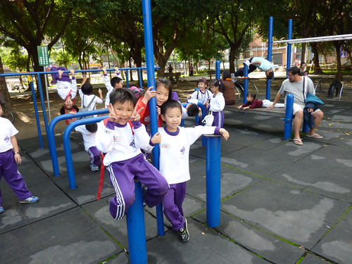
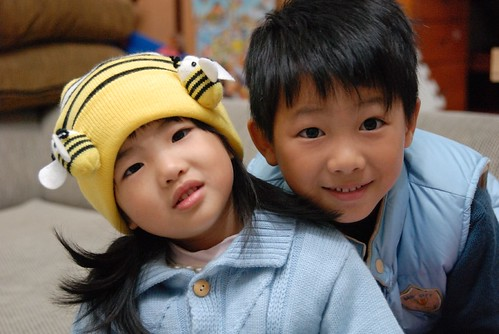
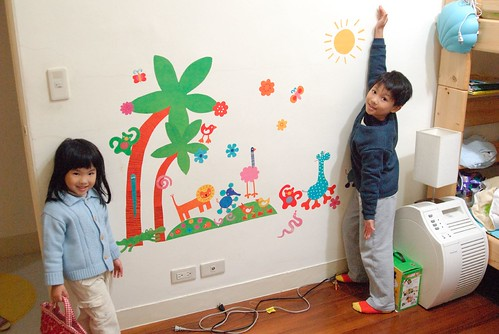
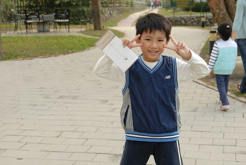
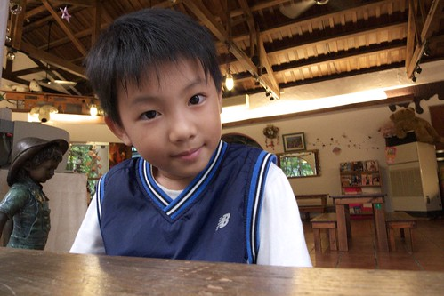
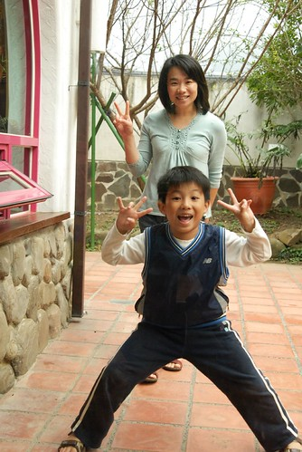
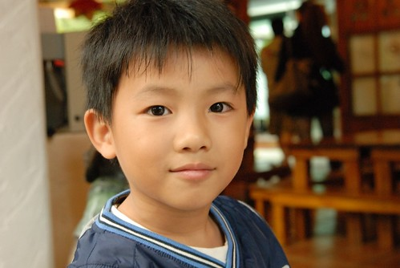

好像好久沒有阿徹小愛的成長故事了… 這版都快變成旅遊版了 呵呵~ 最主要的原因還是因為阿徹小愛都已脫離3歲前的黃金發展期 可以算是個"人"了 而成為"人"之後 一切就都是在平凡 穩定中過日子 就像你問大人(起碼我啦) "你在忙什麼" "ㄟ…忙工作 忙家事 忙兩個小孩 忙睡覺 忙著玩…" 講不出個具體所以然 但是日子就真的還蠻忙的阿 而雖然似乎也說不出哪裡特有趣 特難忘 特欣慰 但其實過的也還挺開心的阿 或許正確說法是 也沒什麼特不開心 特難過 的阿 所以用反推法的話 沒有不開心 沒有壞事 不好的事 那就可以算是好事好日子了吧  (哈哈~日子被徹媽講的超平凡無淡+無奈似的)

雖然好幾個月前就有在想該是紀錄一下小學生的滿月 雙滿月日記的 但….大家知道的…….所以…….當我沒提 哈哈~ 最近不少人問我 "阿徹好嗎 小學還適應嗎?!" 老實說 聽到問題要回答的我 停頓的"ㄟ.."越拉越長了 想想真是該給大家也該給我自己跟以後的孫子好好一個交代了 接下來就東扯西扯講一些 這幾個月來小學生阿徹發生的事或是小學生媽的所見所感 (ㄟ…真的要開始來寫 竟然才發現好像都忘光了說 慘)

9-10月對阿徹來講都還是小學蜜月期 每天開開心心的上學放學 從他口中提到越來越多的同學號碼以及名字 可以感受到他已經建立起他在小學的朋友圈 情感依賴網了 在他口中有很恰的女生 很會畫圖的人 很愛亂罵人的人  考試常考100分的人 也有讓他覺得很好 想要當好朋友的女生 我想起碼人的問題方面算是完全適應 融入了吧

(戶外教學照片) 

很久沒把"女朋友"這個名詞拿在嘴邊講的阿徹最近開始說著"我有4個女朋友喔" 除了交代他不要隨便把女朋友這名詞掛在嘴上 要說"女生的好朋友"外 也好奇的問阿徹 人家女生叫什麼名字阿 而阿徹竟然雙手一攤說"我不知道" 我驚訝的高八度音說"你不知道人家名字?!都想要人家當女朋友 以後結婚的了 竟然還不知道人家名字" 而阿徹除了連愛愛都知道名字的27號卓X莉同學外 其他只知道號碼 很湊巧的 那四位女生竟然都介於25~29號中間...

前幾天阿徹跟我講著學校同學發生的不好的事情 (阿徹常會一臉凝重卻又八卦的跟我說"我跟你說 我們班上(學校)今天發生了一件很不好的事 OOXX....") 原來是大家在玩鬼抓人遊戲時 某一位男生不小心推倒/絆倒了26號女生 我問阿徹"那女生還好嗎 有受傷嗎  那你有沒有關心人家..." 阿徹說"有阿 我有問他"你還好嗎" 幸好他都沒有受傷" 我說"哇 你這麼貼心阿 有過去關心人家 這樣很好喔" 阿徹就說"當然阿 他是我女朋友 我們有一次還手牽手去散步哩" 我睜大眼問"牽手? 散步? 誰先牽誰的手阿" 阿徹又用著他一貫的理所當然表情回答我"阿我們就說去散步然後就一起牽手啦.." ㄣ..ㄟ...ㄚ...好有默契的兩小無猜阿!!! (害媽媽忍不住也想起自己念一年級時曾經跟一個男生一起手牽手去看陳家哥哥的科學展覽作品) 我又問"都已經牽手散步了 那應該知道人家名字吧" 阿徹還是搖了搖頭說 "我不知道" 哇勒~都進展到這樣了竟然還用號碼相稱 這這這...莫非就是9字頭的戀愛方式....

(之前很堅持前面頭髮要長一搓的阿徹 竟然在學校自己動刀剪了頭髮 剪的凹凸不平阿) 

最近有些叔叔阿姨看到阿徹忍不住問"阿徹最近好像比較黑喔" 咦~ 夏天過了 理應有白些回來阿??? 仔細觀察了幾天 發現阿徹果然 好像又更黑了 (夏天本來就曬很黑了) 不過對照他之前常跟我說的 下課常跑去操場玩鬼抓人 或跑去閱讀園或哪兒的 我想這黑應該就是每節下課跑來跑去 曬太陽的結果吧

上個月的某個原本該回嘉義的週末前夕阿徹第一次提出不要回嘉義的要求 他說 "上了一個禮拜的課想好好在家休息" 我問"很累阿" 阿徹點了點頭說"是阿 有點累 所以週末想在家就好..." 徹爸說"阿徹已經到了 期待週末在家休息的年紀了" 看來每天上學快樂歸快樂 還是挺累人的

上週日睡前阿徹唸著"又要上學了"    我問"你不是說上學很好玩 很喜歡嗎" 阿徹竟然回答我"上課不好 我只喜歡下課"  ㄟ....怎麼上學的動力變成"為了下課"阿 真快~小學生最甜蜜的蜜月期似乎已經結束了

(貼了動物園的房間看起來總算有兒童房的FU了) 

每週除了週四為全天班外 其餘都是半天課 下課之後就是跟著安親班的路隊走20分鐘左右的路回到晨暘 在安親的時間除了上才藝美語的時間以外就是寫功課玩遊戲看課外讀物 美語課: 週一週四下午4點半~六點 美術課: 週三下午一小時 舞蹈課週四下午六~七點 除了週四必須在全天課後接著上美語舞蹈課比較忙比較累外 其他的天其實都還蠻愜意悠閒的 除非作業寫的特醜得花更多時間重寫外

本來也一直不覺得阿徹的功課有特多或特少 起碼除了週四外的其他天 他的功課都可以在安親班完成 且他還是該玩的都有玩到 安親老師安排的評量也都有寫 心理還忍不住竊喜 明星小學還好嘛 課業壓力沒之前聽說的那麼恐怖嘛 後來聽了園長講別班小孩的情形 還有聽說洪同學的功課量(還得寫日記)後 我想阿徹這小子真算是幸運吧 遇到他的小菁老師 起碼就我到目前的感受來講 小菁老師還蠻重視課外閱讀 生活教育的 課業的話當然也不馬虎但起碼還不會讓家長小孩有喘不過氣的感覺 除了國語作業比較花時間寫功課 (但幸好不像聽說的別的老師要求得美到像用"刻"的) 其餘的作業都可以讓阿徹笑著輕鬆完成 我們每天在家只需逐一檢閱簽名聯絡簿作業 再需我們額外費心的也就只有一週一次的國語聽寫考 得在前一天幫阿徹考過一次(叫阿徹準備都是5分鐘翻過就結束的) 這麼聽起來小學生的爸媽好像也還挺好當的嘛~   錯!!!! 每天早上叫著賴床的小學生起床 換衣服 吃早餐 時間內出門 晚上念著 該簽的名簽了沒 該帶的東西準備沒 亂七八糟的書包整理沒  該收的玩具垃圾收沒... 累阿~~~  尤其我這阿母在父子三人口中是越來越兇 越愛罵人了 某一天我正式宣告 檢查功課確認上學用品這重責大任交給徹爸全權負責 我將不再在睡前巡視檢查聯絡簿 書包了  少簽的名 少帶的東西  都別再說"都是媽媽..."了 只是阿 有時候看到阿徹那塞到暴 亂到誇張的書包還是忍不住偷偷整理一下 唉~

(本來以為會是偏小品 結果又一如以往的變成字很多媽媽 唉) 最後來講講有關考試這檔子事 話說阿徹是上小學後才第一次體會考試這事 第一次的國語聽寫小考是在前一天晚上媽媽睡前檢查聯絡簿時才發現的 隔天早上徹爸提醒他準備一下吧  阿徹說好 然後在翻了1-2分鐘的書後說他準備好了 然後徹爸只送了他一句話 "那就祝你今天好運吧" 就帶他出門上學了 (那天早上媽媽剛好有事得早出 才會有這麼帥氣的父子倆對話出現) 隔天本子發回來時 考了84還86分 阿徹有點開心 因為有達到媽媽設下的標準 (國語80分以上 數學90分以上即可) 但也有點懊惱羨幕別人可以考100分 我問那你覺得你下回應該要怎麼準備  阿徹說"那我把課文抄一遍好了"

而第二次考聽寫剛好在星期一  於是無聊的週日上午經我提醒之後阿徹如約的抄了一次課文 結果這回只拿了個80分 阿徹很不解的問我 這次我有準備啦 怎麼考的比上次還低ㄋ 我還是問他 你覺得你下回要怎麼做 結果阿徹出乎我意外的跟我說" 下次要抄三遍課文" 嗯~很好 媽媽我原本還擔心他會說  就像上次那樣翻一翻就好了 抄課文沒有用

不過第三回的考試前 阿徹當然沒有如他之前嘴巴說的 抄三遍課文 (玩都來不及了 還抄三遍勒) 也因此之後每次聽寫考前一晚我們在家都會先考過一遍 錯的字要求罰寫三遍 我想我們絕對算是懶爸媽 對於小孩課業 字體美觀性的要求其實不高 做的也很少 更別說要在考前陪著小孩溫習功課 抓重點 陪著背書啥的 (徹爸早已嗆聲不准幫小孩溫習功課) 只能透過這樣的在家預習考強迫阿徹去練習注音/國字 幸好迄今為止的聽寫小考除了一次76分外 其餘都能維持在80-90上下

11月份的全國小一學生注音符號大會考 我們依然沒有幫阿徹額外加強 除了在安親班最後一週多寫了幾張評量外 不管是我們(起碼我們是這樣)或是小菁老師都並未特別強調 重視 或複習 同時間卻聽到二哥家的萱萱以及同事念小一的女兒在最後兩週的週六都得到安親班加強 吼~ 我們家的阿徹卻還在遊遊蕩蕩... 考完試那天回家路上 我一如往常每次有小考時會問阿徹"今天考的怎麼樣阿" 阿徹也一如每次相同的答案 自信滿滿的告訴我"一百分" (真的 每次問阿徹覺得自己考幾分 他都是信心十足的告訴我一百分 當然啦 開學迄今也只有一次的國語小考考過一百分 那次他的心情可真躍上枝頭阿 雖然明知每次問他 他一定都是回答我一百分 可是我每次還是都愛問他 或許是愛看他那種不知天高地厚 天真得意 自信滿滿 大聲告訴我一百分的模樣吧)

後來發考卷那天 阿撤看到我時臉嘟嘟的告訴我"他心情不好"  因為他只有考89分 我說"不錯啦 有80分不用打屁股啦" 可是阿徹一臉不解的問我"爲什麼有人考一百分 我才89分" 為娘的我只好殘忍的告訴他事實 "除了爸爸媽媽平常對你的要求也就是上課要認真外 你並沒有多去複習準備考試 考這80多分我覺得差不多啦 " 阿徹還是不滿意我的答案繼續追問  我又只好再說啦 "如果你這樣都可以考100分了 那對像萱萱那樣週末還要去安親班複習 加強的人來說不是太不公平了嗎 人家可以考100分 不知道多讀了幾遍書 多寫了多少評量ㄋ" 阿徹雖然還是不甘心的樣子 但他卻也不敢再說什麼了

那晚徹爸回家後又問了阿徹考幾分阿 阿徹一樣嘟著嘴說"89分" 而徹爸跟我不愧是夫妻阿 竟然跟我講一樣的話 再次聽到的阿徹竟然啪的就哭了出來 嚇了我跟徹爸好大一跳 老實講 我們很訝異阿徹的得失心會這麼重 不過就如我們跟阿徹說的 "你會難過 會不滿意 這是件好事 表示你想要讓自己更好" 真的~ 我想阿徹不是天才也應該沒有過人的聰明 我們只期望他上課認真 認真的做好每一件他該做的事 也明白學習的目的/重點所在 至於成績 我想能做到上面那樣的期許的話 應該就不會差到哪裡去吧   當然也不會好到哪裡去 但我們相信總有一天我們家的阿虎真的會開竅的 就算沒開竅 起碼也算是個快樂的小學生吧 呵呵~~~

