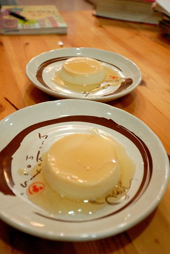

愛愛準備上小學前 我最擔心的一件事是她的早餐 因為她既不喜歡三明治,麵包 也不喜歡饅頭跟包子 而且她很善變 明明前一次說好吃的東西 下一次再弄給她吃時她卻吃的痛苦萬分 以前念幼稚園時 反正園內有早餐所以只要求她在家喝杯牛奶墊墊胃即可 可是上小學了 早餐得先在家裡吃飽 而且小學生活其實挺勞心勞力了 早餐更顯重要! 所幸經過這陣子的食譜搜尋,研究與實驗 我也漸漸體會準備早餐的樂趣與成就感(當然絕大部分還是來自於阿徹給的) 而不知道是不是因為早上比較常喝熱湯,特別是入秋以後 這個秋天兄妹倆的鼻過敏現象比往年好很多 果然再次證明媽媽的廚房是一家健康與幸福的源泉阿! 我忍不住在FB上驕傲一下且給自己一個贊!!

我辦公室電腦的桌面上有一個名為"早餐"的文字檔 是我從愛愛開學以來的週間早餐紀錄 原先的用意為紀錄一下到底可以吃什麼早餐 順道看能不能歸納出個什麼軌跡 而果然資料的整理與歸納真的很重要(我這樣也算學以致用吧) 徹愛的喜好與一週的營養分配一目了然 而從中我也越來越有準備早餐的啟發與得心應手  

洋洋灑灑的果然挺壯觀的樣子 雖然東西不全都是自己做的 例如蔥抓餅跟蛋餅的皮 法國麵包還有台大農場蛋糕 但還真有點佩服自己的認真 而且自己也越發喜歡且徹愛也越漸習慣 用馬鈴薯,玉米,雞蛋,麵粉,飯...等這些簡單物料做出各種早餐 前一晚燉煮好的十穀粥 隔早只要幾分鐘的溫熱  阿徹說"好新鮮的味道" "好喜歡吃這種粥" 煮過多的濃湯就分兩天吃 有時後配麵包 有時後加義大利麵進去  每次喝濃湯的早餐 愛愛總能很快的完成 只花15分鐘煮悶的水煮蛋也總仍換得阿徹的滿足 他常邊吃邊說"蛋白好Q好甜阿" 可是明明什麼調味都沒有...

而除了早餐外 現在的日子媽媽還得多費心下午點心 這是小孩沒上安親班的最大副作用之一 不過看到以前常抱怨安親班點心的阿徹(不過對安親班中餐很滿意) 每天放學後吃著喜歡的小點心時的既滿足又放鬆 一切真的又值得了 買個烤地瓜,豆花 甚至煮個甜玉米 就是我們母子三人傍晚時分的小確幸 而最近正在嘗試用大同電鍋做的布丁更是讓我們吃的甜孜孜  徹爸常會說我害慘了一家子 因為我讓他們越來越不能適應外頭食物的重油鹹 但我依然堅持要繼續這樣養他們的胃 他們的嘴 雖然家裡的東西不高貴 不奇罕 但絕對都是最真的味道 而且我相信可以讓我們每天活力滿滿 頭好又壯壯! 真的! 民真的以食為天~ PS. 跟烤布丁一樣口感的蒸布丁  只要蒸10分鐘即完成 跟用烤的50分鐘相比真的CP值高很多 大同電鍋果然真的好厲害 除了燉湯超讚 做布丁也一點都不輸人ㄋ
