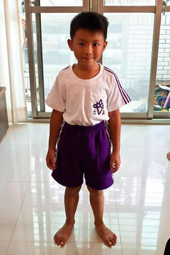
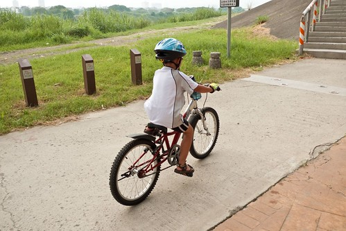
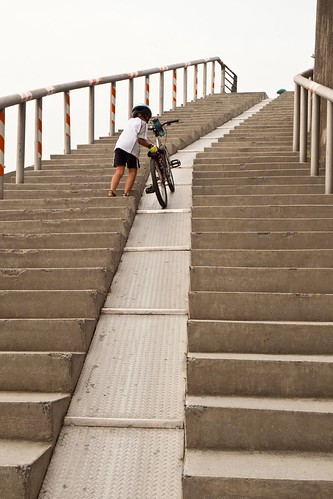
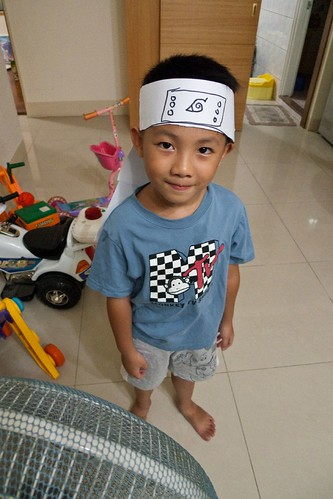
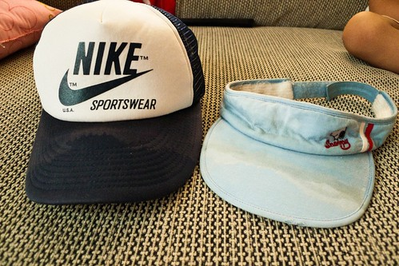

我們家的小學生開學已經快三週了 媽媽該是好好整理紀錄一下低級小學生新生蜜月期發生的大小事

\- 開學兩週 阿徹依舊覺得小學很好玩 每天開開心心的樣子 這是我跟徹爸最感到欣慰的地方... 雖然我們也知道因為是蜜月期 所以小子才傻咚咚直嚷著好玩  但起碼是好的開始ㄇㄟ

\- 小學的課程對於阿徹來講很新鮮有趣  回家時常會興高采烈+口沫橫飛的跟我形容多麼有趣 "我跟你講一個笑話..我們今天在學校有看電視耶(超不可思議的語氣)  看XX卡通" "我們今天有上健康生活 老師說要OOOXXX (儼然成為衛生教育傳遞者了)" "我們今天第一次上音樂課 /體育課喔 超好玩的..." (對不起! 媽媽實在太不才了 都忘光光了) 我問阿徹"你喜歡小學嗎?" 阿徹說"喜歡阿! 不過國語課好多喔..." 呵呵~希望隨著蜜月期過後以及11月注音大會考的逼近  對於小學阿徹還能這麼興致勃勃

(爸爸說寫這麼多字 人家會沒有耐性看啦.. 所以穿插一下阿徹開學前一天去騎車的照片)    

\- 每天的早餐是到目前為止最考驗阿徹跟阿母的一件事 阿母要費心思餵飽小孩 讓他可以不要餓肚子 可以有好精神上早上的課 而阿徹則要努力的不賴床 逼著剛起床的沒食慾的胃吃下阿母準備的早餐 講真的我很能體諒他那慢吞吞吃早餐的原因與心情 可是每當時鐘已經指到7點30分時 我跟徹爸真的還是忍不住催催催 甚至當起奴婢 書童 幫他穿襪子 幫他拿起書包 所以我說阿 小學生辛苦 小學生的爸媽也不好當阿...

\- 開學後安親班的老師換成Apple老師  相較於暑假嚴格的正音班老師 Apple老師可讓阿徹笑咪咪了  還私底下對此開心的不得了 不過Apple老師也說啦 現在跟學校一樣還在蜜月期 等學校作業多 測驗多 安親班的忙碌就會跟著來啦 不像現在每天下課後到安親班吃飽睡飽到2點多起床寫完功課後 就是自由運用時間 玩遊戲 畫圖 看書隨自己高興安排  回家也不用寫功課了(因為幾乎都在安親班寫完了) 難怪阿徹常高喊著"上小學真是太好玩了" ps.徹爸看到這邊才說 對耶今天都沒事了 還真是爽歪了

不過周四那天是一週中的唯一例外 阿徹忙忙忙  忙到一整個不行阿 那天是一週中唯一上整天課的 四點才從學校放學然後到幼稚園緊忙吃個點心後 緊接著4點半的中師美語課上到6點 然後又是舞蹈課到7點 連我們看的人都覺得好忙好累阿   可是這都是阿徹自己決定要上的 舞蹈是因為已經上了兩年 而小子竟然也自己主動說還想繼續 美語則是他掙扎很久後自己決定放棄陶藝上這美語的 (因為週一衝堂) 我們有預告也一再強調這一天真的會很累喔... 所幸他還算認命 就算練舞練到打哈欠也沒喊不要了 (因為我們也威脅要上就都要以學期為單位) 就前一天早點睡覺 而當天更是早早上床休息    希望阿徹可以撐的過去 持續下去阿...

(戴上徹爸提早送的50KM禮物- 運動型墨鏡  帥阿!!!) 

\- 開學第一週中阿徹有三天(還過週末)忘記帶水壺回家 兩天忘記帶鉛筆盒回家 第二週情況有改善些 只有週四的便當盒忘記帶回家 (我用"只有"還真是安慰自己阿) 叮嚀他週五一定得帶回家要不然便當盒放過週末肯定發霉 臭到不行 結果週五小子有記得帶回家了 而且他說他早上到學校後還把便當盒用水沖過了 嗯嗯~ 不錯 不錯  竟然會做這樣的事  罪減一級 那個週六到校開家長會時 聽到有媽媽跟老師抱怨小孩子的便當盒不見了 回家轉述給徹爸聽時 我說幸好阿徹只是忘記帶回家 結果徹爸竟然大笑說"阿徹 你會不會是拿錯人家的便當盒啦"

(這回騎到鶯歌時看起來比上次不累 體力又有進步嚕) 

\-開學第三週的週二晚上徹爸看聯絡簿時才發現 阿徹那天竟然沒有帶英文課本 一問之下 小子悠悠的說"我的英文課本不見了" 啥咪~ 才第三週竟然就有課本不見了!!! 哇勒 阿母的心中的怒火頓時上升到有如101那麼高 阿母當然是狠狠的唸了一頓 順道連有點雜亂的書櫃這事也一併唸了進去 處罰辦法除了扣除一個生日禮物外 還得自己去福利社問有沒有賣 賣多少錢 回報之後再拿錢去買 (  一年也才兩次可以買禮物 就這樣被扣一個了 不過我一開始時跟阿徹說"應該要扣除..." 我真沒打算就這樣剝奪他期待好久的願望的 阿母還是很有人性的  是後來討論處罰方式時 阿徹自己一直說"一天不能玩玩具 明年生日禮物不能買"  那我們只好照著辦嚕)

那天晚上後來阿徹很認真的查字典 要在他的畫本上先寫好"幾塊錢" "第幾排" 好在隔天去快樂屋(福利社)問到價錢後可以寫下來以免忘記 可惜隔天去福利社問了阿姨後 阿姨說她們只有賣寫字本沒有賣書 所以再隔一天 阿徹得再去向導師問清楚... 希望這週前可以把英文課本這事搞定哩

(有了20吋腳踏車助陣 速度果然增加很多 騎的更爽了) 

\-開學第一週 我跟徹爸每天都問阿徹"今天有跟同學講話嗎?" 阿徹說"有阿"  又問她"那知道同學的名字嗎?" 阿徹聳聳肩說"不知道"  問他那你下課都在做什麼阿 他說"就畫畫或是去找OOO或XXX玩(以前幼稚園的同學)" 聽的我跟徹爸倆人實在覺得很納悶  阿...有這麼孤僻阿?!

剛好期間阿徹因為久咳的問題去馬偕看醫生 醫生檢查過後說 喉嚨/氣管/肺啥的聽來都沒啥問題 於是醫生給了張衛教單張 18歲以下兒童 尤其男生容易出現的類XXX症 (全名太坳口了) 那症簡而言之就是因為壓力或是某些個性, 原因下(常同時併好動 自閉等問題...) 養成習慣性的會清喉嚨 或像老人般發出咳咳咳的聲音 我們是有點覺得阿徹有那麼一點點"習慣"性咳咳咳了 同時我們也相信如他所言喉嚨有那麼點不舒服 以致愛清喉嚨 只是我跟徹爸兩人有點自嘲卻也有點小擔心"小學不適應 不會吧?!" 所幸吃了大醫院的藥幾天後狀況改善很多 所以"小學不適應症"這問題看來是多慮了

(爸爸說 現在出門騎車阿徹已經可以盡量自己"照顧"自己的車了) 

\-開學第二週問阿徹"有認識同學了嗎" 阿徹總算提到了坐在他後面的女生 他說那女生畫圖很厲害喔(眼神還有點崇拜哩) 不過問他人家叫什麼名字 阿徹很小氣完全不肯透露(唉! 開始有秘密了) 我問"那女生是因為圖顏色很漂亮所以你覺得他畫圖厲害阿" 阿徹說"不是..他真的很會畫 很厲害耶... " 以前阿徹常"充滿自信"的跟我們說"我很會畫圖對不對?!" 阿徹現在雖然一樣會說他最喜歡的事是畫畫 但沒敢再亂臭屁了 看來在小學真是見識到高手 知道天外有天人外有人阿...

(小騎士阿徹努力的踏著車 逐一實現訂下的目標) 

\-第三週也總算有第二號跟第三號同學出現了 阿徹依舊不知道人家的名字 不過認識的第三號同學是男生喔  破除了男生魔咒 因為之前阿徹曾無辜的跟我們說"他都沒有男生朋友 沒有男生要跟他玩" 可是我總想阿徹應該還沒"娘"到這麼不受男生歡迎吧 問他 那你喜歡跟男生玩嗎? 阿徹搖了搖頭說"男生玩的都好暴力" 突然間我想起了多啦A夢裏的大雄  喜歡玩女生喜歡的遊戲  常被調皮的男生笑跟女生一樣 可是阿母我覺得大雄很善良單純哩(雖然也很傻) 而且電影中的大雄都超有勇氣的 而且而且他最後可是娶到像靜香這樣的好女生ㄋ... 阿母我心裏認真的期望"希望有一天我們家的大雄也能娶到像靜香這樣的女生"

後來跟Frada聊到此事時  Freda說因為阿徹的個性算是溫和的 而且以前寶貝日時 別的男生都是帶車子 帶機器人 可是阿徹卻喜歡玩家家酒類的遊戲 (帶去的瓶瓶罐罐可都很受女生歡迎ㄋ) Freda跟我們一樣不以為意 甚至很讚賞這樣的行為 就像以前徹爸曾經說過的一句名言"我寧可養出同性戀也不要養出流氓" 所以啦~ 當我們從不買槍買刀給他 也從不讓他看電視上那些打打殺殺的卡通後 阿徹的個性自然而然就更加不能適應那些所謂男生應該玩的玩意 可是阿徹跟他爸一樣也很愛看火影漫畫 玩火影wii  打火影架的阿   我想他的本質還是很"男性的"啦

(這是阿徹自己做的NARUTO 木葉春護額) 

(他替我們四個人做的護額  ) 

而且跟妹妹相較之下 他真的就是一整個男生樣的調皮好動暴力阿 怪怪~ 還真的有點好奇這年紀的小男生到底都是什麼模樣的... 我們很誠懇認真的跟阿徹說 你喜歡跟誰玩就跟誰玩沒有關係 不用因為刻意要跟男生玩 而就要去跟男生玩 而且我們真的覺得你是個很棒的男生了   可以騎這麼久這麼遠的車到鶯歌  很多小男生都還做不到ㄋ

所謂凡走過必留下痕跡 流的汗也必定會在帽子留下汗漬 父子倆騎完50KM後 帽子被汗漬的很扯....

