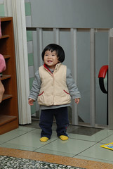
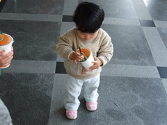
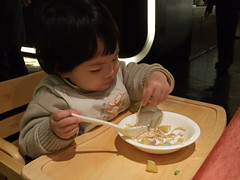

從花東回來後  
徹爸可能處理照片處理到怕了  
最近很少拿相機出來 也沒抓照片  
昨兒個徹爸抓出這三週的照片好好細看  
才又驚覺怎麼小孩又大了  
真的 小孩在大真的好快~  
  
小愛的妹妹頭長了些 若沒塞到耳後還是很像豬哥亮  
小愛越來越enjoy遊戲的樂趣 常常玩的咯咯笑~  
  
  

  
雖然還是不給爸媽保姆以外的人抱  
但比較不怕生 願意跟人玩了  
尤其四個阿公阿嬤 算是爸媽以外的最熟悉 互動最多的人  
回到嘉義阿嬤家也跟哥哥一樣放風放的很開心  
  
    
  
阿嬤對小愛很好 還拿筆讓小愛亂塗鴉  
就是因為阿嬤教了小愛拿筆在紙上畫  
此後每次小愛看到哥哥在畫圖都會很激動  
堅持也要拿隻筆 (隨便拿支不能畫的筆乎哢他還不行)  
然後拿著筆開心的在紙上亂畫  
阿嬤很得意 小愛筆拿的很好 還懂得畫在紙上...  
  
    
  
已經會煞有其事的玩起哥哥的炒菜菜玩具  
把魚放到碗裡 開心的一口一口吃了起來  
應該很快就可以跟哥哥和平共處的辦一桌"ㄘㄟ ㄘㄠ"的吧  
  
    
  
徹爸打球不在的早上  
媽媽可以很悠哉的一手牽著一個的  
帶著兄妹倆去公園嬉戲然後去50元批薩店吃各套餐犒賞母子三人  
薯條果然是這對兄妹的殺手  
但小愛還太小 果汁只能吸吸空瓶過乾癮  
  
    
  
寒冷的早晨 全副武裝像球一般  
我們說 小愛現在啥都不會最會"Bye"而已  
要回家 要出門 總可聽到她那爽朗明亮的"Bye"聲  
很甜 總讓人想要多聽幾聲  
  
   
  
除了會"Bye"外  
小愛每每要吃東西前總會先拉把小椅子坐好(或是坐到書房台階上)  
然後以令人滿意的速度吃完算是令人滿意的份量  
甚至小愛可以坐在餐椅上享用食物達一小時以上  
當阿徹還在這年紀時 完全是不可能的事  
每每外出用餐總得跟徹爸輪流吃 吃飯像在打戰  
要不就得把阿徹留在舅婆家 倆人自個去享用大餐  
也因為小愛的這好習慣 讓爸媽更願意花錢在外好好吃頓飯  
(順道再次謝謝徹爸貢獻了尾牙抽中的一半SOGO禮卷 全家一同享用廣式飲茶)  
  
對了 小愛蠻愛吃麵條的  
跟只愛吃飯的阿徹相比 真是天壤之別  
莫非女人菜根命 比較好吃好養嗎  
  
    
  
最近照相時跟他說"YA"  
會伸出她的小手指 狀勢比YA  
要不就擺頭看著鏡頭  
越來越熟悉鏡頭 願意當個小model了  
  
    
  
恬恬靜靜的小愛在不知不覺中慢慢走出自己的style  
累積她自己色彩的童年回憶~  
  
  
