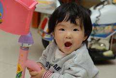
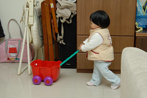

好像很少替小愛買些專屬於她自己的玩具...  
曾經拿出哥哥小時候玩的玩具給小愛  
想說那應該比較適合她點吧  
但小愛常常不太愛 摸個三兩下就丟在一旁  
對於哥哥的玩具興致高一點   
所以家裡已經時常可見兄妹倆搶玩具了  
每當阿徹不讓妹妹時 我跟徹爸就會說著"唉 既然都不愛妹妹 那把妹妹送人好了"  
阿徹哥哥只好摸摸鼻子 把東西讓給妹妹或是想辦法拿其他東西讓妹妹願意鬆手  
不過如果小愛太"過分"時  還是會被爸媽嚴厲斥聲制止的  
  
現在常可見小愛自己一個人不知不覺的玩起某樣玩具  
東西到她手上好像自然就有她自己的玩法 很有趣...  
  

家裡學步車的功用不再是拿來學走路或是關小孩的  
反而成了阿徹與小愛的玩具之ㄧ  
兄妹倆心血來潮便會爬進去嚕一嚕  
  
嬌小短腿的小愛可以自己想辦法攀爬進去學步車裡  
只是費勁千新萬苦爬進後才發現搞錯方向 有點錯愕~哈哈  
  
    
  
    
  
推著哥哥的小推車 給他有點小像氣質空服員  
  
    
  
哥哥的滑板車無法站上去溜  
坐著溜總可以吧~ 還不會跌倒喔  
只是兩條短腿在那划阿划 好像鴨子划水 超好笑~  
  
    
  
有天發現小愛自己默默的站上滑板車  
吼~給他有大膽喔  
只是站上去之後 動彈不得 進退兩難  
不過有天爸爸從後頭推著她滑後 她就愛上這快速的感覺了  
只是會"累死老ㄅㄟ"喔...  
  
    
  
操控性不太佳的挖土機也是小愛最近常玩的車之一  
小屁股跨坐在上面其實還蠻剛好的  
嚕阿嚕也開心~  
照相時還開心的比出"YA" (擺頭看鏡頭)  
    
  
坐上摩拓車 按著轉彎鈕  
聽著"左轉彎 右轉彎" 她也好開心  
我想小孩真的自然有她的生存 玩樂之道吧  
  

