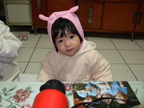

覺得1歲後的小愛成長變化很快 每天都有種"吾家有女初長成"的感覺  
但卻不知道該如何用文字好好記錄下來(其實是媽媽最近怠惰啦)  
看到徹爸整理好的照片 細細回味 細細品嚐   
嗯~ 照片果然還是紀錄成長最好的方式  
  
  
  

1.4歲的小愛 能講的單字很有限 爸爸 媽媽 姨 棒 好 嗯  嬤...  
讓原本以為女生語言發展較早的媽媽有點小失望  
但鑑於阿徹哥哥也是大雞晚啼所以其實媽媽還蠻享受現在的安靜的  
(很難想像以後家裡 兩個小孩嘰嘰喳喳搶說話)  
雖然能講的單字有限 但已經可以明確的聽懂大人對他的指示與指使  
也能透過有限的單字+咿咿ㄚㄚ+肢體語言充分表達他的喜怒哀樂與需求  
  
長腦袋的最佳證明就是越來越懂得利用哭來表達生氣與堅持  
哭一哭還會停一秒偷看你一眼 然後繼續哭的更大聲  
更甚至偶會躺在地上如企鵝班左右翻轉  
往往跟徹爸兩人看了一眼後冷冷的說"不兇不行了"....  
阿徹哥哥似乎也習慣妹妹偶而之哭鬧  
常曉以大義的對妹妹說"不要哭了 哭  有用嗎... "(完全把平常爸媽念他的都搬出來了 應該很得意很威風吧)  
當爸媽這樣說時也會一臉200%認同的說"對阿 哭 沒有用的..." (ㄘㄟˊ 自己哭的時候都不會記得)  
可憐的妹 就這樣常被三個人管教....  
  
還是不愛玩好像該屬於她年紀的玩具 對於得不到的哥哥的玩具興趣都高一些  
也慢慢會像個小跟班似的學著哥哥  
跟著哥哥 伸出舌頭捲捲舌"嚕嚕嚕"的唱歌  
跟著哥哥拿筆筆寫作業  
跟著哥哥穿拖鞋 爬高爬低  
  
還有...也會告狀了 被哥哥或爸爸欺負會來跟媽媽咿咿ㄚㄚ的比劃一番  
還有...現在會主動要牽哥哥的手走路回家  
還有...會幫忙把啥東西都往垃圾筒丟 把衣服往洗衣桶丟  儼然像個小管家  
還有...害羞的時候很愛"咪咪ㄚ笑" 常讓人家更愛捉弄她  
真的是越來越可愛 卻也越來越讓人費盡心思的難搞  
不過這就是長大 不是嗎~  
  
自己拿著哥哥墨鏡往頭上戴 還不害羞的讓爸爸拍照  
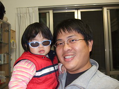 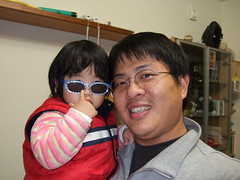  
  
彷若戴上花冠的小仙子 (越來越是個稱職的小model了)  
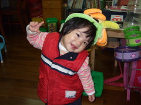  
  
頭髮總算漸漸脫離豬哥亮頭  
徹伯說"小愛越來越美了 換髮型果然不一樣"  
會乖乖的讓保母綁美美的頭髮   
但對於技術不佳的媽媽耐性不太好  
  
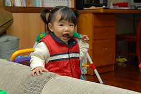 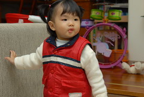  
  
一樣吃多屎多 好像除了臉稍微長肉外 其餘四肢很不給老媽面子(夏天快到了 ...要阿母臉往哪裡放ㄚ)  
臉圓圓笑起來的樣子真的很像爸爸  
很多人看到兄妹倆 都會望望哥哥然後看著妹妹說 哥哥眼睛比較大  
跟徹爸很認真的研究兩人的照片   
覺得其實妹妹不笑的時候 眼睛沒比哥哥小  
只是笑了後 臉上的橫肉就把眼睛擠的細細長長了...  
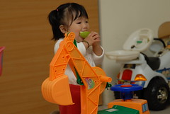 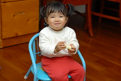  
  
天使與魔鬼很極端的表情 (哭起來真的有夠醜的)  
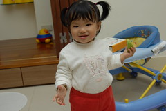 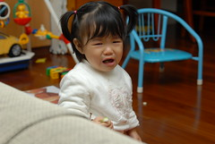  
  
還是喜歡小愛開懷大笑的樣子  抿嘴笑的樣子  
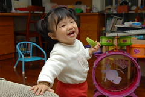 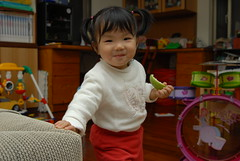  
  
看書的類型不拘 最愛的還是哥哥手上那本    
常偷偷的等著接收然後急著坐到爸媽腿上  
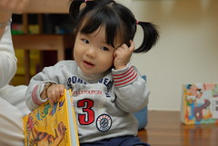 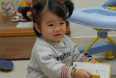  
  
也越來越會裝可愛嚕 甜死人不償命...  
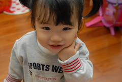 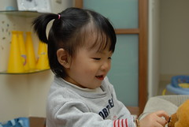  
  
  
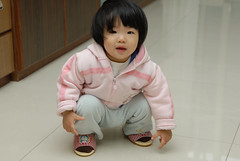 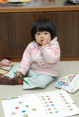 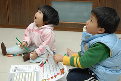
