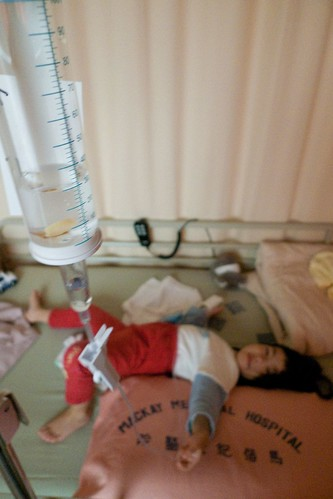 可以說是意外  但卻又好像有跡可循... 一樣季節變化的三月 一樣有點尷尬的三歲多一些 小愛追隨她哥哥在一樣的季節一樣的年紀有了住院初體驗

其實從過完農曆年後 小愛的感冒就一直沒完全好但也不會太壞 大概有2/3的天數都與藥罐為伍吧 但3月初開始的那次感冒卻歹戲拖棚的拖很久 其實一開始只是有一點留鼻水 有一點咳嗽 且在家裏的吃飯睡覺啥卻是一切正常絲毫沒受影響 所以我一直認為慢慢有抵抗力就會好的了 但老師常在連絡簿上寫 中午睡覺很咳喔 所以藥也是乖乖的給她吃 吃完再乖乖的去看醫生 醫生說"應該是過敏 氣候變化造成的 不用擔心" (不用擔心是我們"家醫"的口頭禪) 可是因為小愛的咳嗽聽起來痰音頗重 都會特別詢問醫生氣管的狀況 醫生說聽起來OK 就中間那根有點痰 既然醫生說兩邊的細支氣管都沒問題 我們就也沒拍痰了

直到3月14日前幾天 晚上睡覺咳的開始有點嚴重需要靠止咳塞劑換得她的一夜好眠 於是醫生換了藥方試試 但咳嗽還是沒改善 甚至連止咳塞劑也沒用了 於是3/15(一)給了同家診所的另外一個醫生看 醫生聽了聽還是說"沒啥問題 過敏反應" 但醫生還是再換了藥方 甚至加了抗生素

那天晚上除了咳嗽持續惡化外還發起燒來了 想想真不行真該帶去大醫院看看了 本來打算預約週二早上殺到淡水馬偕給之前阿徹常看的醫生看 偏偏醫生那天休診於是只能先預約他週三在台北馬偕的診 而小愛咳到幾乎徹夜未眠的狀況也讓我橫下心就讓他請假在家休息兩天吧 (因為我的假太少 請假是要有決心的)

從週一晚上到週二早上反覆的發燒讓我在週二早上還是臨時決定拎著小愛去馬偕現場掛號看醫生 掛了個專長氣喘的有資歷的老醫師 老醫師看了看 聽了聽 一臉和藹的說"沒什麼大問題 過敏反應加上又感冒引起發燒" 然後只開了抗過敏防氣喘以及氣管擴張等簡單的藥 雖然跑了一趟大醫院有稍微安心一點 但還是忍不住打電話詢問我們的"家醫" 家醫聽到小愛發燒有點擔心 甚至有點質疑那位他口中的"主任"老醫師怎麼這麼有信心 家醫一再叮嚀如果到隔天早上還再燒1-2次 基於為小愛好的立場 最好一定要再帶去做檢查

因此在小愛又再咳整晚 且6小時退燒藥效過後反覆燒起的情況下 週三早上又再拎著小愛去馬偕 (去馬偕前還麻煩家醫先寫了張轉診單 但是有這張不代表就有提前看診的特權 只是結帳少了170元) 醫生看診超仔細 速度當然也就很慢 10點多到達醫院後 還得等10多號才能輪到 忍不住去問護士 我們有轉診單可能要做檢查可不可以先看 忙番的護士冷冷的說"等候號碼" 高燒的小愛等到軟趴趴的在我身上睡著了 等了一個多小時在還差4號的情況下 總算聽到護士叫著"張有愛小朋友" 看診時醫生說"家醫有打電話給我問我狀況 我說我病人都還沒看到阿..." 突然心裏好感動 我們的胖胖家醫果然是好人阿

醫生聽診器一聽 眉頭很皺 一臉認真的說著"有兩個檢查一定要做 X光還有A型感冒" 然後預測了最壞最不利的可能結果 肺炎99%有吧 加上39.8度的高燒所以住院一定是躲不掉了 可是醫生懷疑可能有A感 如果證實有A感病房就得隔離 隔離?! 我心裏馬上浮現起小愛被圈在玻璃罩裏 而我只能隔著玻璃安撫她 (我好像想太多了) 幸好醫生說 隔離就是不能跟其他一般小朋友住同病房而已

反正大概百分之99.999要住院了 差的只是最後檢查的證實 所以我得利用最後距離中午12點前的15分鐘帶著小愛去照X光 送A感的檢體 中間還因為護士把檢體上的標籤貼錯 多跑了一趟 檢驗科跟診間本來不是很遠的距離 因為手上抱了個軟趴趴重沉沉的小愛讓我疲於奔命

12點半醫生看到了X光結果 果然右邊肺有一角已經一片白還慢慢往上蔓延著 所以百分百要住院啦 可是因為A感檢查報告要一點才出來 才能確定需不需要隔離 其實我跟徹爸本來就喜歡單人房的單純寧靜 所以我省麻煩的說"選單人房是不是就不用等A感的檢查結果了" 可是醫院病床爆滿阿!!!!! 單人房完全沒有 雙人房也剩的寥寥可數 所以還是得等A感報告出來才能確認病房 但是因為診間有下午的醫生要用 所以醫生只能先幫我們安排住院期間的主治且把我們的報告轉到請急診醫生看

然後母女倆又利用一點前的半小時空檔去結帳領退燒藥(醫生當時唯一能開且必須開的藥) 還有就近買麵包吃麵包以及讓小愛吃藥水舒緩燒了一上午的高燒 一點整去急診室看報告時徹爸也剛好從公司到醫院了 所幸A感的結果是陰性並未雪上加霜

之後就是到住院中心登記 到病房報到

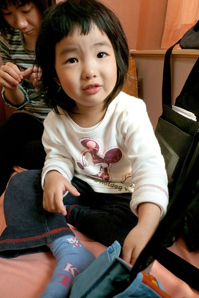

只是兩點多就到病房安頓的我們只能遲遲等著住院醫師 睡不好吃不好的小愛等到都睡著了

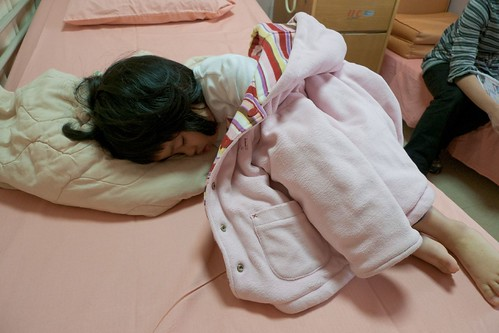

盼到四點多總算住院醫師巡到我們這 粗略的看診及問過一些相關問題後 才總算(好多的總算喔)可以進行扎針這大事 鑒於上回阿徹住院扎針時 徹爸竟然會暈針 叮嚀徹爸要小心不要過度觀看 就由我負責壓小孩就好 這回扎針的護士阿姨有厲害 竟然一針就中 只是小愛這兩天吃的少喝的少 要吸出一管要送檢的血竟然還是得花一番時間 所以徹爸還是滿頭大汗 最後站離二公尺遠

護士阿姨固定好點滴管跟板子後 還很俐落的用他的左手(因為她是左撇)反著畫了一個A夢在上面

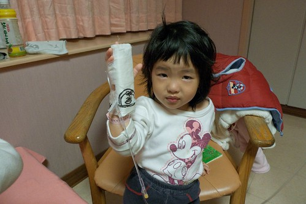

看著在哭的小愛 徹爸還哄著說"A夢耶! 你出院後問阿琦他住院有沒有畫A夢 他一定沒有..." (補充說明: 星期一Freda告訴我他將有幾天時間不在學校 因為高燒的阿琦哪天去醫院檢查為肺炎必須要住院 Freda沒能馬上辦理住院 在簽了切結書後隔天再去醫院報到住院 沒想到我們竟然也緊接著他的腳步得去住院了 唉~)

接下來幾天這根支架(重點當然是上面的點滴)將會如影隨形的跟著小愛啦

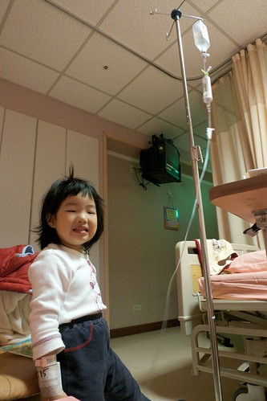

從早上到馬偕看病到搞定住院扎針這事 竟已經是下午五點了 也就是說經歷了一整個白日後 才總算有藥開始注入小愛的體內 唉....病人的"動頭"還真的得要夠阿 5點了 我也種算可以回去接阿徹還有整理住院的行蘘

小愛看到哥哥很開心 可是也直嚷著她想要回家 尤其在哥哥8點多準備離去時 心情更是焦躁不安 帶著她目送哥哥爸爸們進電梯時 大哭到一個不行 跟她說明天哥哥就會再來看你 她說"我要今天 我要哥哥今天來看我" 我只好說"你乖乖睡覺 哥哥就會來看你" 我避免說明天今天啥的 要不然她一直哭著說"今天..." 可是小愛還是哭 於是打了通電話讓她跟哥哥說"要哥哥來看她" 結果沒想到電話那頭 還在回家路上的哥哥竟然也是哭到一整個不行 徹爸說在醫院電梯門一關上時哥哥就哭出來了 然後就這麼一直哭著 也就是說到我們打電話給他時 哥哥已經哭了十幾二十分鐘了 挖勒! 兄妹倆會不會都太誇張啦... 不過徹爸說就在他說了"今天晚上爸爸陪你睡覺"後哥哥就不哭了 看來哥哥應該是在哭晚上得一個人睡覺吧!

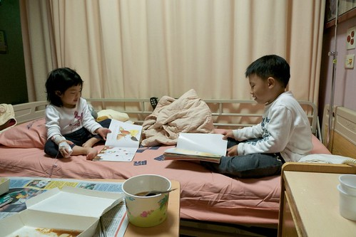

哥哥走後 小愛足足哭了10幾20分鐘之久 傷心難過到讓人覺得她們兄妹倆感情這麼好喔?! 結果好不容易安撫好 晚上九點半多後 檢驗科的阿姨又來要補抽一管血做檢查 說是因為血凝固了要重做 但我事後懷疑是因為小愛的白血球數太高所以要再檢查確認吧 哇勒!  好不容易才安撫她心情平復了 這下子又要準備讓小愛大哭了 唉........ 果然下午那次的扎針是老天有保佑可以一針命中 晚上那一抽就很折騰人了 先是檢驗科的阿姨扎到一針 可是不小心跑掉了 針就這麼在裡面"鑽"了數分鐘之久最後還是失敗拔出從來 然後護士請了值班住院醫師阿姨進來一起幫忙 阿姨在小愛的左手摸摸按按壓壓數分之久還是遍尋不找 期間又累又想睡的小愛當然已經哭到不行 看到小愛越哭越烈 我可能也面露心疼之色了 護士把我請了出去 說"這管血一定要抽 對小愛很重要 請媽媽先去外面等" 於是我在外面聽著小愛凌利的哭喊聲等了近10分鐘之久 其實被請到外面後 我就已經後悔應該堅持陪在小愛身邊的 尤其當小愛總算抽完血 點滴的管子裏嚴重的血液回流 (護士說小愛掙扎的太激烈) 且護士說"小愛個性應該很固執" (連用媽媽威脅都沒用 反而哭的更激烈害她們這麼難抽血) 我更是懊惱自己的俗辣 沒有堅持也沒有勇氣破門而入 下回不管怎麼樣 自己一定要堅持在場的 好歹要壓小孩也要用我這為娘的身軀

徹爸公司請假以半天為單位 早上9點半上班中午12點離開只需請4小時 而我公司請假以小時為單位  若請上午的4小時假可以下午1點半再進公司工作到5點半離開 因此從星期二開始(3/17)我跟徹爸像是工廠輪班似的分工著 他上上午的班 請下午的假 我請上午的假 上下午的班 (除了星期三住院我請了全天假)

我每天下班後回板橋接阿徹放學 回家洗個澡後 便再提著阿姨飯飯帶著阿徹到醫院全家團員 晚上8點多再換徹爸帶著阿徹回家洗澡睡覺  隔天早上送阿徹上學 去上班 然後中午再來醫院接替我 換我去上班 這就是那幾天的運作模式 雖然很趕很累但比想像中的還可以負擔啦!

完全沒跟阿公阿嬤們透露小愛住院的事免得她們跟著擔心 而且真的覺得小愛她們黏我們的緊 就算阿公們上來幫忙 我跟徹爸還是得有一人隨侍在側 那不如就一家四口合力撐過去 輕鬆簡單些...

其實那幾天在醫院的時光 就單純的陪著小愛玩 陪她說話睡覺吃東西 那種感覺還不錯 恬恬淡淡的溫暖感覺在心頭 而靠窗的病床更強化了這樣的愜意

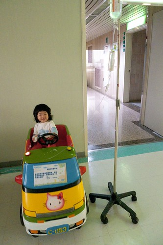

要打發小孩子在醫院的時間 對照顧的人來講是最大的考驗 所以在病房走廊常可見阿嬤/媽媽 揹著推著吊著點滴的小孩散步"度"時間 而電梯口的幾部"遙遙"更可在非常時刻發揮他安撫小孩的效果 "乖乖 今天讓你坐一次搖搖" 坐上搖搖就開心的笑了  暫時舒緩"思家病"

住院前三天起小愛就開始睡不好 吃不好 在住院後的抗生素注射以及點滴營養補充後 果然病情快速的好轉著 住院第二天胃口好多了

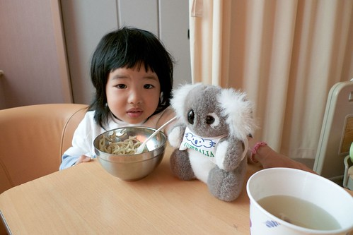

睡覺情況當然也好多了 住院之前的晚上在家邊睡邊咳(幾乎沒有超過30分鐘不咳的) 甚至咳到生氣(明明好想睡 可是又一直咳無法安眠) 住院第一晚咳嗽狀況舒緩一些  起碼在藥物投入的12小時後可以連睡3-4小時了 第二晚咳嗽少多 但卻鼻塞的嚴重就像豬在睡覺一樣呼呼叫的 可是起碼可以不被咳醒了 第三天下午之後的睡眠品質明顯提升嚕  不太咳也不呼呼叫了 那晚媽媽我總算也得以一夜好眠

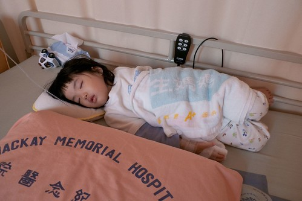

其實小孩子的適應力真的很強 從住院第一天的想拔點滴 哭著要回家 到第二天就能跟點滴和平相處 知道去哪都要推著他 也可以怡然自得的在病房內跟媽媽或爸爸打發時間 但卻也常在開心之後的下一秒念著"我想回家..."

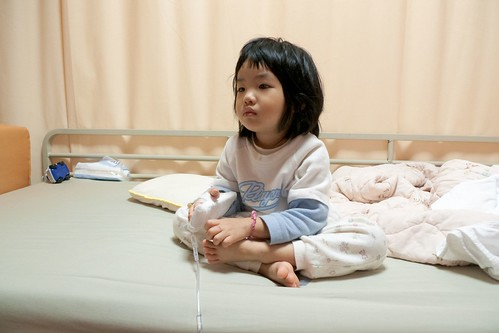

決定住院後問醫生護士的第一件事就是"要住多久?" 醫生護士說 不發燒之後觀察1-2天如果都沒再燒就可以出院了 住院第二天中午後小愛的體溫總算降到38度上下 高溫的頻率時間也拉長些了 但因為小愛住院後做的檢查顯示她的白血球數高的嚇人 醫生說一般生病小孩大約1萬多 小愛衝到接近2萬5很嚇人 可見感染的很嚴重 每次主治醫師來巡房都會一再提起這事 連醫生都不敢預期到底會燒多久 到底藥能不能有效  到底病情會怎麼進展著 所以我也已經做好最壞打算 那個週末應該還是在醫院吧

想不到星期六一早主治來詢房檢查過後 笑咪咪的說 "想不想出院阿?  今天真是出院的好日子(那天還真是陽光普照的好天氣阿) 我好多病人都今天出院ㄋ..." 聽的我開心的問著"真的可以嗎?" OHYA!  意想不到的我們就在星期六早上臨時可以出院嚕

歸心似箭的我急call徹爸來接我們回家 只是他們父子倆似乎在家拼拼圖拼的很開心 有點珊珊來遲 (父子倆利用小愛住院的幾天竟然聯手拼了一個500片拼圖 效率應該比我跟小愛在家高多 因為媽媽在家會管控時間而小愛會在一旁搗蛋)

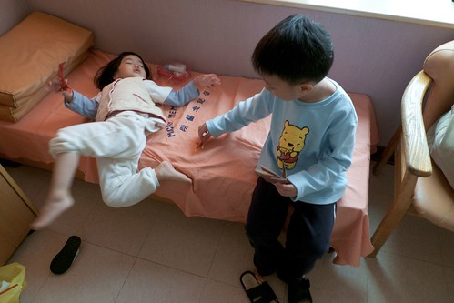

住院幾天沒全身洗澡的小愛回家後第一件事就是洗澡洗頭 然後跟媽媽在自家溫暖的床上睡午覺補眠 明明很累的她在睡了2-3個鐘頭後硬是起床要去客廳跟爸爸哥哥玩 結果走到沙發旁就這麼不支的又睡著了 而且還是跪著睡的勒...

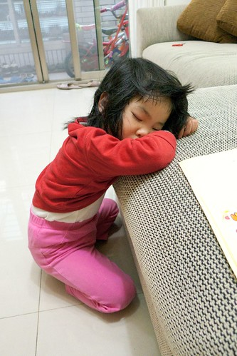

可憐的小姑娘這麼折騰了一個禮拜  希望出院後一切都沒事了

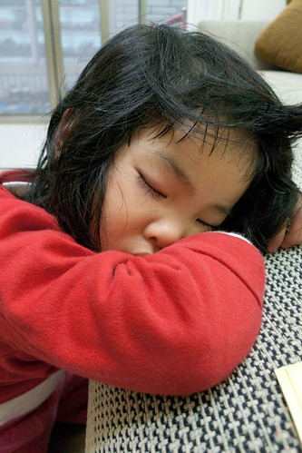

醫生讓我們提早出院的唯一旦書是必須兩天後星期一回診 星期一徹爸請了一天假帶小愛回診順便在家好好休息 回診時醫生聽了聽說好多了 然後只開了簡單的兩罐止咳跟抗過敏的藥水 抗生素不用吃了 下一次的回診也不用了 簡潔簡單的"收尾"讓我跟徹爸驚訝的難以置信卻也只能接受

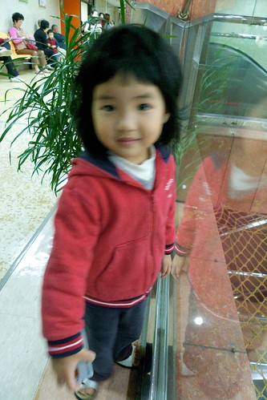

乖乖持續的吃著藥水 每天也加減拍痰 可是偶而還是會小咳嗽且痰音聽起來還尚不淺 到星期五感覺似乎又不好不壞的卡住了(就像住院之前一兩週一樣) 於是又帶去診所給我們的家醫看看 家醫"馬老大"果然一臉信心的說"放心 這次在我的監控下 一有風吹草動就會注意" 只是吃了馬老大加強氣管的藥後依舊不好不壞 所以在隔週星期一晚上還是帶去馬偕給我們信任的醫生看(下住院診斷的那位醫生) 果然醫生說聽起來還是有痰 且他認為肺炎的抗生素治療療程大約需要10-14天 也就是之前住院主治抗生素停的有點早 而且現在一直沒有完全好甚至有隨時可以惡化的跡象 因此又重新開始抗生素治療 (這回的劑量是之前的一半) 且一週後要再回診

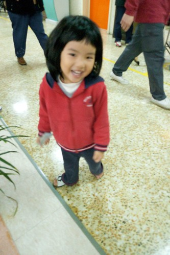

出院後小愛每天的精神狀態 活動力都不錯 甚至胃口還變好了 希望姑娘真的趕快完全病好 可以跟跟了好久的藥罐子脫離!!!

(瞧~小愛是不是看起來又長大成熟了 住院其實也可以算是蠻不錯的人生經歷啦)

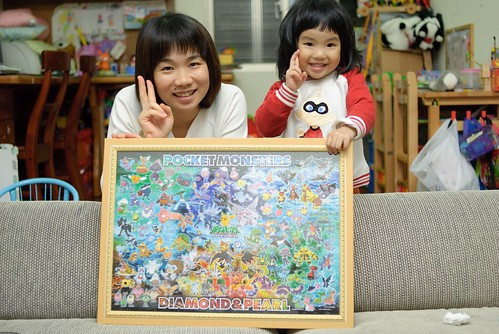

不小心拉哩拉雜寫了好多...如果你有看到最後的這裏要給你拍拍手!!! 謝謝你的分享與關心!!!
