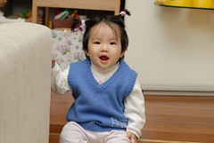
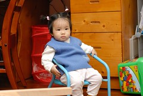
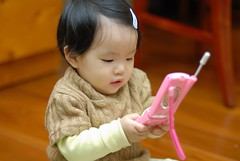
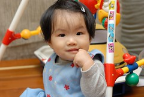
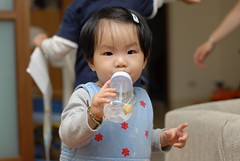
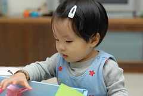
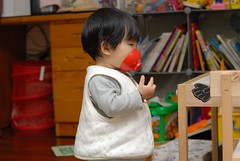
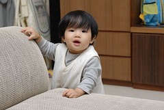
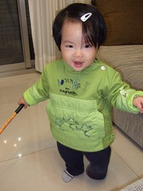
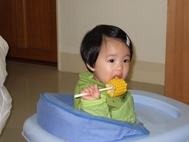

１１月２５日小愛的生日  
小愛滿一歲了  
時間會不會過的太快了點  
一年前的生產記憶猶新  
轉眼間小愛已經可以在家裏暴走了  
讓人”扎扎實實”的感受到家裡有一個小女孩的存在  

  
小愛依然迷你size  
身高應該可以號稱７０  
體重卻如蝸牛般的慢速前進（我甚至懷疑沒有前進）只有７.５公斤  
套陳嬤說的"兜沒在顧媽媽的面子"  
不過可別小看嬌小的小愛  
一天７００－８００CC人奶+2碗粥＋２－３份水果＋餅乾開水跟其他阿布?東的東西  
反正只要看到人家吃東西就肯定哀叫著也要吃  
雖然現在已經會搖頭拒絕他不想吃的東西  
愛吃肉甚於愛吃青菜  
但還算是個不太挑食的小孩啦  
常常胃口好的讓保姆擔心會吃太多  
貼補給保姆的１０００元副食品費真是夠本了  
只是吃的真的都不知道跑去哪了  
也許真如醫生說的吃的全消耗掉了　  
一點都沒能留住  
幸好小愛看起來還算機伶靈巧  
不置於讓人擔心他體重過輕影響腦部發展

會走路了代表身為”人”該有的肢體發展都已大致完成  
接下來就是細部的肢體動作學習 說話練習以及心智發展與成熟  
會跟人家搖手byebye 也會手放到嘴邊kiss bye 甚至還會明確的嘴型發出bye的音  
曾經情急要我抱的情況下叫了"媽媽" 但只有一次  
倒是"爸"的音常會明確的對著爸爸發出  
尤其看到爸爸下班進家門時 手足舞蹈外加開心的嘎嘎叫  
讓媽媽深深覺得"女兒果然不同凡響的甜滋滋" "女兒果然是爸爸的前世情人"

個性越來越鮮明 脾氣不好 固執漸漸顯見  
有時想想也難怪 爸媽都牛脾氣小孩不牛才怪 哎~  
不過小愛真的還是給人一種恬靜的感覺  
尤其當週五晚上常常搞high晚睡時  
(真的很怪 好像知道週五要放假了 常在哥哥睡著後精神會回光返照般的特好)  
一臉甜姐兒的模樣讓人不忍斥責他的不睡覺  
反倒會好好跟她享受難得沒有哥哥打擾的時光

真的覺得小孩在大好快 在學習好快  
雖然其實小愛根本也沒啥長高長胖  
但真的忍不住想常常跟她說"妹 你又長大了 真的長大了"~

(有些動作表現越來越像大寶寶了)  
(真的覺得小愛是走氣質美女路線的)  
(調皮 鬼靈精怪度真的不輸阿徹)  
(總算習慣喝水 可以一次喝下100CC了)  
(趁哥哥洗澡時發狂似的玩哥哥的東西)  
(自己戴上防毒面具)  
(週五夜晚搞high披頭散髮的模樣)  
(像是拿著教鞭的老師)  
(人生第一根玉米)
