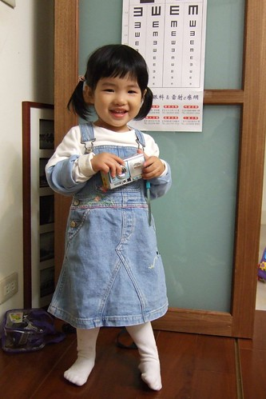

前陣子聽到同事討論著射手座女子的多變與堅持 尤其是"顧地盤"的本位主義  
聽的我一邊冒冷汗一邊點頭稱是  
想想我家射手女最近最令人瞠目結舌的不就是一連番固地盤的言行  
  
越來越能理解當初生小愛時 努力避開天蠍座一心要撐到射手座時  
射手座好友的MSN冷冷的傳來幾聲冷笑   
"呵呵 你覺得射手女生好搞嗎? 小心到時候管不住愛好自由的孩子阿..."  
身為統計"專家"的我  向來覺得"星座只不過是種統計結果的"  
但我想我會開始好好觀察 星座與我家小孩的關係的....  
  

小愛說話的辭彙與技巧正以顯著的遞增函數延伸著  尤其是顧地盤的時候  
反駁徹爸的指控時生氣加無奈的說”我就有…”  
跟阿徹哥哥吵架時嘟著小嘴說”我明明就有…” “明明就是…”  
姑娘真的有堅持 有恰....  
所以最近我們跟阿徹哥哥都會在姑娘心情好的時候笑她"你恰北北~"  
姑娘心情不好或是氣頭上的時候 這話可不能說  她可會嚎啕大哭的  
  
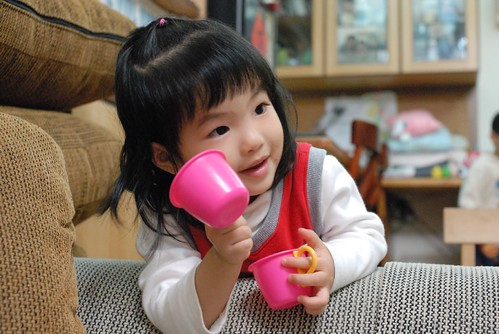  
  
幸好小愛裝可愛的功力也是一流  所以爸媽才一直無法對她下跟阿徹一樣的重手  
例如阿徹講"幹麻"這詞 是會被爸媽嚴厲指教的  
小愛的"你幹麻學我"卻只會讓爸媽也笑著跟她說"不可以說幹麻啦~"(還要學她嗲嗲的語調喔)  
徹爸就說 怎麼幹麻從阿徹口中講出來就覺得很粗魯很不文雅  從小愛口中講出來就這麼可愛...    
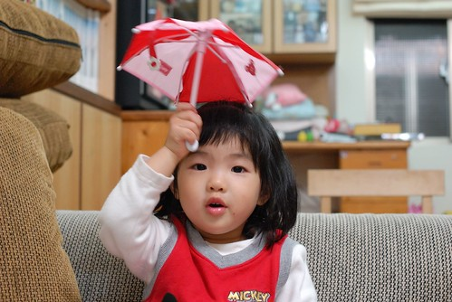  
  
有天晚上爸爸跟哥哥說 不可以隨便摸人家的屁股  
然後小愛故意摸了哥哥的屁股  
哥哥跟她說'不可以隨便摸人家的屁股'  
小愛一臉認真的反駁說'幼幼班的可以'  
ㄟ....怎...幼幼班也算是種特權嗎???  
  
小愛最近對於想做的事很愛說"幼幼班的可以..."  
而不要做的事竟也會說"幼幼班的不可以..."  
  
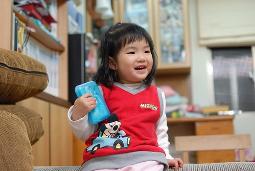  
  
有天要下樓去上學時 小愛站在樓梯口等媽媽抱  
媽媽伸出手要她時  哥哥故意"衡"出來作勢要給媽媽抱  
小愛嘟著小嘴 跟他哥說"你又不是張有愛"  
我跟徹爸聽到大笑不已    真的很難想像2歲的小孩會用這樣的語法說話  
起碼她哥2歲多的時候真的還呆呆的 無法這樣自如的運用語言  
  
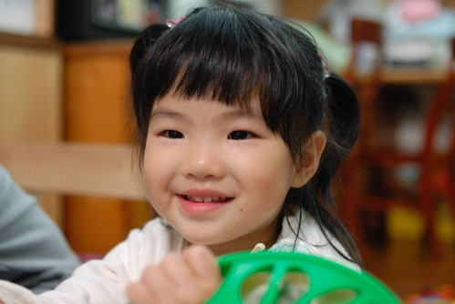  
  
我本來就相信男女生天生骨子就是不一樣  
也相信每個小孩都是獨立的個體 有其獨特的特質與個性  
但真的相差挺多的說....  
  
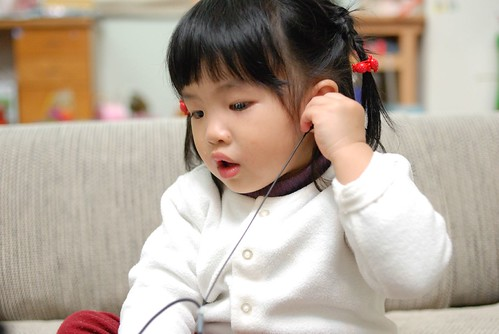  
  
雖然越來越恰但也越來越貼心  
生病的時候跟她說”你生病的時候爸爸媽媽要很辛苦的照顧你”  
小愛頓了一秒鐘後脫口而出”謝謝媽媽”  
指著身上的衣服鞋子跟我說”這是媽媽買給我的…謝謝媽咪”  
吃著水果也說”謝謝媽咪”  
穿完尿布也說”謝謝媽咪”  
   
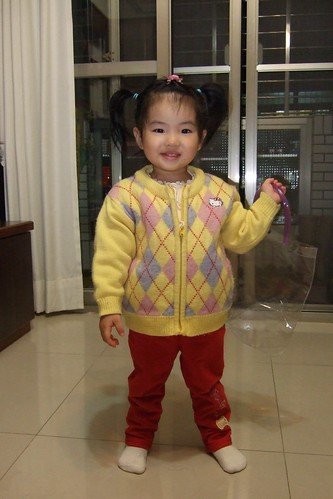  
  
哎呀~真是讓爸爸媽媽甜到心坎裏去了 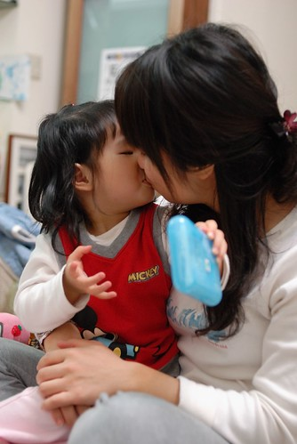  
  
  
雖然兄妹倆的爭執越來越常見了  
但妹妹還是喜歡跟在哥哥屁股後 學(模仿)跟哥哥做一樣的事  
而哥哥對於妹妹氣歸氣 但也越來越不能忍受沒有妹妹跟在身邊的時候了  
  
常常小愛看到哥哥手上的東西  就會一把搶過還義正嚴詞的說"這是我先拿到的"   
(爸爸說小愛大概真的搞不懂什麼叫做我先拿到的)   
搞的哥哥一把鼻涕一把眼淚的邊哭邊罵哭他妹  
然後兄妹倆一起放聲大哭的時候就是媽媽該出手的時候了  
"妳們不要一起玩好了  這麼愛吵架  妹東西還哥(我一把拿過 小愛當然會哭的攀向第二個高峰)  
 哥哥你自己去玩 不要跟妹妹玩好了 反正妳又不想跟她一起玩"  
然後阿徹也會哭的攀向第二個高峰"不要啦 我要跟妹妹一起玩 自己一個人玩好無聊"  
這時候我再悠悠的丟了句"那還要搶東西 還要吵架嗎..."  
兩張垂著淚與鼻涕的小臉便會一起跟我點點頭說"不要了"  
我再烙下最後一句狠話"輪流玩或一起玩 再讓我聽到吵架就不要玩了"  
到此事情就算是圓滿落幕了...  
然後兄妹倆就像是啥也沒發生的又開開心心玩在一起  
ㄘㄟˊ 距離兩人嚎啕大哭的時候還不到5分鐘哩....  
雖然媽媽用這樣的方式有點冷血無情  但真的有效哩  
起碼阿徹哥哥的肚量真的有越來越大 要不也有比較懂得怎麼乎巄她妹 轉移她妹的注意力了   
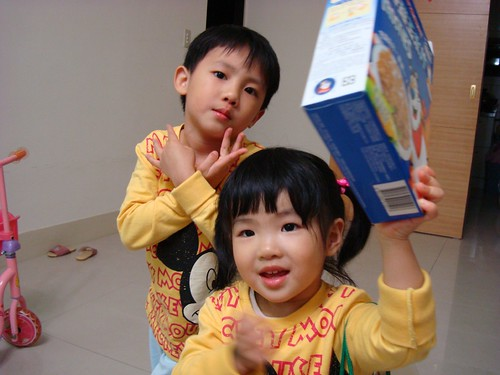  
  
就像爸爸的耳機要一人分一耳才可以都聽的  搶就誰都沒有了喔...   
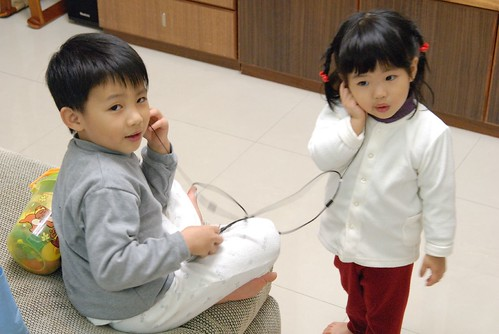  
  
射手座另一個讓我見識到的特點是"大膽"  
尤其是看到小愛對於這大滑梯躍躍欲試時  我跟徹爸真的只能說"這小女子非泛泛之輩阿"  
  
一開始我們讓小愛先試試一小段  
  
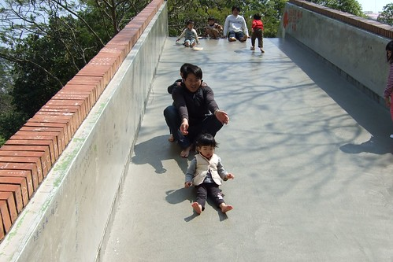  
  
恩~感覺應該還不錯吧    
畢竟是45度的斜坡 比起公園裡的小滑梯爽度應該上升不少  
  
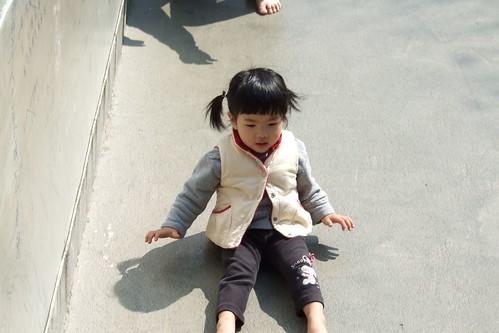  
  
然後一骨作氣自己走上高點啦  
雖然有點"挫"  但還是給她自己溜下來了  
反倒是有著高速重力加速度的徹爸溜的心臟蹦蹦跳  直呼"老了 老了 我不行了"  
  
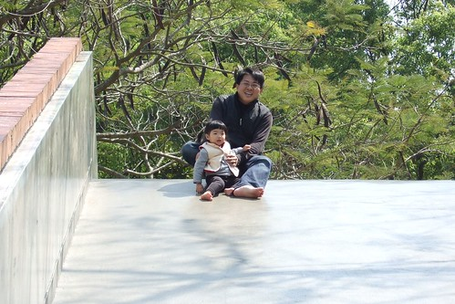  
  
小愛只有10公斤重力速度不大    
加上她會用她的雙手雙腳稍加增加阻力  
所以她的速度反倒是剛剛好 不像越重的人越得擔心到底後阻擋不了的飛了出去  
只是她那相較之下顯慢的速度又讓人擔心會被後頭有著高重力速度的大孩子給追撞下去  
所以結論是 玩這不止小孩心臟要強 大人的心臟也要強啦....  
  
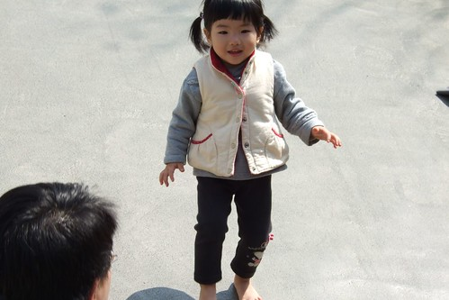  
  
玩了幾趟後 幸好小愛也很認份的自己說不要玩了  
不過自己還給自己拍拍手 說自己好棒 第一名勒  
  
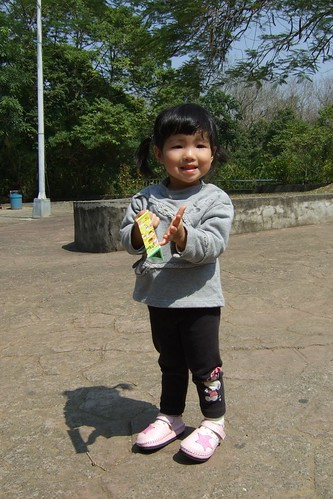  
  
好啦~你最棒 你是我們家的大膽愛~  
  
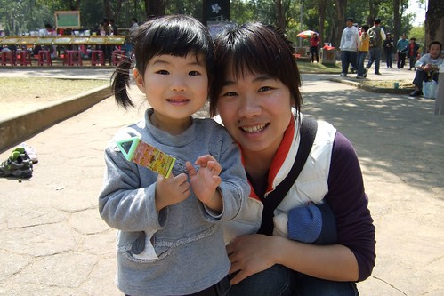  
  
大膽愛連碰碰車也要自己開了  徹爸是被徹公要求得坐在後頭的  
免得不小心撞翻一旁的套圈圈攤子  那損失會就有點慘重了...  
  
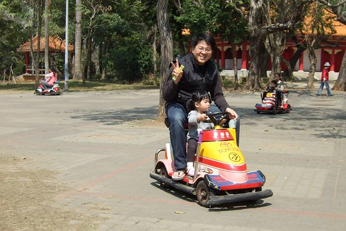
