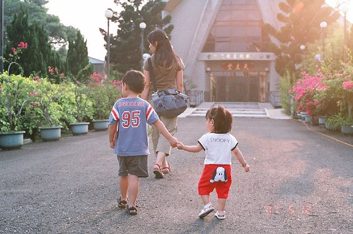
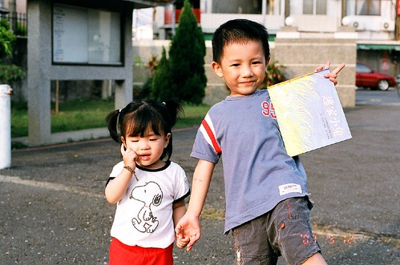
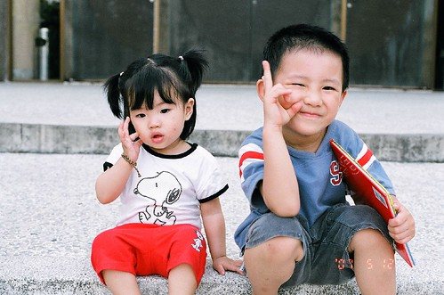
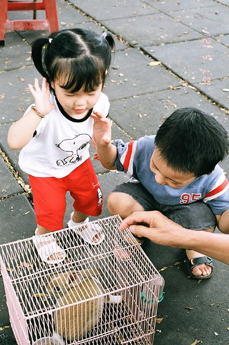
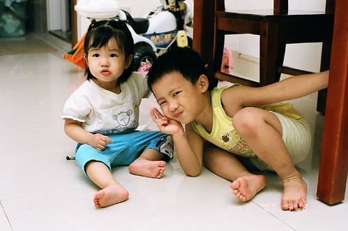

  
  
  
過完年 天天漸漸暖和後   
開始讓小愛在從保母回家的路上自己走路  
從一開始的只走捷運站內那段平坦的路  
(保母家在捷運一號出口 我們家在三號出口 捷運站是必經的地下道)  
然後出站後的凹凸不平且人潮洶湧的人行道  
到讓她自己站在手扶梯上 從上而降 從下而升  
小愛越來越不安於被媽媽抱在手上  
  
小愛被媽媽放下後 會尋著媽媽的手要牽牽  
阿徹哥哥看到常會吵著"我要牽妹妹的手"  
然後顧自的 想盡辦法的要去牽妹妹的手  
可是妹妹常很不領情 會撇身不要哥哥那"強來"的手  
若強不過哥哥的逼迫 便會苦臉唉唉大叫  
兄妹倆常這麼的僵在人來人往的新埔捷運站內  
看的過往行人忍不住多瞧幾眼 掩嘴微笑  

一開始阿徹很不能接受"為什麼妹妹不要讓我牽"  
我說可能她覺得給媽媽牽比較有安全感吧  
有時候小愛連媽媽的手也不給牽 一個人儘自暴走   
我總算可以用更能撫慰心靈的話說"你看她連媽媽的手也不想牽阿"  
當第一次小愛願意讓哥哥牽著小手走路時 阿徹哥哥好開心 好開心  
笑的很燦爛的跟我說"妹妹要讓我牽她的手了"  
這幕小手牽著小小手的畫面更是吸引了無數過往行人的目光  
有的像是在說"ㄟ...擋到路啦 擋到路啦"  
有的又像是在說"ㄟ...小孩子 小心一點"  
更多的像是在說"好一對可愛的小兄妹阿"  
老實說 媽媽這時候有點不好意思但也有點驕傲  
  
只是讓她們兩個小人並肩走路 媽媽得更小心掌握路況了  
小心兄妹倆成為路霸 小心路上的路霸绊著兄妹倆   
小心別被路邊停放的摩拓車燙傷了 搞髒了  
(曾經阿徹的頭就這麼硬聲聲撞上路旁一台凸出許多的摩托車後座)  
很多的小心與擔心 但就像人生的道路是需要他們自己走過才能體會明白的  
  
  
  
跟小愛說要照相時  小妮子的pose便是小手放到臉龐  
眼睛迷濛的望著下方或旁方  
不管爸媽怎麼呼喚 怎麼等待 小妮子就是這樣子直到你照完相   
怎~突然覺得這眼神有點像唱著玻璃心的楊林....  (天阿...)  
  
  
  
小愛現在會跟著哥哥一起與阿公阿嬤去公園玩耍  
完全可以不需要爸媽陪的在外玩耍2-3個鐘頭  
阿嬤說阿徹算是照顧妹妹的了 走路會牽著妹妹的手  
偶而還會轉過身親一下妹妹 好像感情很好的樣子  
  
  
  
兄妹倆狼狽為奸的躲在餐桌底下吃薯條  哥哥好個榜樣蛤...  
  

