前陣子跟徹爸兩人才在說"妹妹很懶惰 都不像哥哥那樣好動愛爬"  
想不到這一週妹妹整個人卻突然靈活了起來  
不止臥房 客廳 廚房 廁所 自己一人來去自如  
還越來越懂得爬上爬下的技巧(在張嬤家還爬了10階的樓梯)

望著她俐落的身手 彷若開始思考的眼神  
真的只能說 "長大了 真的長大了"  
真是好個歲月催人老阿~  

最近很愛推著小機車四處溜達 偶而還會停下來講講電話 翻翻置物箱

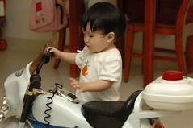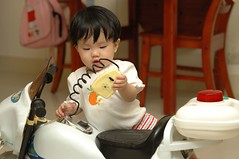

為了拿哥哥的貼紙簿 趁人不注意大膽的站上積木堆上 被發現後還不忘傻笑

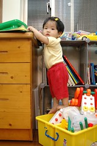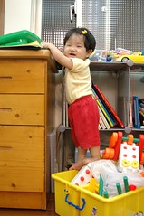

爬爬藍色小椅子已經算是基本動作了 就像開口吃飯那般

沙發是目前仍在挑戰的目標  偶而可以從沙發下到遊戲區  
也想要從沙發爬到地磚上了 我想應該是一頭墜地比較快一點  
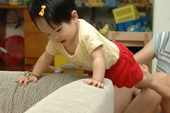

開始有七情六慾 有慾望了  被拿走東西後會懂得哀號了(蓮霧鼻實在有夠像媽媽的 真慘)

昨天練成的"功夫"爬上桌子再爬下來  
爬上後若無其事的坐了5分鐘 沒人救她下來 只好自個想辦法了  
腳探不到地開始有點惶恐 小啜泣了一下   
小桌子上左右又繞了好一會 媽媽還是不救她  
只好硬著頭皮再嘗試 總算腳搆到椅子  先下到椅子上 接著平安落地  
成功!!  
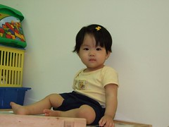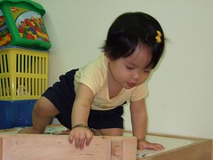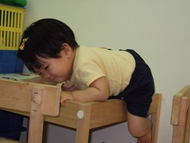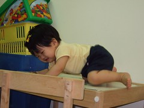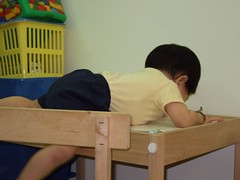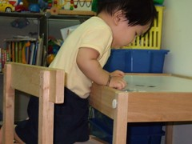

有了成功落地的經驗 小妮子又自信滿滿的爬上桌然後下桌  
前後不到2分鐘完成 速度快的連小DC快門都來不及  
別太得意阿 小心驕者必敗阿~

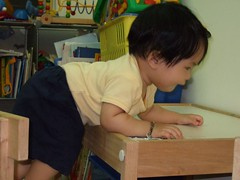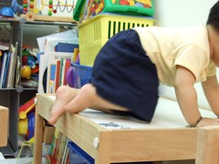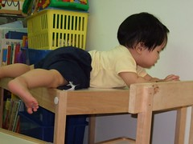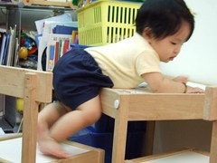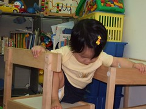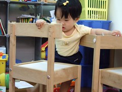
