昨天晚上睡覺前 愛愛一臉滿足 開心的跟我說"今天好好玩 下次還要去" 我笑說"今天一整天都沒出去(除了吃午餐) 你都在家瞎玩阿"  愛愛笑著解釋說"還要像今天在家裡這樣啦" ㄏㄏ~ 其實不只是愛愛 我們一家子都愛這樣宅在家 雖然一整天下來 我的產出只有餵飽大家的早晚餐以及烤兩盤中種麵包 而徹愛們除了看週間錄的電視節目外 更是無所事事的讓人搞不懂他們都在忙些什麼 有點忙  有點盲 是平凡也是奢侈 真高興我們都懂得這樣享受~  

話說我覺得家裡最棒的一點就是 有個可以讓小人玩耍的小環境 小遊戲室 小兒童房 以及徹愛從小時累積起的各式書籍與玩具 讓打發小人這件事不會太難 加上我們從小又以身示範的告訴/提醒徹愛培養興趣的重要 所以在我們家 可以躺在沙發發呆 可以在任意光線充足的地方看書 可以把遊戲區鋪滿家家酒玩具遊戲 也可以把自己躲在房間裡做秘密的事... 唯一不可以就是不能喊無聊 總算徹愛越是長大後的現在 我們可以很多時候雖共處在家裡這個大空間裡 但四個人卻在不同角落各自做自己的事 我跟徹爸每每被這樣祥和的畫面 感動的給彼此一個大擁抱~

這一年樂高出了一系列的friends組合 迥異於以往的城市 車子或是消防隊等等的陽剛主題 走家家酒路線的friends一上市就吸引許多小女生的喜愛 我們家那對很愛玩家家酒的徹愛想當然爾也是心動不已 半年來陸續因著生日禮物 聖誕禮物 過年樂透小獎金以及阿徹存了一兩年的零用錢 家裡不知不覺竟也累積了好些 而這些小樂高更是兄妹倆打發無聊時光的最佳選擇 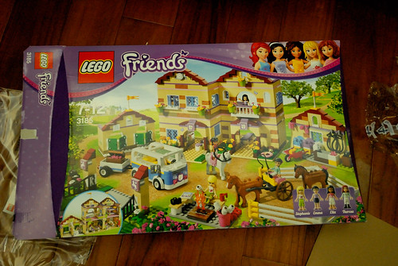 前陣子阿徹生日 他撒盡所有銀蛋買了剛好特價中的農場組 回家後兄妹倆花了三天時間 在家醒著時不是吃飯寫功課就是在組裝樂高  兩人超級執著且難得的分工合作及互相體貼的完成組裝  超多的小配件以及有模有樣的建築物規模 讓兄妹倆喜歡又滿意的不得了 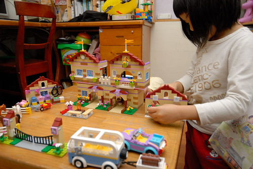 只是阿徹完成組裝後竟不太履行當初找愛愛贊助出錢時說的諾言 讓愛愛總是氣呼呼的說"你都不陪我玩家家酒 我以後不要再幫你出錢了" 我笑說"哥哥玩樂高的樂趣是在於做的過程 你就自己玩家家酒吧" (阿徹在一旁點頭如搗蒜) 愛愛哀號"沒有哥哥 我就不想玩啦~"  這對兄妹的依附關係真的很有趣 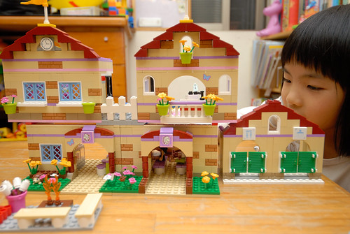 過沒幾天 阿徹手又癢了 開始跟妹妹打商量改建事宜 求了好久 總算妹妹答應了他 只是條件是蓋好後一定一定要陪她玩家家酒(後來阿徹當然又都敷衍他妹) 於是在哥哥的主導下 兄妹倆又花了好些天晚上 動員所有家中小樂高 完成他們口中的"民宿"  完工後 我在他們的解說下好好觀賞他們打造的民宿小屋 哇~ 真的很漂亮呢~  而且看的出兩人有豐富的住民宿經驗 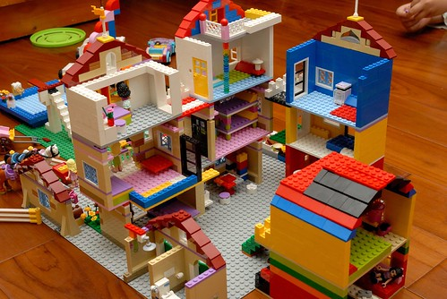 為了紀念兄妹倆打造的民宿之家 有天晚上我拿著相機趴在地上 隨著兄妹倆忙錄的角色扮演與場景更換 替這個小屋留下見證 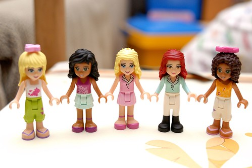

場景一 民宿的中庭內  中庭串連著三棟建物共八間房間的出入 也是旅人交流談天的好所在  場景二 農場的馬廄  住宿的旅客都贈送有騎馬體驗課程  場景三 游泳池畔 有水上摩拓車可以騎  還有跳水高台可以跳水 真是酷斃了 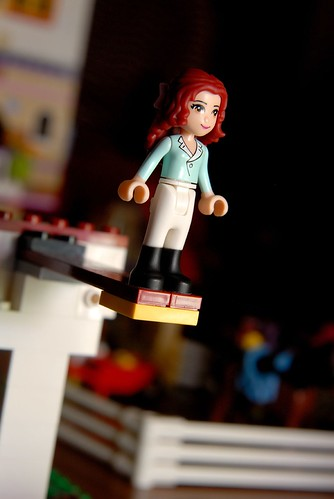 場景四 戶外餐廳 飲水機 冰箱 各式調味料 餐盤 杯子....一應俱全 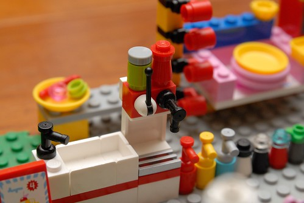 房客可以替自己準備一頓美味的餐點 然後在庭院的雅座中享受美食 (話說連寵物都有好吃的ㄋ)  場景五 民宿最核心的各個房間 就讓我們一一打開 窺視一番 (連別的樂高小人也來尬一角)  有著上下舖的紫色小房間 很是適合兩個女生的背包客 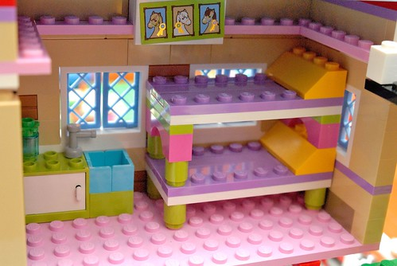 只有梳妝台與單人床簡單擺設的房間當然是for一個人旅行的女生 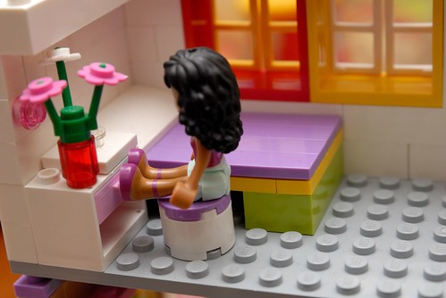 有著沙發與陽台的豪華房間 適合放空的旅人 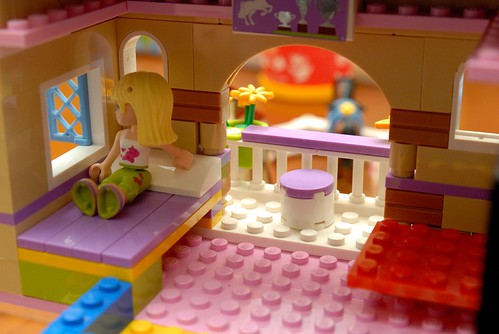 加上陽台望去便是美麗風景 這間房間的定價真的好貴ㄚ!  除了數間房間 以及戶外的餐廳 游泳池外 還有室內的視聽室 交誼廳供旅人使用  而盥洗間的設備也是一流 完善的淋浴設備  齊全的梳妝打扮行頭  就連馬桶也是乾淨又舒適的哩 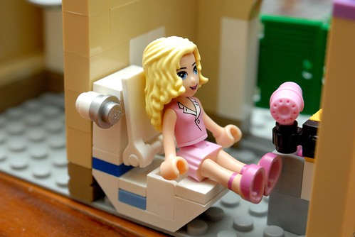 介紹完食與住 最後的"行"也是多樣的肯定讓人滿意 兩個女生可以帥氣的開著跑車去兜風  一家四口可以使用四人座的休旅車  而如果是一大家子也別擔心 民宿老闆也貼心又大氣的準備有豪華小巴士任君使用 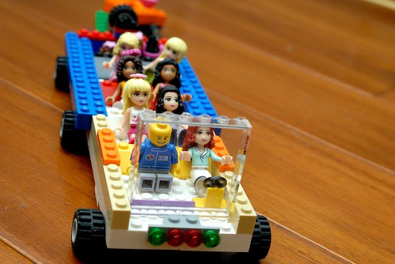 你說這民宿讚不讚?! 我好想去住阿!!! 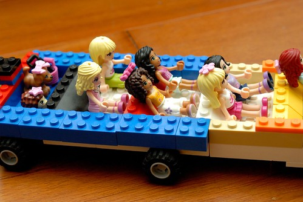 為了表達對兄妹倆的讚賞與肯定 我履約替阿徹寫下這篇日記 而就在昨天 阿徹也拆除了這間民宿並花了一兩個小時把各零件分門別類裝好 Good boy & girl! 不過徹爸說我好像在幫樂高打廣告ㄛ~ 哈哈哈~~~
