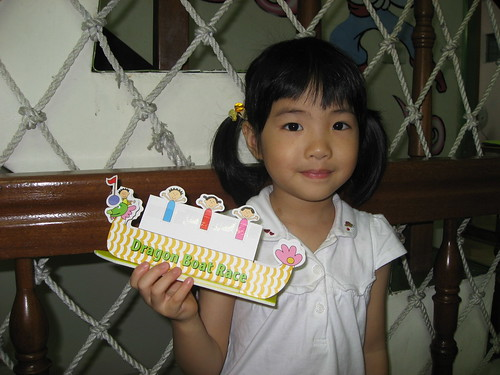
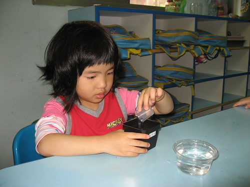
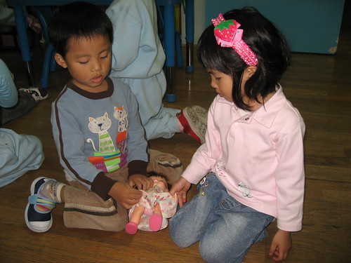
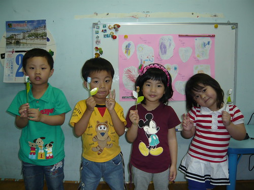
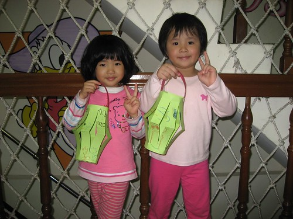

愛愛升上中班已經一個月了   感覺小女孩變的不太一樣了 是長大 是成熟 是機伶 但也是難搞外加拗脾氣 望著家裡一雙逐漸脫離爸媽印象中小嬰兒模樣的兒女 我與徹爸兩人益加懷念起小時後的阿徹跟愛愛也越來越喜歡兜弄那些別人的baby 隨著小孩每個階段的成長 身為爸媽的我們跟著有不一樣的學習與辛苦 講真的費心小孩的教育問題 品格問題遠比只要擔心他有沒有吃飽 睡飽來的勞心勞力許多... 如果可以  可不可以就把小孩定格在那最最最可愛的三歲之前阿!!! 

來回味一下愛愛小班下學期在學校的照片 這些照片都是這半年陸續在學校的flicker網站上下載下來的 擱了這麼久再看 阿母我還是只能說那句老話'真的有在長大阿~~~'

雖然上幼稚園就是吃吃喝喝睡睡玩玩 小孩有開心有健康有安全就好 但學校的任何學習課程 聽說愛愛都是很認真的喔 

幼幼班跟小班的課程很著重於小手指的運用訓練 升上中班後日子應該沒法再過的這麼愜意了 

細心灌溉小樹苗 

看 小白菜長出來了 '媽媽 什麼時候可以炒來吃阿' 

當初決定讓愛愛唸一般小班最大的考量就是想讓她暫時跟她的三人行稍微離開些 多去熟悉 認識一些不同的同學 小朋友 而且希望在家已經是老么 備受爸爸媽媽跟哥哥寵愛的她(相較之下真的有寵啦) 能夠在正常的同年齡環境中學著去當照顧人的小姐姐 很高興這一年的小班裡 愛愛口中的好朋友多了好多個  班上的一號到十號也都能如數加珍 且在同屆裡算是較早出生的她也真能拿出'大姐頭'的風範照顧其他小朋友甚至還是老師的最佳小幫手 看到這些愛愛跟同學一同分享玩具 且似乎還邊玩邊談心的模樣  我更加欣慰當初的決定是對的

(這是愛愛最好的朋友 跟她同樣是班上的迷你小個子) 

哈 兩人各自用小手拉著娃娃的裙子一角還真引人遐想 此時愛愛的心理可能在想'你要不要還我了啦 我要去跟我的老朋友玩了啦...' 

各式團體活動的照片中也都可以看到愛愛那自信又快樂的模樣~ 音樂發表會舞蹈表演服裝試裝中 (寫到這徹爸剛好喵過來唸了句 那頭髮真是太糟糕了...呵呵) 

班級的音樂表演服裝 

美勞作品展示 

春季庭園野餐會 

故事屋戶外教學 

元宵節燈龍製作 (這張真的有隔半年 有沒有長大很多的感覺) 

品格教育之黑暗中尋找迷失的摳ㄇㄟˋ 

我們家的愛愛經過小班的洗禮真的長大不少 接下來的中班 我相信不論外貌或是心智上一定會改變更多的 至於變好還是變化 就看愛愛跟我們的努力到哪裡了  加油阿~~~
