前陣子把前前陣子的愛愛照片貼在blog草稿裡  想不到不知不覺就又放了一兩個月了... 網誌管理介面裡呈現草稿狀態的文章應該累計有十篇以上了吧 雖然大部分都是早已貼好照片等著加文字的遊記 不寫也沒關係 但心頭總有一點點的遺憾...

最近blog有新增一個預設功能 就是在每篇的文章下面都會有隨機選取的以前文章 我跟徹爸有時間且心情也對的時候 很愛順道點選這樣的隨機文章看看 看著照片裡不同階段的徹跟愛 好笑的 好氣的 或是值得紀念的點點滴滴 感覺實在很有趣 而且很多早已遺忘的事就這麼又被點醒 總讓我們看的忍不住惠心一笑 不知道以後她們的另一半更甚至他們的小孩是否可以透過這些而更了解愛徹家 更愛愛徹家..

趁著清照片的同時順道紀錄下愛愛這學期來寶寶手冊上 Jennifer老師或我所寫的分享

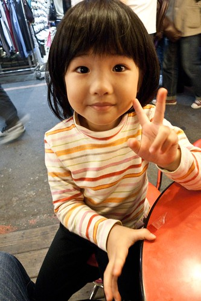 (愛愛很愛吃粉圓豆花裡的粉圓 可是他又不太會說粉圓 每次都說他要吃黑黑圓圓的那個) 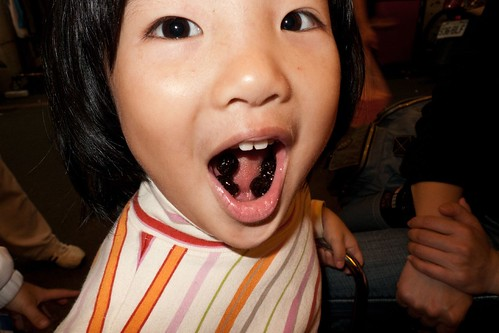 

(2月最後一週) J:  長大一歲的愛愛每天依然生氣勃勃的愛發表自己的想法 也依舊習慣的帶領眾好友們活動去... 相信愛愛一定很享受上學的日子的喲

M: 只是愛愛真的是越來越愛講話了 就像Jennifer說的你說1句他跟著說2-3句 就像 回家的路上常跟阿徹哥哥爭著跟我講話 我還得規定兩人輪流來 哥哥稍微講久了一些 她便會又生氣又難過的一直唸著 "哥哥一直講 哥哥講好久喔 換我了啦" 等到哥哥總算講完 我跟她說"換你了" 她的表情可以馬上一百八十度的大轉變 一臉天真開心的跟我說著她學校發生的事 真是辛苦Jennifer還有其他小朋友們每天這樣被她轟炸 也麻煩&拜託你們能有耐性多多 請愛愛聽你們講…. 此外愛愛最近的脾氣常會又拗又倔的也麻煩Jennifer多幫我們盯一點 謝謝~

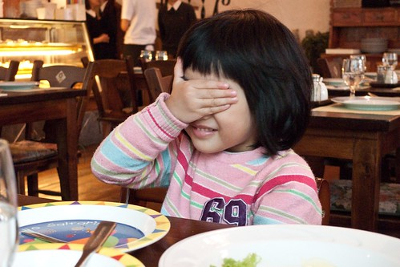

(三月第一週) M: 週日當徹爸徹媽跟徹哥各自忙著自己的事時 愛愛沒吵也沒鬧 卻一起待在房間裡玩著她自己的老師遊戲 上課上到一半 鈴~鈴~鈴~電話響了…. 就說"等一下 老師接一下電話喔" "喂~ 你好 請問找誰.." "我們在上課 他現在不方便接電話喔…好 我會幫你轉告他…" 徹爸說 "哇賽~一整個忙碌又超有架式的" 哈哈~我說 說不定老師在學校里就是這麼的忙碌 能幹 結果都偷偷被愛愛有模有樣的學起來了… 除此之外 愛愛最近在家也有積極練習舞蹈班要上台表演的曲子喔 換上舞蹈衣 穿上新的舒適舞鞋 對著假裝的大鏡子(關著的電視) 念著口訣 動作一個接著一個很俐落 只是害羞的愛愛都不准我們看(尤其媽媽) 自 己逕自的沉盡在他的快樂舞蹈/遊戲中~

J: 可見得這小姑娘在教室裡除了忙著說話 帶領(分配)遊戲之外 也有注意到我喲 嗯...有沒有破壞形象的時候呀?

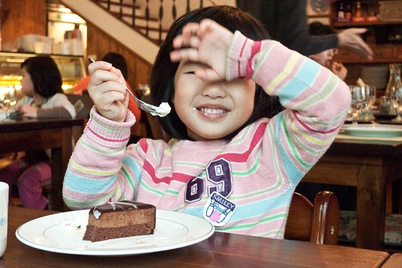

(三月第四週) M: 愛愛最近在家常會哼起要表演的曲子 還很得意的跟我們說她要打大鼓喔 媽媽高八度音很好奇的問她"你這麼瘦小 打大鼓? 打的動嗎?" 愛愛點點頭 做出奮力一擊的樣子 呵呵~真是期待看到愛愛的演出

J: 大鼓選手可是經過Mabel & Jennifer多堂課的觀察下 挑選出穩定性較高教不怯場的人選喔 而平時害羞得很的愛愛 在經過充足的心理建設(很棒 很認真 很勇敢 很...的人才能擔任)後 也沒讓推薦的Jennifer失望 幾次練習之下也讓Mabel 拍手稱讚喲 相信愛愛 她很厲害的~

(四月第三週) J: 愛愛的兩首歌曲的確有做到確實 不馬虎 不怯場呢 最值得稱讚的是 平時練習時 愛愛的大鼓都是放在大積木上墊高敲擊的 而臨到就定位時才發現墊大鼓的大積木仍在晨暘睡覺呢 糟糕...在找不到替代品之下 只好笑笑的告訴愛愛實情 臨時改變站姿 微彎身 一手握鼓 一手拿鼓棒敲擊 所以愛愛就在如此克難的情況下鎮定 大方的完成表演 真的超級棒的~

(坐在台大校園裡 望著川流不息的人潮 這樣的世界還離徹愛好遠....) 

學會的第一首流行歌'童話'  讓愛愛最近很常隨口哼唱 等候媽媽的空檔 連雨傘都可以當麥克風唱了起來 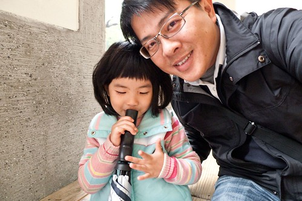

(音樂發表會前 為了練習而穿的舞蹈衣) 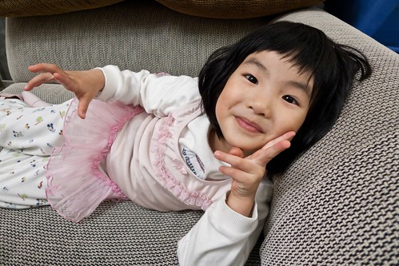

(今日這對父女的ㄓㄨ頭臉超像的) 

徹爸很愛逗愛愛 尤其是姑娘鬧彆扭或是害羞的時候 搞的姑娘總忍不住氣呼呼的對他阿爸說'我討厭你' '我不要理你'..之類的話 看到這樣我也忍不住跟徹爸說'你很愛鬧她耶' 結果徹爸總是笑咪咪的說'誰叫她這麼可愛 我就很愛鬧她' 這對前世情人真的很愛吵吵鬧鬧哩.......

剛懷愛愛時 徹爸說他希望還是男生 因為他擔心他會不知道怎麼對女兒 怎麼跟女兒相處 結果現在愛死她的寶貝女兒 逮到機會就抱人家親人家

我這媽媽會不會吃醋?! 真的不會說..因為我也好愛這女兒 也很愛抱她親她........

只是女生好像似乎真的比較嬌一點 或許該說比較注重小細節跟一些感覺問題吧(這就真是男女大不同了) 

所以女兒可愛歸可愛 該噹的時候還是會被噹的很慘 

不過愛愛不論在家裡跟在學校裡都是很好的小幫手喔

(五月第一週) J: 本週玩具熊來的一位新的小女生 愛愛本著其熱心的個性 不論上課上廁所...始終照顧著對方 也隨時注意著對方的一 舉一動 超級盡責的 只因為Jennifer在新生到班的第一天上午委託愛愛要幫忙照顧心來的小朋友喔 真的是Jennifer的超級小幫手

M: 愛愛不只在學校愛當小幫手 小姐姐 連在家裡也很喜歡當爸爸媽媽的小幫手 我們在拖地時 他總會很熱切的說"我來拖 我也會拖喔.." 媽 媽偶而洗碗時也嚷著"我會洗碗 我幫你沖水" (爸爸洗碗就不會了) 跟他說"可是碗很重怕不小心拿破了" 他說"那我可以洗湯匙筷子阿" 又 跟他說"可是你不夠高" 他也說"我搬椅子來就好" 其實那些都是媽媽趕 時間敷衍他的濫理由啦  不過小妮子都有對策 媽媽往往只好投降 讓他幫點小忙 滿足他的虛榮心 我相信假以時日 愛愛能做的事一定越來越多越來越好 真正成為媽媽的大幫手…..

越來越會玩wii了   雖然還是哥哥口中的遜咖一個不過認真的小孩最可愛了 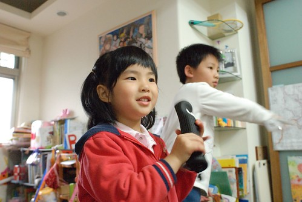

(很愛看新娘子  有機會的話都會跟著爸爸媽媽去喝喜酒看美麗的新娘 ) 

(下面這模樣又有ㄓㄨ臉了 不過十足大女孩的FU了) 

還是很愛當全家人的跟屁蟲 所以家裡的任何活動都會很開心的參與 騎車去野餐 自己一個人可以吃掉御飯團 可見真的很愛野餐 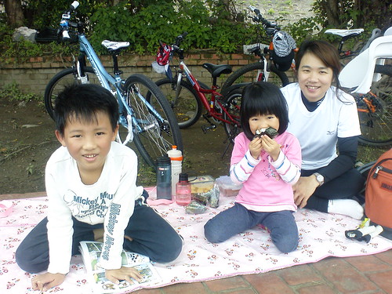

新坐騎也真是越來越舒適了  難怪這麼愛跟著趴趴造 

M: 覺得愛愛最近的拗脾氣似乎有改善一些 比較容易"放下身段" 承認自己的錯誤 不過還是很愛面子哩 如果不小心撞到牆或是跌倒之類的 如 果他覺得週遭沒人發現的話 他自己便會悶不坑聲 摸摸鼻子好像就算了 可是如果我們因為替他覺得疼而出口問他"還好吧" 他反而一二三啪的眼 眶就紅了起來 ㄍ一ㄥ了起來 所以啦 還是不要太把她捧在手掌心 反倒可以堅強 希望愛愛可以越來越堅強 但越來越放的下身段!!!

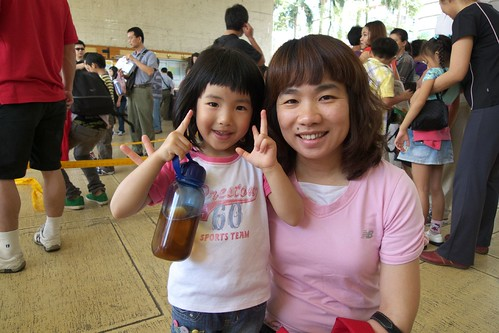

(媽媽在猛力k火影的時候 姑娘總也一起跟著假認真) 

雖然愛愛應該完全不懂火影 可是因為玩wii的火影跟隨手可翻的漫畫 她個人本身倒是覺得自己跟火影還蠻熟的 

J: 在學校和同學同樂玩耍時 偶會有出槌如騎腳踏車翻倒 跌倒等的狀況出現 這時她會很迅速的恢復正常貌並停止(僵住)一兩秒後再若無其事的繼續之前的 遊戲 而不小心看到的路人甲這時絶對不能讓咱家的愛愛發覺 更不能向前表達關切的動作 因為會很尷尬...... 我通常會在她自己條 是好(自以為沒事 沒人發現)之後 在經過他身旁時不經意的拍拍她告訴她~沒關係 勇敢喲  有需要(擦藥或冰敷)要來找我哦 這時她就會露 出小小的微笑 回答著"好"或"只有一點點痛而已啦" 勇敢的孩子! 加油!!

這是阿徹跟小愛的小孩 我跟徹爸的孫子: 張有粉跟張有黃(她們取的名字有夠台的) 兩人還一起用包巾把小孩包好 小心抱著 呵護著... 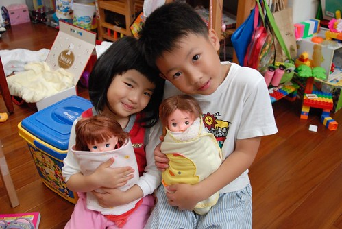

依然常是哥哥新裝設計的最佳model    今日上什麼衣?!就是這垃圾洋裝衣 

我們常說 哥哥不在家 沒有哥哥陪伴的愛愛就像是沒電 電力只有10%的人 提不起勁玩遊戲 看電視 東搞西搞 就只會兩眼無神的發呆或是直唸著'我要哥哥 我要哥哥 哥哥什麼時候回來...' 

我們常想如果沒有哥哥 應該也不會有現在這樣的小愛 不過如果小愛是姐姐 阿徹是弟弟 他們兩個不知道又會跟現在有多麼的不一樣 (真是好奇) 我想愛愛應該一定會是個好姐姐 可是會不會是個鬼點子這麼多 可以讓阿徹弟弟迷戀的姐姐那就真的很難說了... 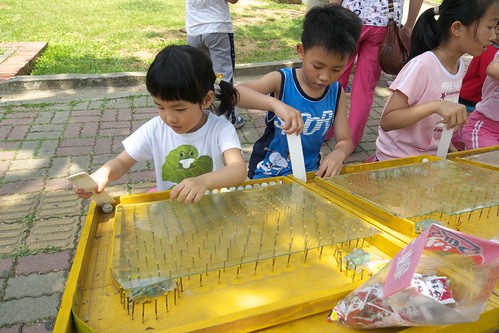

愛愛最近下床偶有下床氣 上週我們總算明白他一大早心情會不好的原因了 某個哥哥早起的早上 愛愛起床後嘟鬧著脾氣不說也不動 請他給我們個生氣的原因  愛愛含著眼淚說 '晚上(指的是上床後睡著前) 我要出去拿東西 哥哥都要我跟他說(然後膽小的哥哥跟著一起出來) 可是他早上起床後都沒有跟我說... (哥哥就自己去客廳留著愛愛睡覺 醒來才發現哥哥早已不見)' 講完最後一句 愛愛放聲大哭了起來 似乎要把她的委屈一股的宣洩出來 聽到她這麼說 我跟徹爸很訝異也覺得很好笑 把阿徹哥哥叫了過來交代他'以後起床要跟妹妹說一聲 別再讓妹妹這樣傷心難過了'....

M: 現在的作業跟聯絡簿都是爸爸在看的 每次爸爸都會請愛愛把作業上的數字或是英文或是歌謠唸一次給她聽 今天爸爸笑她說 "1,2,3,…. 不是寶寶熊就在學" 愛愛就說"那只有學數數而已" 言下之意現在的1,2,3,…層級是不一樣滴.. 後來不知怎樣 阿徹哥哥說要給愛愛考1,2,3聽寫 愛愛也信心十足的接受了挑戰 聽著哥哥隨機唸的數字 愛愛總能立刻的寫出數字 而除了數字6的筆順不 太對外 都寫對也都很工整漂亮喔 阿徹哥哥最後給愛愛打了個大大100分 跟她說"你好棒"

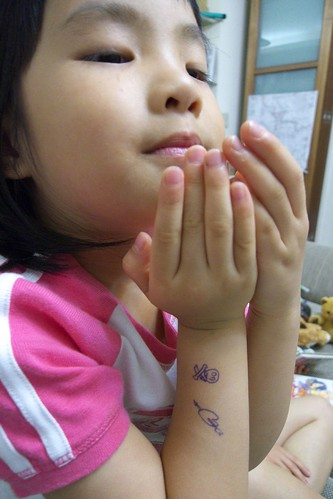

很喜歡這系列小兩鏡頭下的小愛 憂愁懊惱的.. 

開心的.. 

凝望的.. 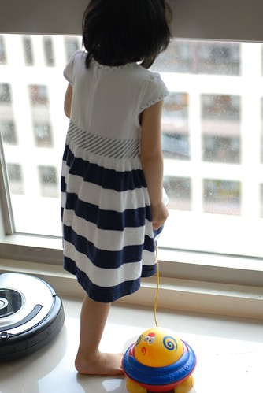

深思的.. 

學院氣質風的.. 

看到愛愛喜歡阿伯家小晴晴的模樣 我相信他真的很想當姐姐的... 

最後一個好笑的... (五月最後一週) J: 自從換季後 午睡前的洗腳也就成為大家期待且不可少的活動嚕 '好! 陽台洗腳去' 只見孩子們一個接著一個急著就定位 這時愛愛的聲音就會出現了~ XXX, 你都沒排隊 XXX, 你褲子忘記拉高了 XXX, Jennifer說站那麼後面會沖不到水喔 XXX, 不要一直講話啦 很吵耶 (ㄟ 自己不是一直唸這個 管那個的) 啊! Jennifer...水滿了啦 "OK! 沖水嚕"  "站好喲" 當冰涼的水從雙腳沖過 聲音又出現了~ XXX, 輕一點啦 你會把別人的褲子踢濕掉耶 XXX,.....

為娘的OS: 我百分之兩百的相信愛愛有這麼雞婆 這麼愛碎碎唸...Orz
