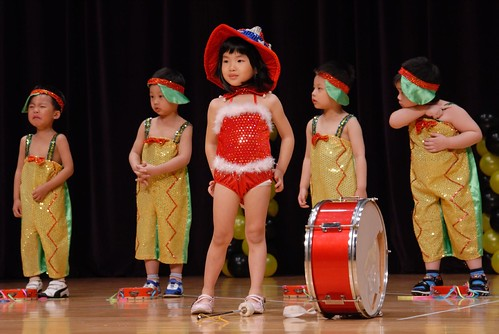
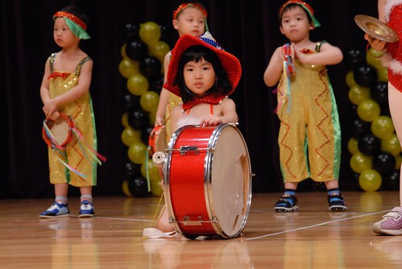
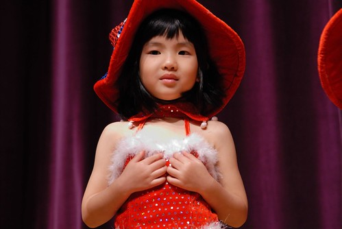
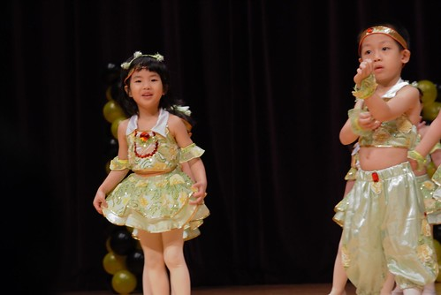
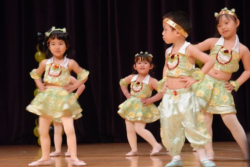
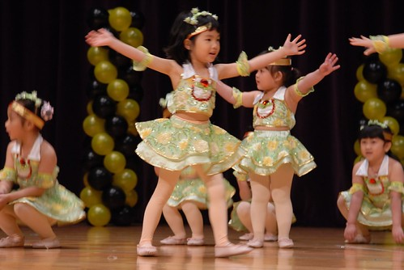
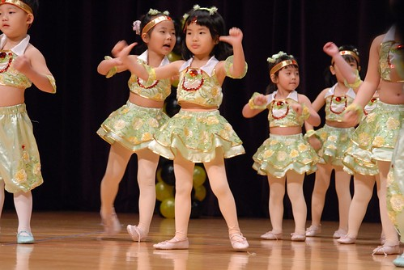
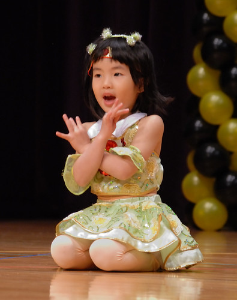
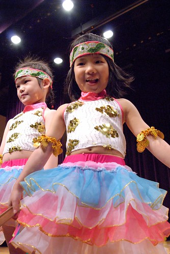

小愛小姊姊已經第三年的音樂發表會上台表演嚕~ 雖然還是一如本性的有點ㄍ一ㄥ 但是表現的越來越落落大方了 而且不再是傻不隆冬 呆呆任人擺佈的小小孩嚕~

愛的第一首'虎姑婆'被安排在第二個表演節目 當第一個表演節目落幕 第二個表演班級躲在側邊 stand by時 我跟徹爸撇見了一個疑似我們家小愛的身影  徹爸驚呼'哇塞 這麼露' 正式上場時 果然看見兔女郎小愛  可愛阿~ 事後問愛愛最喜歡哪套表演服裝時 愛愛也說最喜歡這套 只是不知道是太緊張還是褲子太短 愛愛的手閒下來時會不自覺的去拉小短褲 她的小內褲不知道是不是就是這樣不小心扯出來 露出小花邊了

幾週前開始排練時 愛愛就有告訴我們 她負責打大鼓喔 印象中以前小班或幼幼班的大鼓手都是由中大班小朋友支援的 很懷疑+驚訝 愛愛被交予這樣的重責大任阿 不過我們還是用著讚賞的語氣跟愛愛說'哇~你個子這麼小打的動大鼓' 愛愛總是裝出奮力一擊 自信滿滿的樣子說 '可以阿'

愛愛這個大鼓手 節拍抓的很好(爸爸說的 因為媽媽耳頓不靈敏) 咚咚咚的沒多也沒少 看來果然是沒付Jennifer跟音樂老師的期待

表演完 愛的緊張感還是未減  小嘴緊抿

我跟徹爸拼命喚著她 要她對著鏡頭笑一笑  愛總算露出靦腆笑容

第二個上場是舞蹈班的表演'小青蛙' 會前兩週愛愛幾乎每天都會在家裡對著電視(她的鏡子)練習她的小青蛙 雖然明白愛愛一定十足的有把握 沒問題 可是當她上場而我跟徹爸還在搜尋她的身影時 竟然聽到一個開心熱切的聲音喊著'媽咪 媽咪' 看到他那笑咪咪 蹦蹦跳跳的模樣  很訝異她怎麼突然不緊張而且還這麼充滿自信

音樂開始後 果然愛愛這隻小青蛙看起來超級自信阿

快樂又確實的跳每一個舞步

而且小嘴巴也大聲的跟著唱和

看的我跟徹爸也跟著一起High了起來

蹲著的那個是愛的'小石頭' 只有在小孩子身上才會看見的蹲法 醜的超級可愛

接下來這幾個地板動作 徹爸看的愛不釋手

因為愛的小手指 比的超認真又有自信的

雖然我們也不知道正確到底是怎麼跳的 但就是覺得愛的動作很'到位'哩

以前大學社團練舞時 學長都會交代說不要扭捏 放開手腳 動作做出來就會漂亮 我覺得愛愛的舞蹈表演有抓到這樣的訣竅(小孩子臉皮比較厚嗎) 所以我跟徹爸兩人很'老王'的覺得愛愛跳的真是棒阿 (誇自己的瓜好)

小天鵝的後腳竟也可以碰到後腦杓了 學了一年半多的舞 柔軟度果然進步很多...

經過快樂的小青蛙舞蹈洗禮 愛的表情一整個的放鬆柔和了

所以第三個節目登場時 亦是自信滿滿嚕~

看到這裡就讓徹媽再一次感嘆'時間納ㄟ過這麼快   我家女兒怎麼這麼大啦'

已經是個小亭亭玉立的女生嚕~

看到這有沒有發現愛愛都排第一排阿 哈哈~這就是小個子的好處 跟哥哥一樣 表演時往第一排找就對啦

YA! 表演結束! 小姐姐表演的很棒喔~ 給妳拍拍手~

忍不住挖出愛愛以前 剛上幼稚園 第一次穿上自己舞蹈衣的照片出來兩相對照

還沒開始上舞蹈課前 模仿著哥哥做著舞蹈動作

甚至還要求偷穿哥哥的舞蹈衣 假裝她在上舞蹈課

快滿三歲的那學年開始上舞蹈課 第一次穿上自己的舞蹈衣 化身飛揚的小舞者

這個小舞者還很勤勞的常會在家練習新舞步 新動作

叔叔阿姨是不是跟徹媽一樣覺得我們家的愛愛真的長大很多啦~ 相信我 接下來的兩年 愛的成長跟變化會更多的....讓我們繼續拭目以待了
