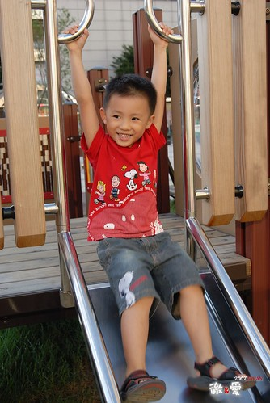
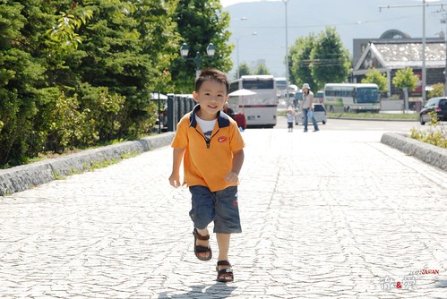
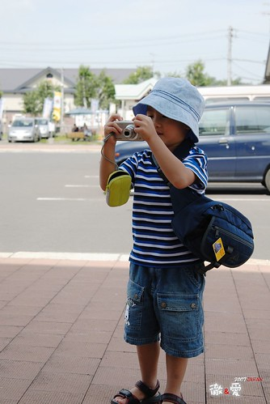
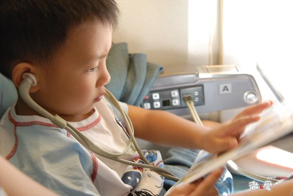
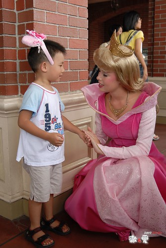
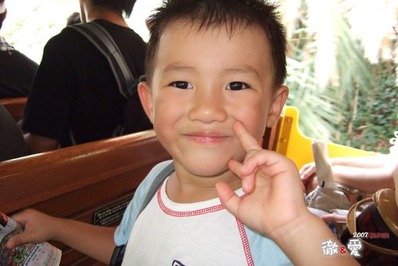

阿徹屆滿兩歲前也曾經被爸媽搶便宜的拎去日本一趟  
相較於那時候的害怕坐飛機 只會咿咿唔唔  
現在真的長大嚕 是有腦袋 有思想 不可馬唬的男孩嚕  
雖然常必須花很多唇舌跟他解釋為什麼得坐這麼久的車 為什麼每天這麼累  
也得安撫他有時疲累 有時過於雀躍 有時慾望太大的心情  
但透過阿徹的眼睛 真的讓爸爸媽媽享受 觀察到許多被我們大人忽略的"事務"  
雖然帶著小孩旅行得增加許多行李 揹著重重的媽媽袋   
但沒有他們的旅行 我相信一定會少了許多樂趣   
甚至多了許多無聊的時間不知如何打發  
  
旅行的第五天早上 躺在我腿上休息的阿徹突然問我  
"為什麼我們每天都這麼累阿"  
ㄣ..ㄟ..ㄚ...真是個好問題 也真是令媽媽窘的差一點說不出話來  
只能告訴他"因為我們要去看美麗的風景ㄚ 因為大家一起出來玩就是這樣ㄚ..."  
阿徹點了點頭~~~  
可是這一天阿徹起碼說了5次的"好想他的朋友 好想Freda(班導)"  
然後媽媽只能一而再的提醒他"撐著點 明天就要去你最想去的迪士尼了"  
然後阿徹眼中閃過一絲光芒喊著 "OHYA"   
(好酒真的要陳甕底  要不然看了這麼多天自然美景的小孩遲早"起叛")  
  
其實每天真的都很累   
睡眠不足的累 走好多路的累 看好多新奇事物的累  笑太多講太多話的累  
但阿徹走的路不比大人少(只有shopping mall跟樂園 動物園裡 偷懶的也要坐推車)  
甚至吃的飯也不會比大人少  
最後一天去上野動物園時 也只有他還可以熱情的衝去看地圖(爸媽都沒力氣跑了)  
莫非這就是"年輕人"~  
  
行程中不止一次的跟阿徹說"哥哥好棒"   
他真的很棒 他就是我們家的阿徹~~~  
  
  

很觀光客的打扮 漁夫帽+腰包  信心滿滿的展開第二次日本行  
  
  
  
這次多了許多等候(火車或啥的)時間 可以去公園晃晃 賣場裡轉轉  
也不是說國外的天空真的比較藍   
但就這樣悠哉的坐在公園裡 陪著小孩玩滑梯  看看美麗的天空 就是種幸福  
  
男孩真的越來越調皮 膽量也越大 花樣也越多  
  
  
  
阿徹算是個很耍寶的小孩  
除了常會冒出刻意被爸媽保護而保有的"天話"外(說是童言童言好聽些)  
也會做出許多單純的令人發噱的小玩意  
  
  
  
男孩最近很愛泡溫泉 不管在家裡的小臉盆 阿嬤家的浴缸 阿公家的戲水池 都叫泡湯  
這回真的讓他泡湯泡的很爽了  
連三天跟老爸還有眾家男人赤裸裸 坦承相見  
  
  
  
在大沼公園堅持的要騎自己選的紅色淑女車  
雖然遇到爬坡段 石子路 危險的下坡段  
阿徹沒吭一聲的自己努力踏著 牽著  
果然好個替自己的選擇與堅持 負責到底阿  
  
  
  
泡個熱呼呼的溫泉後 真的只有"爽"字可以形容  
  
  
  
真的不知道男孩哪裡來的活力泉源 可以每天這麼陽光  
  
  
  
第四晚總算記得幫阿徹要了件小孩子的浴衣 開心的哩~ (本來還說要穿著睡覺)  
  
  
  
拿著相機幫爸爸媽媽拍下美麗的合照  
構圖掌鏡能力越來越有乃爸之風 快要凌駕媽媽之上了(其實幾乎了啦)  
  
  
  
可以說阿徹是人比花"嬌"嗎?  我想不會太為過(只是這表情真的糟了點)  
  
  
  
第六天搭機回東京 阿徹已經完全不怕搭飛機了  
聽著音樂 認真的看著緊急逃生示範單張  
表情成熟的讓人不敢打擾他  
  
  
  
這一天....真的 真的實現了阿徹的夢想 遇見了夢寐以求的公主  
起初我跟徹爸看到公主時 開心的跟阿徹說"公主耶 你最喜歡的公主耶 去跟他照一張"  
想不到阿徹提不起勁 冷冷的說 "我不要跟藍色的公主照相 我要粉紅色的"  
聽的我跟徹爸OS"挖勒  人這麼多能遇到公主就偷笑了  你還挑勒 "  
結果我跟徹爸一個轉身竟然真的就看到了"粉紅色"的公主  
阿徹跟徹爸二話不說的 雀躍的湧去人潮中   
然後趁公主的小空檔 徹爸毫不遲疑的把阿徹推向公主  
(旁邊還圍了一圈似乎等候已久的小日本哩 徹爸真是不怕死  不過這種場合真的要用"搶"的)  
公主蹲下身來 牽起阿徹的小手說" 空你基哇"   
看徹沒反應 公主大概知道不是小日本了 就又問"What's your name?"  
徹竟然毫不遲疑 害怕的回答"My name is Henry"  
然後公主又問"How old are you?....."   
阿徹就這麼落落大方的跟公主一來一往對話了好幾句 (聽口音公主應該更確定阿徹不是小日本了)  
  
  
  
最後公主竟然還讓阿徹親她  
來的太突然害徹爸沒照到 請公主再讓阿徹來一次(結果徹爸還是沒照到 甚至糊了)  
  
  
  
這一親真的給了阿徹接下來兩天的活力泉源  
想到公主香香的親親 就露出幸福甜蜜的笑容 連眼睛都笑的瞇瞇的  
也沒再說想他的朋友 老師了  
反倒直喊著"迪士尼真是太好玩了 明天還要再來 以後還要再來"  
ㄟ...小子 迪士尼不是你家旁邊公園 想來就可以來的啦~~~  
  
  
  
親過公主之後 真的很High  High到跟他頭上的米妮很相互應  
  
  
  
幾天來的疲累 辛苦都值得了...  
  
  
  
到了傍晚即使遍尋公主爆米花桶不著  還是累的睡著了   
休息一下才有力氣撐到晚上看美麗的夜間遊行喔  
  
  
  
最後一天當觀光客了 當然要給他很觀光....  
依舊興奮的戴著"米妮"去搭地鐵 去上野公園 去東京自由行  
看到阿徹這樣帥氣+妖媚的矛盾裝扮及怡然自得  
真不知道該說是忌妒還是羨慕  
當小孩子真好 真幸福.....  
   
  
  
流落日本街頭的跑幫小子  
  
  
  
(徹)回家 我想回家 想念我的朋友 想念我的玩具 想念我的床阿....  
快了 就快登機回家了~~~  
(阿徹真的累了 回台灣的飛機上 聽著音樂看著逃生手冊 空服員都還沒送上果汁就睡著了  
  等大家都用完餐後 才努力的搖醒他起來吃他的兒童餐...)  
  

