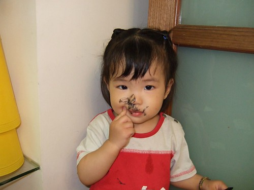
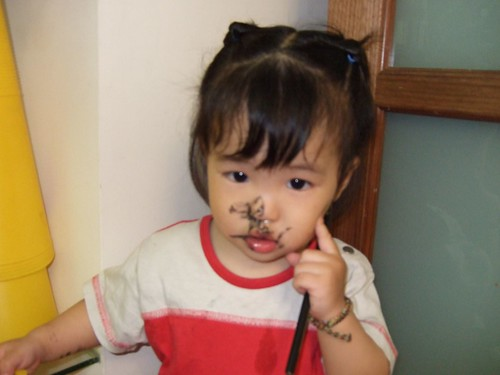

上週的某天晚上   
徹爸龍體欠安 於是吃完晚餐後就先進房小睡片刻  
同時間阿徹拿筆在畫畫 寫功課  
小愛看到哥哥拿筆也猛比著筆袋跟我說 "要...要...要"  
雖然小愛偶而會把筆含在嘴巴吸阿吸 但都還算安全沒釀出啥意外  
於是我選了隻黑色的粉鉛筆給她   
想說黑色 畫的明顯些 應該比較可以按耐的住她   
可以拖久一點時間好讓我可以到廚房把碗洗一洗  
於是我放心的收桌子 洗碗   
還頗安慰的心想"真是好一對乖兄妹阿 可以自個玩 不用人擔心了"  
5-10分鐘後 突然聽到阿徹對著廚房的我喊"媽媽 妹妹嘴巴鼻子都黑黑的了"  
啥咪~從廚房出來的我果然一眼就看到這隻小花貓  
訓斥一番後 當我拿出相機要照相為證時  小愛還自個看鏡頭擺好手勢   
看的我真是又好笑又好氣~  真的很像武松打虎裡的那隻虎  
   

不過看的出小妮子還是有點被嚇到啦  
眼匡泛紅 鼻涕共共牢  
其實最慘的不是這些看的見的黑  
而是嘴巴裡的舌頭 牙齒跟口腔  活像兔著黑墨的巫賊  
害我忍不住邊擦邊罵 擦完還補上打小手  
希望下次真的不要這樣子了哩~  
  

